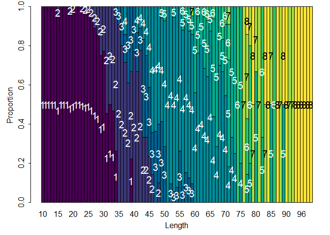
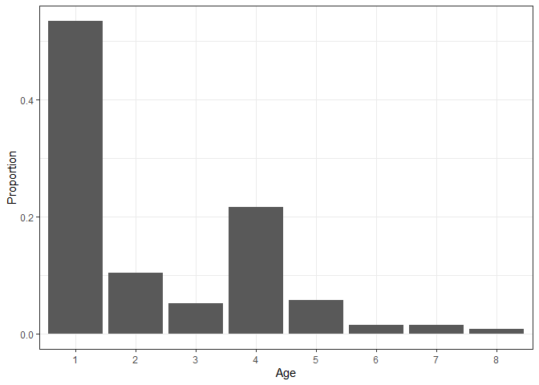

---
authors:
- admin
categories: []
date: "2019-02-05T00:00:00Z"
draft: false
featured: false
image:
  caption: ""
  focal_point: ""
lastMod: "2019-09-05T00:00:00Z"
projects: []
subtitle: Age-length keys and Continuation Ratio Logits
summary: Age-length keys and Continuation Ratio Logits
tags: []
title: Age composition estimation
---

This is a tutorial to estimate age compositions from fishery-independent
sources (e.g. survey) using classic age-length keys and continuation
ratio logits (Berg et al., 2012). These two methods were evaluated in a
simulation experiment previously (Correa et al., 2020). I use these
libraries:

``` r
library(ggplot2)
library(FSA)
```

    ## ## FSA v0.9.3. See citation('FSA') if used in publication.
    ## ## Run fishR() for related website and fishR('IFAR') for related book.

``` r
library(dplyr)
```

    ## 
    ## Attaching package: 'dplyr'

    ## The following objects are masked from 'package:stats':
    ## 
    ##     filter, lag

    ## The following objects are masked from 'package:base':
    ## 
    ##     intersect, setdiff, setequal, union

``` r
library(maps)
library(mapdata)
```

I use simulated data based on the bottom-trawl survey design in the
eastern Bering Sea. The data have this structure:

``` r
head(catch_data)
```

    ##   YEAR STATIONID    LON  LAT NUMBER_FISH
    ## 1 2007       108 -165.1 54.7          38
    ## 2 2007       230 -166.9 55.0          49
    ## 3 2007       236 -166.3 55.0          36
    ## 4 2007       241 -165.8 55.0          21
    ## 5 2007       248 -165.1 55.0          19
    ## 6 2007       310 -164.6 55.1          16

``` r
head(len_data)
```

    ##   YEAR STATIONID    LON  LAT LENGTH FREQUENCY
    ## 1 2007       108 -165.1 54.7     17         3
    ## 2 2007       108 -165.1 54.7     23         2
    ## 3 2007       108 -165.1 54.7     24         2
    ## 4 2007       108 -165.1 54.7     26         1
    ## 5 2007       108 -165.1 54.7     28         4
    ## 6 2007       108 -165.1 54.7     35         3

``` r
head(age_data)
```

    ##   YEAR STATIONID    LON  LAT LENGTH AGE
    ## 1 2007       108 -165.1 54.7     17   1
    ## 2 2007       108 -165.1 54.7     23   1
    ## 3 2007       108 -165.1 54.7     61   4
    ## 4 2007       108 -165.1 54.7     61   4
    ## 5 2007       230 -166.9 55.0     53   3
    ## 6 2007       230 -166.9 55.0     60   4

`catch_data` is the catch data, `len_data` is the length subsample data,
and the `age_data` is the age subsample data (each row represents a fish
sampled). The columns are:

-   `YEAR` is the sampling year
-   `STATIONID` is the station name or code where the sample was taken
-   `LON` and `LAT` are the longitude and latitude of the sampling
    station, respectively
-   `NUMBER_FISH` is the number of fish caught in the sampling station
-   `LENGTH` is the fish size
-   `FREQUENCY` is the fish size frequency
-   `AGE` is the fish age

The sampling stations can be plotted:

``` r
par(mar = c(4, 4, 0.5, 0.5))
plot(x = catch_data$LON, y = catch_data$LAT, pch = 19, xlab = 'longitude', ylab = 'latitude')
map(database = 'worldHires', add = TRUE, fill = TRUE, col = 'gray60')
```


For this example, only data from one year is considered. Also, I assume
that the sampled area per station is constant over stations.
Standardization (e.g. catch/area) would be required if this assumption
does not meet for your data.

Before going to the calculations, we should set the age plus group. In
this case, I set it to 8:

``` r
age_data$AGE = ifelse(test = age_data$AGE >= 8, yes = 8, no = age_data$AGE)
```

We also need to find the total number of fish sampled per station the
length subsample:

``` r
len_data = len_data %>%                               
              group_by(YEAR, STATIONID, LON, LAT) %>%
              mutate(NUMBER_FISH_SAMPLED = sum(FREQUENCY))
head(len_data)
```

    ## # A tibble: 6 x 7
    ## # Groups:   YEAR, STATIONID, LON, LAT [1]
    ##    YEAR STATIONID   LON   LAT LENGTH FREQUENCY NUMBER_FISH_SAMPLED
    ##   <int>     <int> <dbl> <dbl>  <int>     <int>               <int>
    ## 1  2007       108 -165.  54.7     17         3                  38
    ## 2  2007       108 -165.  54.7     23         2                  38
    ## 3  2007       108 -165.  54.7     24         2                  38
    ## 4  2007       108 -165.  54.7     26         1                  38
    ## 5  2007       108 -165.  54.7     28         4                  38
    ## 6  2007       108 -165.  54.7     35         3                  38

Then, we need to calculate the proportion of fish in the length
subsample (relative to the total catch) per station:

``` r
len_data = left_join(len_data, catch_data, by = c('YEAR', 'STATIONID', 'LON', 'LAT'))
len_data$PROP_SAMPLED = len_data$NUMBER_FISH_SAMPLED/len_data$NUMBER_FISH
head(len_data)
```

    ## # A tibble: 6 x 9
    ## # Groups:   YEAR, STATIONID, LON, LAT [1]
    ##    YEAR STATIONID   LON   LAT LENGTH FREQUENCY NUMBER_FISH_SAMPLED NUMBER_FISH
    ##   <int>     <int> <dbl> <dbl>  <int>     <int>               <int>       <int>
    ## 1  2007       108 -165.  54.7     17         3                  38          38
    ## 2  2007       108 -165.  54.7     23         2                  38          38
    ## 3  2007       108 -165.  54.7     24         2                  38          38
    ## 4  2007       108 -165.  54.7     26         1                  38          38
    ## 5  2007       108 -165.  54.7     28         4                  38          38
    ## 6  2007       108 -165.  54.7     35         3                  38          38
    ## # ... with 1 more variable: PROP_SAMPLED <dbl>

Finally, we calculate the numbers-at-length per station:

``` r
len_data$NUMBER_AT_LEN = len_data$FREQUENCY/len_data$PROP_SAMPLED
head(len_data)
```

    ## # A tibble: 6 x 10
    ## # Groups:   YEAR, STATIONID, LON, LAT [1]
    ##    YEAR STATIONID   LON   LAT LENGTH FREQUENCY NUMBER_FISH_SAMPLED NUMBER_FISH
    ##   <int>     <int> <dbl> <dbl>  <int>     <int>               <int>       <int>
    ## 1  2007       108 -165.  54.7     17         3                  38          38
    ## 2  2007       108 -165.  54.7     23         2                  38          38
    ## 3  2007       108 -165.  54.7     24         2                  38          38
    ## 4  2007       108 -165.  54.7     26         1                  38          38
    ## 5  2007       108 -165.  54.7     28         4                  38          38
    ## 6  2007       108 -165.  54.7     35         3                  38          38
    ## # ... with 2 more variables: PROP_SAMPLED <dbl>, NUMBER_AT_LEN <dbl>

Using age-length key (ALK)
--------------------------

We use the functions in the R package `FSA`.

### ALK calculation

We construct the ALK using the information in the age subsample data.
First, calculate the frequency by length and age.

``` r
freq_len_age = xtabs(~LENGTH + AGE, data = age_data)
head(freq_len_age)
```

    ##       AGE
    ## LENGTH  1  2  3  4  5  6  7  8
    ##     10  1  0  0  0  0  0  0  0
    ##     11  4  0  0  0  0  0  0  0
    ##     12  3  0  0  0  0  0  0  0
    ##     13  1  0  0  0  0  0  0  0
    ##     14 10  0  0  0  0  0  0  0
    ##     15 16  1  0  0  0  0  0  0

If you want to change the size bin, I recommend using the function
`lencat`. Then, we calculate proportions (this is the ALK for this
year):

``` r
ALK_year = prop.table(freq_len_age, margin=1)
head(round(ALK_year, digits = 2))
```

    ##       AGE
    ## LENGTH    1    2    3    4    5    6    7    8
    ##     10 1.00 0.00 0.00 0.00 0.00 0.00 0.00 0.00
    ##     11 1.00 0.00 0.00 0.00 0.00 0.00 0.00 0.00
    ##     12 1.00 0.00 0.00 0.00 0.00 0.00 0.00 0.00
    ##     13 1.00 0.00 0.00 0.00 0.00 0.00 0.00 0.00
    ##     14 1.00 0.00 0.00 0.00 0.00 0.00 0.00 0.00
    ##     15 0.94 0.06 0.00 0.00 0.00 0.00 0.00 0.00

We can plot the ALK:

``` r
alkPlot(key = ALK_year, type = "barplot")
```



### Age composition estimation

First, we calculate the numbers-at-length from all stations:

``` r
num_at_len = len_data %>%
                group_by(LENGTH) %>%
                summarise(NUMBERS = sum(NUMBER_AT_LEN))
```

Similarly, we calculate the number of fish per size bin in the age
subsample:

``` r
num_at_len_A = age_data %>%
                group_by(LENGTH) %>%
                summarise(NUMBERS = n())
```

Then, we only select lengths with information in the ALK (the age
subsample does not normally have age information for all sizes in the
length subsample):

``` r
num_at_len = num_at_len[num_at_len$LENGTH %in% num_at_len_A$LENGTH, ]
```

Finally, we use the function `alkAgeDist` to calculate the age
composition for this year. See the statistical background in Quinn and
Deriso (1999):

``` r
age_comps = alkAgeDist(key = ALK_year, lenA.n = num_at_len_A$NUMBERS, len.n = num_at_len$NUMBERS)
age_comps
```

    ##   age        prop          se
    ## 1   1 0.534321495 0.006423584
    ## 2   2 0.104063039 0.006896247
    ## 3   3 0.051805725 0.005640747
    ## 4   4 0.215700318 0.007399301
    ## 5   5 0.057223880 0.005304152
    ## 6   6 0.014732579 0.002398039
    ## 7   7 0.014183269 0.002084561
    ## 8   8 0.007969694 0.001587404

Make simple plot:

``` r
ggplot(age_comps, aes(x=as.factor(age), y=prop)) + 
  geom_bar(stat = "identity") +
  theme_bw() +
  xlab('Age') +
  ylab('Proportion')
```



Final thoughts: - In some cases, this estimation is perfomed by sampling
strata and then extrapolated to the entire survey area. - Some users
take subjective decisions to keep numbers-at-length information for size
bins not present in the age subsample.

Using continuation ratio logits
-------------------------------

To be added