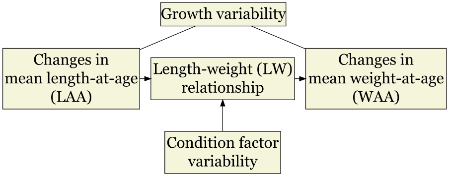
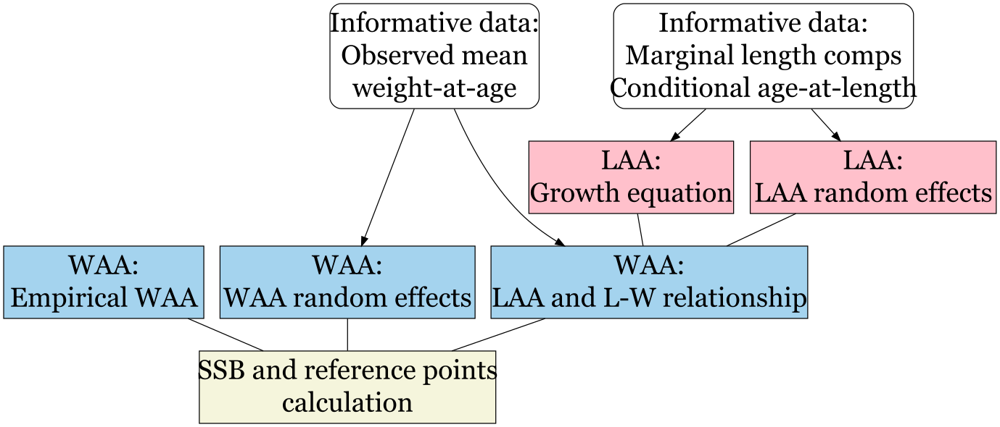
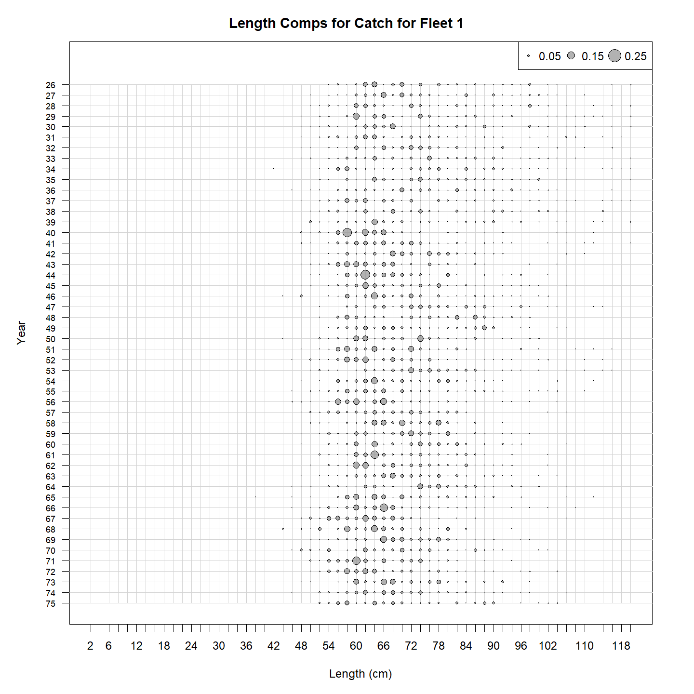
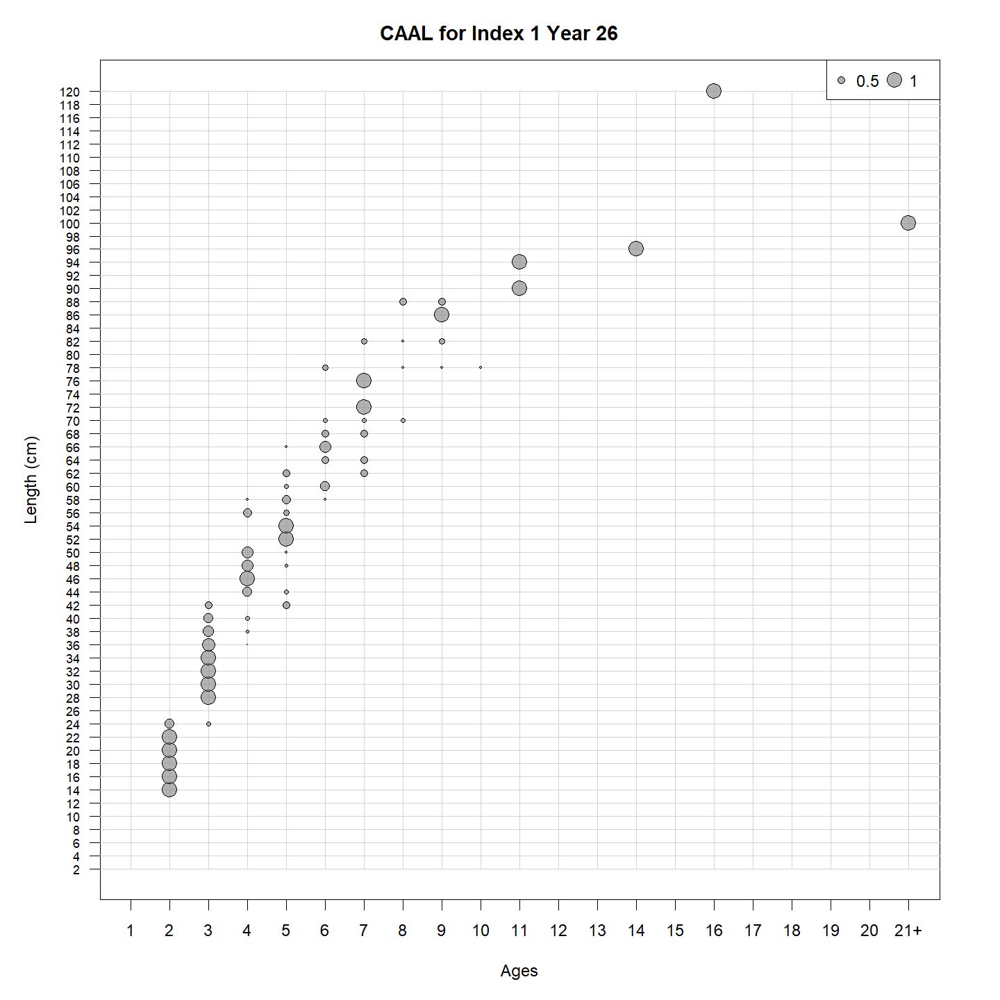
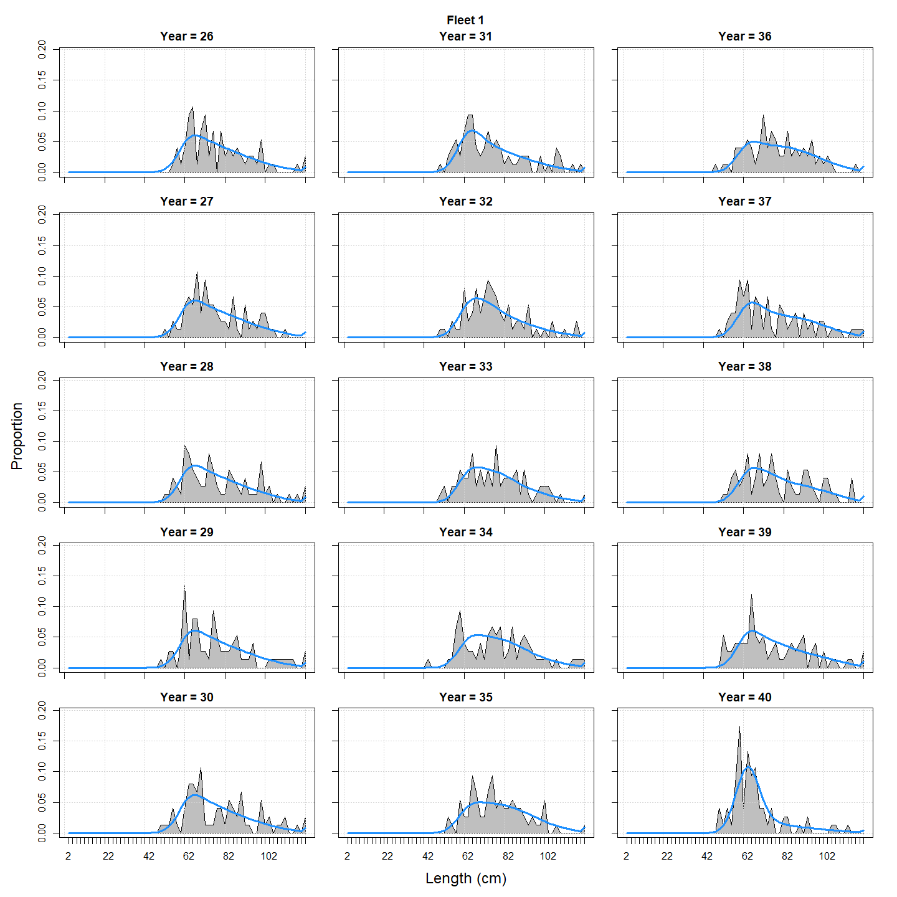
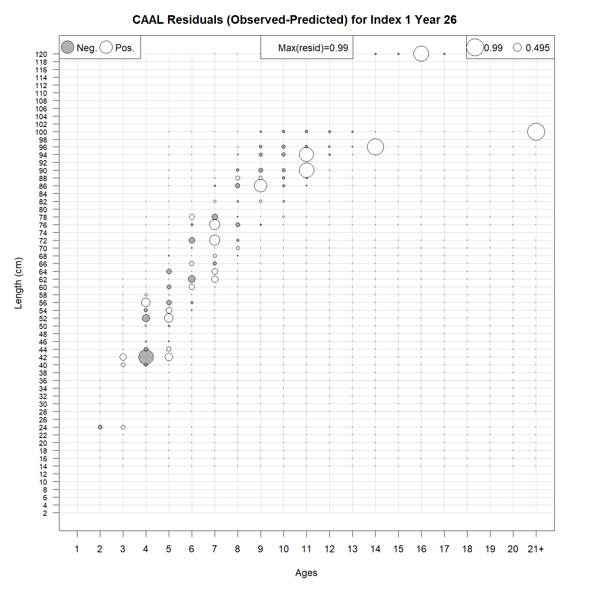
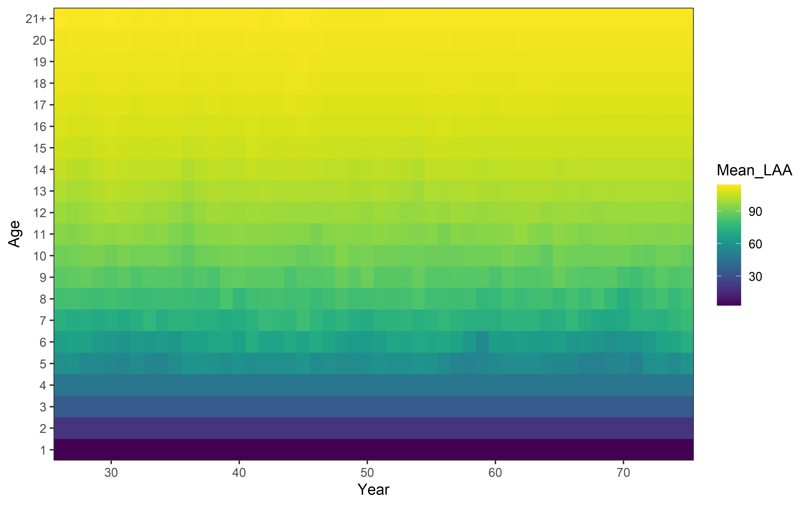
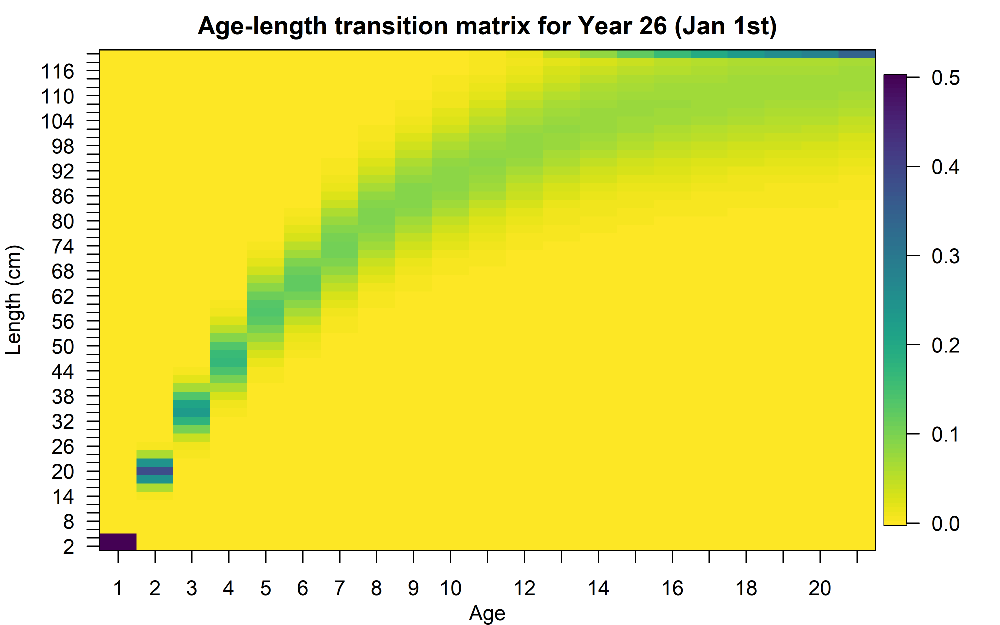

---
authors:
- admin
categories: []
date: "2022-07-25T00:00:00Z"
draft: false
featured: false
image:
  caption: 'Mean length-at-age variability.'
  focal_point: ""
lastMod: "2019-09-05T00:00:00Z"
projects: []
subtitle: Growth estimation
summary: Growth estimation
tags: []
title: Woods Hole Assessment Model
---


-   <a href="#data" id="toc-data">Data</a>
-   <a href="#parameters" id="toc-parameters">Parameters</a>
    -   <a href="#selectivity" id="toc-selectivity">Selectivity</a>
    -   <a href="#somatic-growth" id="toc-somatic-growth">Somatic growth</a>
        -   <a href="#mean-length-at-age-laa" id="toc-mean-length-at-age-laa">Mean
            length-at-age (LAA)</a>
        -   <a href="#mean-weight-at-age-waa" id="toc-mean-weight-at-age-waa">Mean
            weight-at-age (WAA)</a>
-   <a href="#environmental-covariates"
    id="toc-environmental-covariates">Environmental covariates</a>
-   <a href="#analysis-of-results" id="toc-analysis-of-results">Analysis of
    results</a>
    -   <a href="#input-data" id="toc-input-data">Input data</a>
    -   <a href="#diagnostics" id="toc-diagnostics">Diagnostics</a>
    -   <a href="#parameters-1" id="toc-parameters-1">Parameters</a>
-   <a href="#examples" id="toc-examples">Examples</a>
    -   <a href="#references" id="toc-references">References</a>

> :warning: **This tutorial is under development and some features could
> change in future versions**

Here, I present the extended features that my colleagues and I have
incorporated into the Woods Hole Assessment Model (WHAM). The base
features of this model has been developed by Tim Miller and
collaborators and are reported in Stock and Miller (2021) and references
therein. Also, several vignettes can be found on the [WHAM
website](https://timjmiller.github.io/wham/index.html). Before
continuing reading this site, I highly advise taking a look at that
website.

The features described here are available on the [**growth**
branch](https://github.com/gmoroncorrea/wham/tree/growth) forked from
the [**devel** branch](https://github.com/timjmiller/wham/tree/devel) of
the WHAM GitHub repository and can be installed running:

``` r
remotes::install_github(repo = 'gmoroncorrea/wham', ref='growth', INSTALL_opts = c("--no-docs", "--no-multiarch", "--no-demo"))
```

Then:

``` r
library(wham)
```

> :heavy_check_mark: **This new WHAM version produces the same results
> of the base WHAM (devel branch) version (using the same input data)**

# Data

New data inputs have been added. There are two main ways how WHAM can
read the input data: reading an ASAP3 data file or creating an R object
(list). Here, we will explore the latter option:

``` r
wham_data = list()
```

`wham_data` will contain the data used by WHAM. For example, the age
bins or years:

``` r
wham_data$ages = 1:21 # age bins
wham_data$years = 1970:2020 # years
```

To explore all the basic inputs, see the [WHAM
website](https://timjmiller.github.io/wham/index.html).

Some new inputs are:

-   `wham_data$lengths`: fish length bins (cm). Length bin width should
    be uniform.
-   `wham_data$catch_pal`: Length compositions for fisheries. Array
    (number of fisheries
    ×
    number of years
    ×
    number of length bins).
-   `wham_data$catch_NeffL`: Input sample size for length compositions
    (fisheries). Matrix (number of years
    ×
    number of fisheries).
-   `wham_data$use_catch_pal`: Use (1) or not use (0) length
    compositions (fisheries). Matrix (number of years
    ×
    number of fisheries).
-   `wham_data$catch_caal`: Conditional length-at-age (CAAL) for
    fisheries. Array (number of fisheries
    ×
    number of years
    ×
    number of length bins
    ×
    number of ages).
-   `wham_data$catch_caal_Neff`: Input sample size for CAAL (fisheries).
    Array (number of years
    ×
    number of fisheries
    ×
    number of length bins).
-   `wham_data$use_catch_caal`: Use (1) or not use (0) CAAL (fisheries).
    Matrix (number of years
    ×
    number of fisheries).
-   `wham_data$index_pal`: Length compositions for indices. Array
    (number of indices
    ×
    number of years
    ×
    number of length bins).
-   `wham_data$index_NeffL`: Input sample size for length compositions
    (indices). Matrix (number of years
    ×
    number of indices).
-   `wham_data$use_index_pal`: Use (1) or not use (0) length
    compositions (indices). Matrix (number of years
    ×
    number of indices).
-   `wham_data$index_caal`: Conditional age-at-length (CAAL) for
    indices. Array (number of indices
    ×
    number of years
    ×
    number of length bins
    ×
    number of ages).
-   `wham_data$index_caal_Neff`: Input sample size for CAAL (indices).
    Array (number of years
    ×
    number of indices
    ×
    number of length bins).
-   `wham_data$use_index_caal`: Use (1) or not use (0) CAAL (indices).
    Matrix (number of years
    ×
    number of indices).

These data inputs are not mandatory (i.e. if length compositions for
indices are not available, `wham_data$index_pal`,
`wham_data$index_NeffL`, and `wham_data$use_index_pal` do not need to be
created).

There are another important data inputs that will be explained below.

# Parameters

All parameters are specified using the `prepare_wham_input` function. I
invite the readers to take a look at the help of that function
(`?prepare_wham_input`) to find more details about the new features
implemented here.

The length composition model is specified in the `prepare_wham_input`
function:

``` r
prepare_wham_input(...,
                   len_comp = "multinomial",
                   ...)
```

and the options available are the same as those for the age composition.
For CAAL data, the model should be specified in the `age_comp` argument.

## Selectivity

``` r
prepare_wham_input(...,
                   selectivity = list(model, re, initial_pars, fix_pars, n_selblocks),
                   ...)
```

The base WHAM version has four selectivity-at-age models (`model`) (
[see
here](https://timjmiller.github.io/wham/articles/ex4_selectivity.html)
): `age-specific`, `logistic`, `double-logistic`, `decreasing-logistic`.

For this new WHAM version, the selectivity can be at age or at length.
Also, we added the `double-normal` parametrization (see
Privitera-Johnson, Methot, and Punt (2022) ). Therefore, the following
options are available:

-   `age-specific`: selectivity by age (number of parameters is the
    number of ages)
-   `logistic`: increasing logistic at age (2 parameters)
-   `double-logistic`: double logistic at age (4 parameters)
-   `decreasing-logistic`: decreasing logistic at age (2 parameters)
-   `double-normal`: double normal at age (6 parameters)
-   `len-logistic`: increasing logistic at length (2 parameters)
-   `len-decreasing-logistic`: decreasing logistic at length (2
    parameters)
-   `len-double-normal`: double normal at length (6 parameters)

The double normal equation can be found in Methot and Wetzel (2013).

## Somatic growth



When we talk about somatic growth, we could refer to changes in
length-at-age or weight-at-age, therefore we will divide this section
into two parts.

### Mean length-at-age (LAA)

There are two main ways to model changes in LAA:

#### von Bertalanffy growth function (parametric approach)

As parametrized by Schnute (1981). There are five parameters:

-   
    *k*
    : growth rate
-   
    *L*<sub>*i**n**f*</sub>
    : Asymptotic length
-   
    *L*<sub>1</sub>
    : length at age 1
-   *C**V*<sub>1</sub>: coefficient of variation of lengths at age 1
-   *C**V*<sub>*A*</sub>: coefficient of variation of lengths at age A
    (age plus group)

``` r
prepare_wham_input(...,
                   growth = list(model = "vB_classic", re, init_vals, est_pars),
                   ...)
```

The arguments are:

-   `growth$re`: random effects (RE) on growth parameters (5). Five
    options are available:

| `growth$re` |         Random effects          |  Estimated parameters  |
|-------------|:-------------------------------:|:----------------------:|
| `none`      |        constant in time         |                        |
| `iid_y`     |  varies by year (uncorrelated)  |   *σ*<sub>*G*</sub>    |
| `iid_c`     | varies by cohort (uncorrelated) |   *σ*<sub>*G*</sub>    |
| `ar1_y`     |    correlated by year (AR1)     | *σ*<sub>*G*</sub>, *ρ* |
| `ar1_c`     |   correlated by cohort (AR1)    | *σ*<sub>*G*</sub>, *ρ* |

-   `growth$init_vals`: growth parameters initial values (5).
-   `growth$est_pars`: Which growth parameter to estimate.

#### LAA random effects (non-parametric approach)

The number of parameters is equal to the number of ages. Also, the
*C**V*<sub>1</sub>
and
*C**V*<sub>*A*</sub>
should be specified in `growth`.

``` r
prepare_wham_input(...,
                   growth = list(model = "LAA", re, init_vals, est_pars),
                   LAA = list(LAA_vals, re, est_pars),
                   ...)
```

The arguments are:

-   `LAA$LAA_vals`: LAA initial values (length equal to the number of
    ages).
-   `LAA$re`: random effects (RE) on LAA (1). Five options are
    available:

| `LAA$re` |            Random effects             |                  Estimated parameters                   |
|----------------------|:-----------------------:|:-----------------------:|
| `none`   |       constant in time and ages       |                                                         |
| `iid`    | varies by year and age (uncorrelated) |                    *σ*<sub>*L*</sub>                    |
| `iid_a`  |     varies by age (uncorrelated)      |                    *σ*<sub>*L*</sub>                    |
| `ar1_a`  |        correlated by age (AR1)        |          *σ*<sub>*L*</sub>, *ρ*<sub>*a*</sub>           |
| `2dar1`  |  correlated by age and year (2D AR1)  | *σ*<sub>*L*</sub>, *ρ*<sub>*a*</sub>, *ρ*<sub>*y*</sub> |

-   `LAA$est_pars`: Which LAA to estimate.

Finally, the user could input a transition matrix (see equations) and
not model growth internally.

#### Input an age-length transition matrix

This is an optional data input:

-   `wham_data$phi_matrix_input`: Array (`dim(wham_data$waa)[1]`
    ×
    number of length bins
    ×
    number of ages). WAA pointers are also used for this matrix (e.g.,
    `wham_data$waa_pointer_jan1`, etc).
-   `wham_data$phi_matrix_info`: 1 (use input matrix)

### Mean weight-at-age (WAA)

In this new version, there are three ways to model changes in WAA:

#### Empirical weight-at-age

This is the only strategy available in the base WHAM version, the user
should provide the empirical weight-at-age as input data
(`wham_data$waa`), which will be used to calculate spawning biomass and
reference points. Make sure that:

-   `wham_data$waa_type = 1` (use this method)

#### Length-weight relationship

``` r
prepare_wham_input(...,
                   LW = list(re, init_vals, est_pars),
                   ...)
```

The user could use a length-weight relationship to model changes in WAA
based on LAA. The arguments are:

-   `LW$re`: random effects (RE) on LW parameters (2). Five options are
    available:

| `LW$re` |         Random effects          |  Estimated parameters  |
|---------|:-------------------------------:|:----------------------:|
| `none`  |        constant in time         |                        |
| `iid_y` |  varies by year (uncorrelated)  |   *σ*<sub>*W*</sub>    |
| `iid_c` | varies by cohort (uncorrelated) |   *σ*<sub>*W*</sub>    |
| `ar1_y` |    correlated by year (AR1)     | *σ*<sub>*W*</sub>, *ρ* |
| `ar1_c` |   correlated by cohort (AR1)    | *σ*<sub>*W*</sub>, *ρ* |

-   `LW$init_vals`: LW parameters initial values (2).
-   `LW$est_pars`: LW parameter to estimate.

Here we use:

-   `wham_data$waa_type`: 2 (use this method)

Also, the user could use observed mean weight-at-age data as source of
information.

-   `wham_data$use_catch_waa`: Use (1) or not use (0) waa (fisheries).
    Matrix (number of years
    ×
    number of fisheries).
-   `wham_data$use_index_waa`: Use (1) or not use (0) waa (indices).
    Matrix (number of years
    ×
    number of indices).
-   `wham_data$waa_cv`: Coefficient of variation for observations. Array
    (`dim(wham_data$waa) == dim(wham_data$waa_cv)`).

#### WAA random effects

Like the LAA random effects approach. The number of parameters is equal
to the number of ages.

``` r
prepare_wham_input(...,
                   WAA = list(WAA_vals, re, est_pars),
                   ...)
```

The arguments are:

-   `WAA$WAA_vals`: WAA initial values (length equal to the number of
    ages).
-   `WAA$re`: random effects (RE) on WAA (1). Five options are
    available:

| `WAA$re` |            Random effects             |                  Estimated parameters                   |
|----------------------|:-----------------------:|:-----------------------:|
| `none`   |       constant in time and ages       |                                                         |
| `iid`    | varies by year and age (uncorrelated) |                    *σ*<sub>*L*</sub>                    |
| `iid_a`  |     varies by age (uncorrelated)      |                    *σ*<sub>*L*</sub>                    |
| `ar1_a`  |        correlated by age (AR1)        |          *σ*<sub>*L*</sub>, *ρ*<sub>*a*</sub>           |
| `2dar1`  |  correlated by age and year (2D AR1)  | *σ*<sub>*L*</sub>, *ρ*<sub>*a*</sub>, *ρ*<sub>*y*</sub> |

-   `WAA$est_pars`: Which WAA to estimate.

Here we use:

-   `wham_data$waa_type`: 3 (use this method)

Also, the user could use observed mean weight-at-age data as source of
information similar to the previous method.

This is a general overview about growth modeling in this new WHAM
version:



# Environmental covariates

I assume that the user is familiar with the syntax to include
environmental covariates in WHAM. In this version, new options are
available:

``` r
prepare_wham_input(...,
                   ecov = list(...,
                               where = 'growth',
                               where_subindex = 1,
                               ....),
                   ...)
```

`where` can be `growth` (either for the parametric von Bertalanffy model
or the mean length-at-age) or `LW`. `where_subindex` is the parameter
that will be linked to the environmental covariate, and the subindex
number follows the order as mentioned in the previous section
(e.g. `where = 'growth'` and `where_subindex = 2` will impact the
asymptotic length).

> :heavy_check_mark: **Projections and OSA residuals are also
> available**

# Analysis of results

The function `plot_wham_output` produces plots to summary the data
inputs, outputs, parameters, and others. This function was also expanded
in this new WHAM version.

### Input data

We can get a plot of the observed length compositions:



Or the input CAAL:



### Diagnostics

We can compare the observed vs predicted length compositions:



or bubble plots of CAAL residuals:



### Parameters

Some plots summarizing the variability in some parameters and biological
aspects are also available. For example, the variability of mean
length-at-age (when `growth$model = 'LAA'`):



Or the variability of lengths-at-age (represented by the age-length
transition matrix):



I suggest the user explores all the plots and tables produced by this
function.

# Examples

You can find examples about the use of the new WHAM features
[here](https://giancarlomcorrea.netlify.app/labs/WHAM/WHAM_examples).

### References

Methot, Richard D., and Chantell R. Wetzel. 2013. “Stock Synthesis: A
Biological and Statistical Framework for Fish Stock Assessment and
Fishery Management.” *Fisheries Research* 142 (May): 86–99.
<https://doi.org/10.1016/j.fishres.2012.10.012>.

Privitera-Johnson, Kristin M., Richard D. Methot, and André E. Punt.
2022. “Towards Best Practice for Specifying Selectivity in
Age-Structured Integrated Stock Assessments.” *Fisheries Research* 249:
106247. <https://doi.org/10.1016/j.fishres.2022.106247>.

Schnute, Jon. 1981. “A Versatile Growth Model with Statistically Stable
Parameters.” *Canadian Journal of Fisheries and Aquatic Sciences* 38
(9): 1128–40. <https://doi.org/10.1139/f81-153>.

Stock, Brian C., and Timothy J. Miller. 2021. “The Woods Hole Assessment
Model (WHAM): A General State-Space Assessment Framework That
Incorporates Time- and Age-Varying Processes via Random Effects and
Links to Environmental Covariates.” *Fisheries Research* 240 (August):
105967. <https://doi.org/10.1016/j.fishres.2021.105967>.
