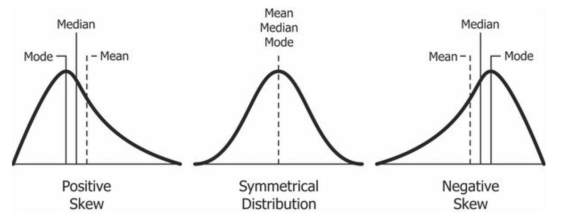
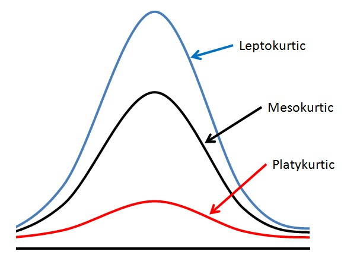

```{r setup, include=FALSE}
knitr::opts_chunk$set(echo = TRUE)
```

En esta sección se resume los conceptos más importantes vistos en la parte práctica de cada clase.

Cargamos librerías a utilizar

```{r warnings = 'hide', message=FALSE}
library(ggplot2)
library(lattice)
library(car)
library(summarytools)
library(moments)
```

# Estadísticos descriptivos

Bases de datos a utilizar:

```{r}
head(iris)
```

Podemos encontrar estadísticos descriptivos más importante para cada variable:

```{r}
summary(iris)
```

Para aplicar una función a una base de datos diferenciado por categorías de una variable:

```{r}
by(data = iris, INDICES = iris$Species, FUN = summary)
```

Para aplicar una función a una variable diferenciado por categorías de otra variable:

```{r}
tapply(X = iris$Sepal.Length, INDEX = iris$Species, FUN = mean)
```

Calcular la asimetría de la distribución de una variable:

```{r}
skewness(x = iris$Petal.Width)
```

Valores cercanos a cero significa una distribución simétrica. Valores positivos significa que la distribución es asimétrica y tirada hacia la izquierda. Valores negativos significa que la distribución es asimétrica y tirada hacia la derecha.




Calcular kurtosis de una variable, que nos indica que tan plano es el tope de una distribución:

```{r}
kurtosis(x = iris$Sepal.Length)
```



Valores menores a 3 se les conoce como platicurtica, por ejemplo:

```{r, echo = FALSE}
x <- c(rep(61, each = 10), rep(64, each = 18), 
rep(65, each = 23), rep(67, each = 32), rep(70, each = 27),
rep(73, each = 17))
hist(x)
```

Valores cercanos a 3 se les conoce como mesocurtica, por ejemplo:

```{r, echo = FALSE}
x <- rnorm(100)
hist(x)
```

Valores mayores a 3 se les conoce como leptocurtica, por ejemplo:

```{r, echo = FALSE}
x <- c(rep(61, each = 2), rep(64, each = 5),
rep(65, each = 42), rep(67, each = 12), rep(70, each = 10))
hist(x)
```

# Tablas de contingencia

Tabla de contingencia:

```{r}
table(iris$Species)
```

Podemos crear una nueva variable categórica a partir de una numérica:

```{r}
iris$Size = NA
iris$Size = ifelse(test = iris$Sepal.Length > 6, yes = 'Big', no = 'Small')
iris$Size = as.factor(iris$Size)
```

Y podemos crear una tabla de contingencia de doble entrada:

```{r}
table(iris$Species, iris$Size)
```

También lo podemos hacer usando la función `xtabs`:

```{r}
xtabs(~ iris$Species + iris$Size)
```

Podemos obtener esta tabla con valores de proporciones:

```{r}
prop.table(table(iris$Species, iris$Size))
```

Estas tablas pueden ser obtenidas en un formato más ordenado:

```{r}
freq(x = iris$Species)
```

Podemos remover información no importante:

```{r}
freq(iris$Species,
     report.nas = FALSE, # remove NA information
     totals = FALSE, # remove totals
     cumul = FALSE, # remove cumuls
     headings = FALSE # remove headings
)
```

Otra forma de obtener tablas similares:

```{r}
ctable(
  x = iris$Species,
  y = iris$Size,
  prop = "n", # remove proportions
  totals = FALSE, # remove totals
  headings = FALSE # remove headings
)
```


# Gráficos

Usaremos la librería `ggplot` para hacer los gráficos a lo largo del curso.

Podemos hacer un gráfico de barras:

```{r}
ggplot(data = iris, aes(x = Size, fill = Size)) +
  geom_bar()
```

Donde tenemos que especificar la base de datos a utilizar `data = iris`, la variable categórica `x=Size` dentro de `aes`, y el color de cada barra (opcional) `fill = Size`.

Igualmente, podemos hacer un histograma:

```{r}
ggplot(data = iris, aes(x = Sepal.Length)) +
  geom_histogram(bins = 20)
```

Un diagrama de cajas:

```{r}
ggplot(data = iris, aes(x = Sepal.Length)) +
  geom_boxplot()
```

Un diagrama de puntos nos puede dar información similar:

```{r}
dotplot(iris$Sepal.Length ~ iris$Species)
```

En este caso, se ha diferenciado por la variable `Species`.

Podemos hacer un scatterplot para explorar la relación entre dos variable:

```{r}
ggplot(data = iris, aes(x = Sepal.Length, y = Petal.Length)) +
  geom_point()
```

Y los puntos pueden ser diferenciados por una variable categórica:

```{r}
ggplot(data = iris, aes(x = Sepal.Length, y = Petal.Length, color = Species)) +
  geom_point()
```

Ahora hagamos un gráfico donde añadimos barras de errores. Usemos la base de datos `ToothGrowth`: 

```{r}
head(ToothGrowth)
```

Obtenemos la media, desviación estándar y error estándar utilizando la función `summarySE` implementada [aquí](http://www.cookbook-r.com/Graphs/Plotting_means_and_error_bars_(ggplot2)/#Helper%20functions):

```{r echo  = FALSE}
summarySE <- function(data=NULL, measurevar, groupvars=NULL, na.rm=FALSE,
                      conf.interval=.95, .drop=TRUE) {
    library(plyr)

    # New version of length which can handle NA's: if na.rm==T, don't count them
    length2 <- function (x, na.rm=FALSE) {
        if (na.rm) sum(!is.na(x))
        else       length(x)
    }

    # This does the summary. For each group's data frame, return a vector with
    # N, mean, and sd
    datac <- ddply(data, groupvars, .drop=.drop,
      .fun = function(xx, col) {
        c(N    = length2(xx[[col]], na.rm=na.rm),
          mean = mean   (xx[[col]], na.rm=na.rm),
          sd   = sd     (xx[[col]], na.rm=na.rm)
        )
      },
      measurevar
    )

    # Rename the "mean" column    
    datac <- rename(datac, c("mean" = measurevar))

    datac$se <- datac$sd / sqrt(datac$N)  # Calculate standard error of the mean

    # Confidence interval multiplier for standard error
    # Calculate t-statistic for confidence interval: 
    # e.g., if conf.interval is .95, use .975 (above/below), and use df=N-1
    ciMult <- qt(conf.interval/2 + .5, datac$N-1)
    datac$ci <- datac$se * ciMult

    return(datac)
}
```

```{r}
my_resumen = summarySE(ToothGrowth, measurevar="len", groupvars=c("supp","dose"))
```

Ploteamos:

```{r}
ggplot(my_resumen, aes(x=dose, y=len, colour=supp)) + 
    geom_errorbar(aes(ymin=len-se, ymax=len+se), width=.1) +
    geom_line() +
    geom_point()
```


