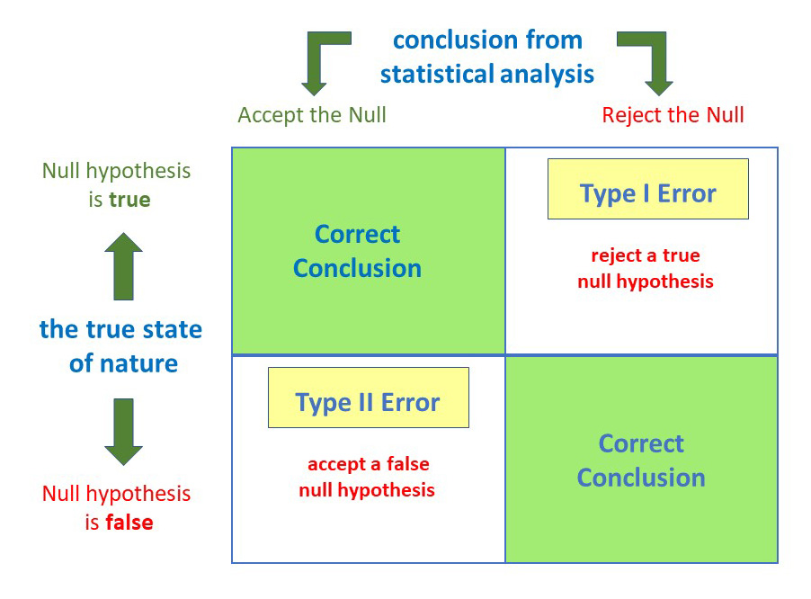
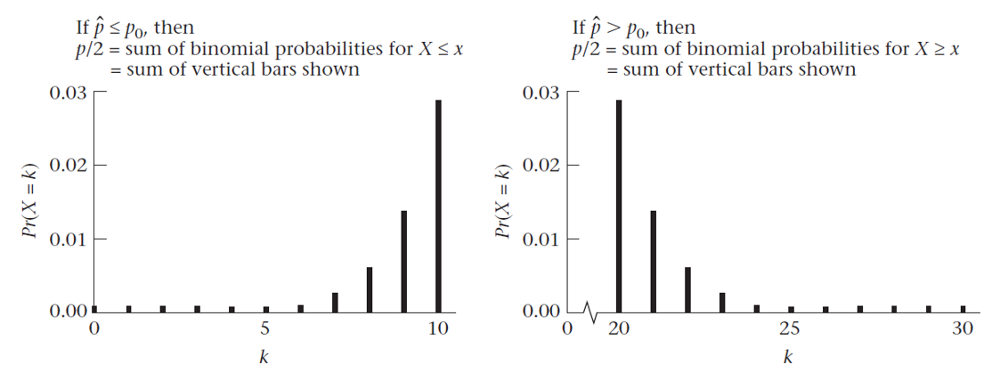

class: inverse, center, middle

# AlwaysR, Módulo III: Estadística en R

## Clase 2: Pruebas de hipótesis. ANOVA. Comparaciones múltiples.

### Giancarlo M. Correa


---

```{r setup, include=FALSE}
options(htmltools.dir.version = FALSE)
```

class: inverse, center, middle

# Pruebas de hipótesis

```{r xaringan-logo, echo=FALSE}
xaringanExtra::use_logo(
  image_url = "LOGO06.png", position = xaringanExtra::css_position(bottom = '-3em', left = 0),
  link_url = 'https://cousteau-group.com/', width = "70px"
)
```

---

# Tipos de estudios

## Experimental

* Laboratorio ó en campo

* Podemos elegir a los individuos

* Requiere manipulación

* Normalmente usado para estudiar diferentes ‘tratamientos’

* Puede determinar causalidad

---

# Tipos de estudios

## Observacional

* En campo

* Diseño de muestreo

* Los individuos no son elegidos a voluntad

* Utilizado normalmente para estudiar diferentes ‘tratamientos’ y realizar inferencias acerca de la población

* Difícil para determinar causalidad

---

# Prueba de hipótesis

* De una muestra

* De dos muestras

--

```{r echo = FALSE, out.width=450, fig.align="center"}

```

---

# Prueba de hipótesis

* **Hipótesis nula** ( $H_0$ ): Un valor especificado o rango de valores para el parámetro de interés. Normalmente representa los valores ‘no interesantes’.

Ejemplo: $H_0: \mu = 0$

--

* **Hipótesis alternativa** ( $H_A$ ): Un valor especificado diferente o rango de valores para el parámetro de interés. Normalmente representan los valores ‘interesantes’.

Ejemplo: $H_A: \mu > 0$

---

# Prueba de hipótesis

Podemos obtener dos resultados:

* Rechazar la hipótesis nula
* Fallar en rechazar la hipótesis nula

--

```{r echo = FALSE, out.width=450, fig.align="center"}

```

---

# Componentes de una prueba de hipótesis

* **Nivel de significancia** ( $\alpha$ ): probabilidad de un error Tipo I (rechazar la hipótesis nula cuando de hecho es verdadera). 

--

* **Estadístico de prueba**: Valor calculado a partir de una función de los valores muestreados que es usado para decidir entre la hipótesis nula o alternativa.

--

* **Distribución de referencia**: Distribución que usamos para decidir si rechazamos la hipótesis nula.

--

* **Región de rechazo**: Valores para los cuales la hipótesis nula será rechazada.

--

* **Valor crítico**: Valor con el cual el estadístico de prueba será comparado para decidir si rechazamos la hipótesis nula.

---

# Componentes de una prueba de hipótesis

Ejemplo: Para $H_0: \mu = 0$

```{r echo = FALSE, out.width=500, fig.align="center"}

```

---

class: inverse, center, middle

# Pruebas de hipótesis de una muestra

---

# Prueba Z (Z-test)

Tenemos: $H_0: \mu\leq \mu_0$ ó $H_0: \mu\geq \mu_0$ ó $H_0: \mu=\mu_0$

--

Estadístico de prueba:

$$Z = \frac{\bar{X}-\mu_0}{\sqrt{\sigma^2/n}}$$

Se asume que la varianza de la población es conocida ( $\sigma^2$ ). $n$ es el individuos en la muestra. $\bar{X}$ es la media de la muestra.

--

Distribución de referencia: $Z \sim N(0,1)$

--

Decisión:

* $H_A: \mu > \mu_0$: Rechazamos $H_0$ cuando $Z>z_{1-\alpha}$
* $H_A: \mu < \mu_0$: Rechazamos $H_0$ cuando $Z<z_{1-\alpha}$
* $H_A: \mu \neq \mu_0$: Rechazamos $H_0$ cuando $\mid Z\mid >z_{1-\alpha /2}$

---

# P-valor

* **p-value**: Probabilidad de observar una media muestral que es tanto o más extrema que la observada, bajo la hipótesis nula es verdadera.

```{r echo = FALSE, out.width=500, fig.align="center"}
knitr::include_graphics("images/fig4.png")
```


---

# Prueba Z (Z-test)

Ejemplo: Dado $H_0: \mu = 12$ y $H_A: \mu \neq 12$. Obtenemos un $Z=2.1$ y un $p-value=0.0357$. La correcta interpretación es: Hay 3.57% de probabilidad de observar el $Z$ obtenido (o uno mayor) cuando la hipótesis nula es verdadera ( $\mu = 12$ ).

--

```{r echo = FALSE, out.width=500, fig.align="center"}
knitr::include_graphics("images/fig5.png")
```

---

# Intervalos de confianza

El intervalo construido contendrá el valor verdadero de $\mu$ (media de la población) el $(1-\alpha)100\%$ de las veces que repetimos el experimento.

--

```{r echo = FALSE, out.width=500, fig.align="center"}
knitr::include_graphics("images/fig6.png")
```

--

* **NO** es correcto decir que hay $(1-\alpha)100\%$ de probabilidad que la media de la población este en este intervalo (de un experimento en específico).

---

# Prueba Z (Z-test)

Veamos la distribución de la variable `Sepal.Width` de la base de datos `iris`:

```{r, echo = FALSE, out.width=450, fig.align="center"}
hist(iris$Sepal.Width)
```

---

# Prueba Z (Z-test)

Para: 

* $H_0: \mu = 0$
* $H_A: \mu \neq 0$
* $\sigma = 0.4$

En R podemos usar:

```{r, echo = FALSE, message = FALSE, warning=FALSE}
library(BSDA)
```

```{r}
z.test(x = iris$Sepal.Width, alternative = 'two.sided', 
       mu = 0, sigma.x = 0.4)
```

---

# Prueba Z (Z-test)

Para: 

* $H_0: \mu \geq 0$
* $H_A: \mu < 0$
* $\sigma = 0.4$

En R podemos usar:

```{r, echo = FALSE, message = FALSE, warning=FALSE}
library(BSDA)
```

```{r}
z.test(x = iris$Sepal.Width, alternative = 'less', 
       mu = 0, sigma.x = 0.4)
```

---

# Prueba Z (Z-test)

Para: 

* $H_0: \mu \leq 0$
* $H_A: \mu > 0$
* $\sigma = 0.4$

En R podemos usar:

```{r, echo = FALSE, message = FALSE, warning=FALSE}
library(BSDA)
```

```{r}
z.test(x = iris$Sepal.Width, alternative = 'greater', 
       mu = 0, sigma.x = 0.4)
```

---

# Prueba t (t-test)

Tenemos: $H_0: \mu\leq \mu_0$ ó $H_0: \mu\geq \mu_0$ ó $H_0: \mu=\mu_0$

--

Estadístico de prueba:

$$t = \frac{\bar{X}-\mu_0}{\sqrt{s^2/n}}$$

$n$ es el individuos en la muestra. $\bar{X}$ es la media de la muestra. $s^2$ es la varianza muestral.

--

Distribución de referencia: $t \sim t_{n-1}$

--

Decisión:

* $H_A: \mu > \mu_0$: Rechazamos $H_0$ cuando $t>t_{n-1,1-\alpha}$
* $H_A: \mu < \mu_0$: Rechazamos $H_0$ cuando $t<t_{n-1,\alpha}$
* $H_A: \mu \neq \mu_0$: Rechazamos $H_0$ cuando $\mid t\mid >t_{n-1,1-\alpha /2}$

---

# Prueba t (t-test)

Para: 

* $H_0: \mu = 0$
* $H_A: \mu \neq 0$

En R podemos usar:

```{r}
t.test(x = iris$Sepal.Width, alternative = 'two.sided', 
       mu = 0)
```

---

# Prueba binomial (exacta)

Ejemplo:

Supongamos que realizo un muestreo de una población y capturé 20 individuos ( $n=20$ ). El evento de interés es que un individuo sea macho ( $p = P(macho)$ ). Tenemos que $H_0: p=0.5$ y $H_A: p>0.5$. Entonces:

* Si observo $X = 2$ machos, debo rechazar $H_0$?

--

* Si observo $X = 10$ machos, debo rechazar $H_0$?

--

* Si observo $X = 16$ machos, debo rechazar $H_0$?

---

# Prueba binomial (exacta)

```{r echo = FALSE, out.width=500, fig.align="center"}

```


---

# Prueba binomial (exacta)

Tenemos: $H_0: p\leq p_0$ ó $H_0: p\geq p_0$ ó $H_0: p=p_0$

--

Distribución de referencia: $X \sim Binom(n,p_0)$

Donde $X = \sum_{i=1}^n Y_i$, e $Y_i$ es un evento con éxito/fracaso:

$$P(Y_i=1)=p\hspace{3cm}P(Y_i=0)=1-p$$

--

Decisión:

* $H_A: \mu > \mu_0$: Rechazamos $H_0$ cuando?
* $H_A: \mu < \mu_0$: Rechazamos $H_0$ cuando?
* $H_A: \mu \neq \mu_0$: Rechazamos $H_0$ cuando?

---

# Prueba binomial (exacta)

```{r echo = FALSE, out.width=800, fig.align="center"}

```

---

# Prueba binomial (exacta)

Tenemos: 

* $H_0: p = 0.5$
* $H_A: p \neq 0.5$

Para la variable `Species` de la base de datos `iris`, donde la presencia de la especie `setosa` es mi evento de interés: 

```{r}
X = sum(iris$Species == 'setosa')
n = nrow(iris)
```

---

# Prueba binomial (exacta)

* $H_0: p = 0.5$
* $H_A: p \neq 0.5$

En R podemos usar:

```{r}
binom.test(x = X, n = n, p = 0.5, alternative = 'two.sided')
```

---

# Prueba Kolmogorov-Smirnov

Utilizada para testear la distribución de una variable.

--

Estadístico de prueba:

$$D = sup_x \mid \hat{F}(x) - F_0(x)\mid$$

Donde $\hat{F}(x)=\frac{1}{n}\sum_{i=1}^n 1\{X_i\leq x\}$, la cual es la proporción de observaciones menores a $x$.

--

```{r echo = FALSE, out.width=350, fig.align="center"}

```


---

# Prueba Kolmogorov-Smirnov

Simulamos una variable:

```{r, out.width=350, fig.align="center"}
rVar = rnorm(n = 100, mean = 5, sd = 1)
hist(rVar)
```


---

# Prueba Kolmogorov-Smirnov


En R podemos usar:

```{r}
ks.test(x = rVar, y = 'pnorm', mean = 3, sd = 0.4, 
        alternative = 'two.sided')
```

--

En este caso:

* $H_0: F(x) = N(3,0.4^2)$
* $H_A: F(x) \neq N(3,0.4^2)$


---

class: inverse, center, middle

# Pruebas de hipótesis de dos muestras

---

# Tipos de pruebas de dos muestras

* **Muestras emparejadas**: un individuo muestreado en la primera muestra está relacionado a otro único individuos en la segunda muestra.

--

* **Muestras independientes**: individuos de la primera muestra son independientes a los individuos de la segunda muestra.

---

# Prueba t de muestras independientes

Tenemos: $H_0: \delta\leq \delta_0$ ó $H_0: \delta\geq \delta_0$ ó $H_0: \delta=\delta_0$

Donde: $\delta = \mu_X-\mu_Y$

--

Estadístico de prueba:

$$t = \frac{\hat{\delta}-\delta_0}{\sqrt{s_p^2/m + s_p^2/n}}$$

$m$ es el número de individuos en la muestra 1 y $n$ es el número de individuos en la muestra 2. $\bar{X}$ es la media de la muestra. $s_p^2$ es la varianza agrupada. $\hat{\delta} = \bar{X}-\bar{Y}$.

--

Distribución de referencia: $t \sim t_{m+n-2}$

--

Decisión:

* $H_A: \delta > \delta_0$: Rechazamos $H_0$ cuando $t>t_{m+n-2,1-\alpha}$
* $H_A: \delta < \delta_0$: Rechazamos $H_0$ cuando $t<t_{m+n-2,\alpha}$
* $H_A: \delta \neq \delta_0$: Rechazamos $H_0$ cuando $\mid t\mid >t_{m+n-2,1-\alpha /2}$


---

# Prueba t de muestras independientes

Para la variable `Petal.Length`, podemos seleccionar los valores para la especie `setosa` y `virginica`:

```{r}
setosaVal = iris$Petal.Length[iris$Species == 'setosa']
virginicaVal = iris$Petal.Length[iris$Species == 'virginica']
```

---

# Prueba t de muestras independientes

Y en R podemos usar la función:

```{r}
t.test(x = setosaVal, y = virginicaVal, alternative = 'two.sided', 
       mu = 0, paired = FALSE, var.equal = FALSE)
```

--

Donde:

* $H_0: \delta = 0$
* $H_A: \delta \neq 0$

--

Tener cuidado al especificar los argumentos `paired` y `var.equal`.

---

# Prueba t de muestras emparejadas

Tenemos: $H_0: \delta\leq \delta_0$ ó $H_0: \delta\geq \delta_0$ ó $H_0: \delta=\delta_0$

Donde: $\delta = \mu_X-\mu_Y$

--

Estadístico de prueba:

$$t = \frac{\hat{D}-\delta_0}{\sqrt{(s_x^2+s_y^2-2s_{xy})/n}}$$

$m$ es el número de individuos en la muestra 1 y $n$ es el número de individuos en la muestra 2. $\bar{X}$ es la media de la muestra. $s_p^2$ es la varianza agrupada. $\hat{D} = \bar{X}-\bar{Y}$.

--

Distribución de referencia: $t \sim t_{n-1}$

--

Decisión:

* $H_A: \delta > \delta_0$: Rechazamos $H_0$ cuando $t>t_{n-1,1-\alpha}$
* $H_A: \delta < \delta_0$: Rechazamos $H_0$ cuando $t<t_{n-1,\alpha}$
* $H_A: \delta \neq \delta_0$: Rechazamos $H_0$ cuando $\mid t\mid >t_{n-1,1-\alpha /2}$

---

# Prueba t de muestras emparejadas

Usemos la base de datos:

```{r, warning=FALSE, message=FALSE}
library(PairedData)
data(BloodLead)
head(BloodLead)
```

---

# Prueba t de muestras emparejadas

En R podemos usar la función:

```{r}
t.test(x = BloodLead$Exposed, y = BloodLead$Control, alternative = 'two.sided', 
       mu = 0, paired = TRUE)
```

--

Donde:

* $H_0: \delta = 0$
* $H_A: \delta \neq 0$

---

# Pruebas no paramétricas

## Prueba Wilcoxon Signed-Rank

Utilizado cuando tenemos observaciones emparejadas y no tenemos información para asumir una distribución normal de la variable. Usando esta prueba podemos decidir si las distribuciones de los datos comparados son idénticas.

Usemos la base de datos:

```{r, warning=FALSE, message=FALSE}
library(MASS)
head(immer)
```


---

# Pruebas no paramétricas

## Prueba Wilcoxon Signed-Rank

En R podemos usar:

```{r}
wilcox.test(x = immer$Y1, y = immer$Y2, paired=TRUE) 
```

* $H_0:$ las distribuciones son idénticas
* $H_A:$ las distribuciones no son idénticas

---

# Pruebas no paramétricas

## Prueba Mann-Whitney-Wilcoxon

Utilizado cuando tenemos observaciones independientes y no tenemos información para asumir una distribución normal de la variable. Usando esta prueba podemos decidir si las distribuciones de los datos comparados son idénticas.

Usemos la base de datos:

```{r, warning=FALSE, message=FALSE}
head(mtcars)
```


---

# Pruebas no paramétricas

## Prueba Mann-Whitney-Wilcoxon

En R podemos usar:

```{r}
wilcox.test(mpg ~ am, data=mtcars, paired = FALSE) 
```

* $H_0:$ las distribuciones son idénticas
* $H_A:$ las distribuciones no son idénticas

---

# Pruebas no paramétricas

## Prueba Kruskal-Wallis

Utilizado cuando tenemos observaciones independientes y no tenemos información para asumir una distribución normal de la variable. Usando esta prueba podemos decidir si las distribuciones de los datos comparados son idénticas.

Usemos la base de datos:

```{r, warning=FALSE, message=FALSE}
head(airquality)
```


---

# Pruebas no paramétricas

## Prueba Kruskal-Wallis

En R podemos usar:

```{r}
kruskal.test(Ozone ~ Month, data = airquality) 
```

* $H_0:$ las distribuciones son idénticas
* $H_A:$ las distribuciones no son idénticas

---

# Prueba Chi-cuadrado de Pearson

Empleado para hacer una prueba a una tabla de contingencia de dos variables categóricas. Evalúa si hay una asociación significativa entre las categorías de las dos variables.

```{r, echo = FALSE}
myTab = as.table(rbind(c(100,20), c(50,30)))
dimnames(myTab) = list(pet = c("Cat", "No-Cat"),
                   ill = c("Toxo","no-Toxo"))
```

```{r}
myTab
```

---

# Prueba Chi-cuadrado de Pearson

En R podemos usar:

```{r}
chisq.test(x = myTab)
```

--

* $H_0:$ las variables son independientes entre ellas
* $H_A:$ las variables **no** son independientes entre ellas

---

class: inverse, center, middle

# Análisis de Varianza (ANOVA)

---

# ANOVA

Tenemos varias muestras de diferentes poblaciones:

--

* Muestra 1: $X_{11}, ..., X_{1n_1}$ de la población 1 con media $\mu_1$ y varianza $\sigma_1^2$.

* Muestra 2: $X_{21}, ..., X_{2n_2}$ de la población 2 con media $\mu_2$ y varianza $\sigma_2^2$.

* Muestra m: $X_{m1}, ..., X_{mn_m}$ de la población m con media $\mu_m$ y varianza $\sigma_m^2$.

---

# ANOVA

Supuestos:

* Independencia dentro de grupos

* Independencia entre grupos

* Normalidad de la variable

* Igual varianza en todas las poblaciones

---

# ANOVA

La pregunta al usar un ANOVA es: Son las medias poblacionales iguales una con otra?

--

Por lo tanto, la hipótesis nula es:

$H_0: \mu_1=\mu_2=...=\mu_m$

--

La hipótesis alternativa es:

$H_A: \mu_1\neq \mu_2\neq...\neq \mu_m$

--

En palabras sencillas, un ANOVA compara la varianza dentro de los grupos con la varianza de todas las observaciones juntas para decidir si las medias poblacionales son iguales (es por esto que es llamado análisis de varianza).

---

# ANOVA

Ejemplo:

```{r echo = FALSE, out.width=650, fig.align="center"}

```

---

# ANOVA

A razonar:

```{r echo = FALSE, out.width=650, fig.align="center"}

```


---

# ANOVA

Observamos diferencias significativas?

```{r, echo = FALSE, out.width=450, fig.align="center"}
ggplot(data = iris, aes(y = Sepal.Length, x = Species, fill = Species)) +
  geom_boxplot()
```

---

# ANOVA

Hagamos un ANOVA para la variable seleccionada:

```{r}
myAnova = aov(Sepal.Length ~ Species, data = iris)
summary(myAnova)
```

---

# Comparaciones de pares múltiples

Un ANOVA nos dice si alguna media es diferente, pero no nos dice cuál.

--

Si queremos comparar medias por pares, podemos usar una prueba Tukey.

## Prueba Tukey

```{r}
TukeyHSD(x = myAnova)
```

---

# ANOVA

Tenemos que verificar los supuestos de un ANOVA:

--

### Homogeneidad de varianza

```{r, echo = FALSE, out.width=400, fig.align="center"}
plot(myAnova, 1)
```

---

# ANOVA

### Homogeneidad de varianza

```{r, message = FALSE, warning=FALSE}
library(car)
leveneTest(y = myAnova)
```

* $H_0$: varianzas son iguales (homogéneas)
* $H_A$: varianzas no son iguales (homogéneas)

---

# ANOVA

### Normalidad

```{r, echo = FALSE, out.width=400, fig.align="center"}
plot(myAnova, 2)
```

---

# ANOVA

### Normalidad: Prueba de Shapiro

```{r}
aov_residuals <- residuals(object = myAnova )
shapiro.test(x = aov_residuals )
```

* $H_0$: la distribución es normal
* $H_A$: la distribución **no** es normal


---

class: inverse, center, middle

# Gracias!

Contacto: [**cursos@cousteau-group.com**](mailto:cursos@cousteau-group.com)

```{r echo = FALSE, out.width=450, fig.align="center"}
knitr::include_graphics("LOGO05.png")
```
