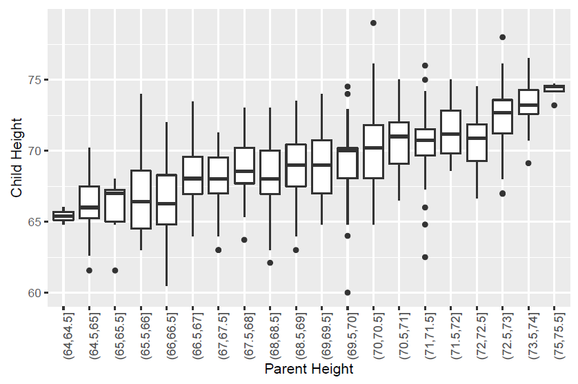
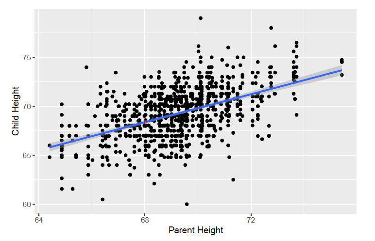

class: inverse, center, middle

# AlwaysR, Módulo III: Estadística en R

## Clase 3: Modelos lineales I

### Dr. Giancarlo M. Correa


---

```{r setup, include=FALSE}
options(htmltools.dir.version = FALSE)
```

class: inverse, center, middle

# Modelos lineales

```{r xaringan-logo, echo=FALSE}
xaringanExtra::use_logo(
  image_url = "LOGO06.png", position = xaringanExtra::css_position(bottom = '-3em', left = 0),
  link_url = 'https://cousteau-group.com/', width = "70px"
)
```

---

# Pregunta de investigación

¿Cómo varía la media de la variable respuesta $Y$ en función a diferentes valores de la variable independiente $X$?

--

```{r, echo = FALSE, message=FALSE, warning=FALSE}
library(Sleuth3)
library(ggplot2)
data(ex0726)
ex0726$cHeight <- ifelse(ex0726$Gender == "male", ex0726$Height,
                         1.08*ex0726$Height)
ex0726$pHeight <- (ex0726$Father + 1.08*ex0726$Mother)/2
```

```{r, out.width=450, fig.align="center", echo = FALSE,message=FALSE, warning=FALSE}
ggplot(ex0726, aes(y=cHeight, x=pHeight)) +
      geom_point() +
      geom_smooth(method="lm") +
      labs(x="Parent Height", y="Child Height")
```

---

# Pregunta de investigación

Para este ejemplo, la pregunta es:

--

* ¿El promedio de altura de niños varía con la altura de los padres?

--

¿Si no supieramos usar un modelo lineal, que alternativas tendríamos para responder esta pregunta?

--

Podríamos agrupar la altura de padres en variables categóricas y ejecutar un ANOVA.

---

# Pregunta de investigación

Diferentes medidas de agrupamiento:

```{r echo = FALSE, out.width=600, fig.align="center"}

```


---

# Pregunta de investigación

Diferentes medidas de agrupamiento:

```{r echo = FALSE, out.width=600, fig.align="center"}

```

---

# Regresión lineal simple

Establecer un modelo para:

$$\mu(altura_{niños}\mid altura_{padres})$$

--

Para este caso, no estamos agrupando la altura de padres, sino estimamos una altura media de niños diferente para cada valor de la altura de padres.

--

Para esto usamos un modelo lineal, asumiendo que estas variables **varían linealmente**:

$$\mu(altura_{niños}\mid altura_{padres}) = \beta_0 +\beta_1altura_{padres}$$

---

# Regresión lineal simple

La ecuación anterior puede ser expresada más generalmente:

$$\mu(Y\mid X) = \beta_0 +\beta_1X$$

--

* $\beta_0$: intercepto de $\mu(Y\mid X=0)$
* $\beta_1$: pendiente (cuanto cambia $\mu(Y\mid X)$ cuando $X$ varía una unidad)

---

Para este ejemplo, $\beta_0 = 19.8261$ y $\beta_1=0.7139$.

```{r, out.width=450, fig.align="center", echo = FALSE,message=FALSE, warning=FALSE}
ggplot(ex0726, aes(y=cHeight, x=pHeight)) +
      geom_point() +
      geom_smooth(method="lm") +
      labs(x="Parent Height", y="Child Height")
```

--

Interpretación: A un valor dado de $X$, el estimado del modelo del valor medio de $Y$ es $19.8261+0.7139X$.

---

Por ejemplo:

```{r, out.width=450, fig.align="center", echo = FALSE,message=FALSE, warning=FALSE}
ggplot(ex0726, aes(y=cHeight, x=pHeight)) +
      geom_point() +
      geom_smooth(method="lm", se = FALSE) +
      geom_vline(xintercept=66, color = "red") +
      geom_hline(yintercept=66.94, color = "red") +
      labs(x="Parent Height", y="Child Height")
```

--

La altura media estimada de niños cuando la altura de padre es $X=66$ es $19.8261+0.7139(66) = 66.94$. En otras palabras: $\hat{\mu}(Y\mid X=66)=66.94$.

---

# Regresión lineal

La media estimada de $Y$ dada el valor de $X$ es escrito como:

$$\hat{\mu}(Y\mid X) = \hat{\beta_0} + \hat{\beta_1}X$$

Donde:

- $\hat{\beta_0}$ es el estimado del intercepto
- $\hat{\beta_1}$ es el estimado de la pendiente

--

### Valores ajustados

En ocasiones llamamos a la media estimada en $X=x$ el valor ajustado:

$$\hat{Y_i} = \hat{\mu}(Y_i \mid X_i) = \hat{\beta_0} + \hat{\beta_1}X_i$$
---

# Regresión lineal

### Residuos

Tienen el mismo significado que en un ANOVA. Son la diferencia entre el estimado del modelo y el valor observado:

$$Y_i - \hat{Y_i} = Y_i - (\hat{\beta_0} + \hat{\beta_1}X_i)$$

--

El residual correspondiente a la observación $i$ es simplemente la distancia vertical del punto $(X_i,Y_i)$ de la linea ajustada:


```{r echo = FALSE, out.width=400, fig.align="center"}

```

---

# Regresión lineal

¿Qué pasa si la línea ajustada es diferente?

```{r echo = FALSE, out.width=600, fig.align="center"}

```

---

# Regresión lineal

¿Qué línea parece mejor?

```{r echo = FALSE, out.width=600, fig.align="center"}

```

---

# Regresión lineal

La mejor línea estimada para $\mu(Y\mid X)$:

```{r echo = FALSE, out.width=600, fig.align="center"}

```

Intercepto es 19.8261 y pendiente es 0.7139. Interpretación: A un valor dado de $X$, el estimado del valor medio de $Y$ por el modelo es $19.8261 + 0.7139X$.


---

# Regresión lineal

En R podemos usar:

```{r}
mod <- lm(cHeight ~ pHeight, data=ex0726)
summary(mod)
```

---

# Correlación

El coeficiente de correlación de la muestra $r_{XY}$ es una forma de medir la asociación lineal entre dos variables $X$ e $Y$ en una muestra de pares $(X_i,Y_i)$:

$$r_{XY} = \frac{\frac{1}{n-1} \sum_{i=1}^n (X_i-\bar{X})(Y_i-\bar{Y})}{s_Xs_Y}$$

--

- $r_{XY}$ toma valores entre -1 y 1
- $r_{XY} = 1$: los puntos $(X_i,Y_i)$ caen exactamente en una línea con pendiente positiva
- $r_{XY} = -1$: los puntos $(X_i,Y_i)$ caen exactamente en una línea con pendiente negativa

--

Importante

- Correlación no nos dice la historia completa de asociación
- Correlación nos dice acerca de la fuerza de una asociación lineal

---

# Correlación

```{r echo = FALSE, out.width=600, fig.align="center"}

```

---

# Regresión lineal

El modelo lineal también puede ser escrito como:

$$Y_i= \beta_0 + \beta_1 X_i + \epsilon_i$$

Donde $\epsilon_i$ es el error de la observación $i$.

--

Es asumido que:

- $E(\epsilon_i) = 0$
- $Var(\epsilon_i) = \sigma^2$ 

---

# Regresión lineal

Supuestos

1. El modelo lineal es correcto: La media de $Y$ es una función lineal de $X$. Esto es: $\mu(Y \mid X) = \beta_0 + \beta_1X$.

2. Los pares de observaciones $(X_i,Y_i)$ son independientes una de otra.

3. La varianza de cada $Y_i$ alrededor de su media $\mu(Y \mid X) = \beta_0 + \beta_1X$ es el mismo valor $\sigma^2$ (homocedasticidad).

4. La distribución de $Y_i$ alrededor de su media $\mu(Y \mid X) = \beta_0 + \beta_1X$ es normal.

---

# Regresión lineal

Si estos cuatro supuestos cumplen, entonces podemos decir que:

$$\hat{\beta_0} \sim N(\beta_0, \sigma^2_{\beta_0})$$

$$\hat{\beta_1} \sim N(\beta_1, \sigma^2_{\beta_1})$$

--

```{r echo = FALSE, out.width=600, fig.align="center"}

```


---

# Regresión lineal

```{r}
summary(mod)
```

---

# Regresión lineal

### Intervalos de confianza

```{r}
confint(mod, level = 0.95)
```


---

# Inferencia

### Sobre los parámetros estimados

* $\beta_0$: ¿Es cero un valor adecuado para el intercepto? $H_0: \beta_0=0$ y $H_A: \beta_0 \neq 0$

* $\beta_1$: ¿Es cero un valor adecuado para la pendiente? $H_0: \beta_1=0$ y $H_A: \beta_1 \neq 0$


### Sobre la media estimada

```{r echo = FALSE, out.width=400, fig.align="center"}

```

---

# Inferencia

### Sobre las predicciones de nuevas observaciones

Intervalo que contiene el 95% de las alturas de niños para la subpoblación con padres que tienen 68 *(añadir unidades)* de altura.

```{r echo = FALSE, out.width=500, fig.align="center"}

```


---

# Inferencia

- El $R^2$ nos dice la proporción de la varianza en la respuesta explicada por las variables independientes.

- Usualmente, un mayor $R^2$ es mejor.

- Sin embargo, cuando se tienen varias variables explicativas, es preferible usar $R^2-adj$.


---

# Inferencia


```{r}
summary(mod)
```


---

```{r , out.width=400, fig.align="center", warning=FALSE, message=FALSE}
pi = predict(object = mod, interval = 'prediction') # intentar interval = 'confidence'
newdf = cbind(ex0726, pi)

ggplot(newdf, aes(x=pHeight, y=cHeight )) +
  geom_point() +
  geom_smooth(method="lm", se=TRUE) +
  geom_line(aes(y=lwr), color = "red", linetype = "dashed") +
  geom_line(aes(y=upr), color = "red", linetype = "dashed")
```


---

# Interpretación

### Pendiente

Una unidad de incremento en $X$ está asociado con un incremento en $\hat{\beta_1}$ en la media de $Y$.

--

¿Qué significa si rechazamos $H_0: \beta_1 = 0$?

--

- Hay una posible tendencia lineal en la media de $Y$ en función a $X$.

--

¿Qué significa si fallamos en rechazar $H_0: \beta_1 = 0$

--

- No hay evidencia (a un nivel de $\alpha$, $p-value=...$) para una tendencia lineal en la media de $Y$ en función a $X$.


---

# Regresión múltiple

Implementar un modelo con

- Una sola variable respuesta $Y$

- 2 o más variables independientes $X_1, X_2, ..., X_p$

--

La variable respuesta debe ser continua

Las variables independientes pueden ser continuas, discretas o categóricas.

--

La notación es:

$$Y_i = \beta_0 + \beta_1 X_{i1} +  \beta_2 X_{i2} + ... +  \beta_p X_{ip} + \epsilon_i$$

Para $i=1,...,n$.

---

# Interpretación

- Intercepto $\beta_0$: Da la respuesta media cuando todas las variables explanatorias (o independientes) son cero, esto es, cuando $X_1 = X_2 = ... = X_p=0$.

--

- Pendientes $\beta_1, ..., \beta_p$: $\beta_j$ representa el cambio en la respuesta media de $Y$ para un incremento en una unidad de la variable $X_j$, manteniendo todas las otras variables explanatorias constantes.

---

# Regresión múltiple

```{r}
library(Sleuth3)
head(case0902)
```

--

- **Objetivo**: Encontrar una relación entre el peso del cerebro (respuesta) y otras variables explicativas (o independientes).

- **Unidades experimentales**: 96 especies de mamíferos

- **Respuesta**: Promedio de peso de cerebro `Brain` (gramos)

- **Variables independientes**: `Body` (kilogramos), `Gestation` (days), `Litter` (número)

---

# Regresión múltiple

```{r}
mod <- lm(Brain ~ Body + Gestation + Litter, data=case0902)
summary(mod)
```

---

# ANOVA

Usado para comparar dos modelos anidados:

```{r}
mod1 = lm(Brain ~ 1, data=case0902)
mod2 = lm(Brain ~ Body + Gestation + Litter, data=case0902)

anova(mod1, mod2)
```

--

- $H_0$: $\beta_1=\beta_2 =\beta_3=0$
- $H_1$: al menos uno de $\beta_1$ o $\beta_2$ o $\beta_3$ no es cero.

---

# Revisión del modelo: varianza constante

```{r, out.width=450, fig.align="center"}
plot(mod, which = 1)
```

---

# Revisión del modelo: normalidad

```{r, out.width=450, fig.align="center"}
plot(mod, which = 2)
```

---

# Revisión del modelo

Existen tres tipos de observaciones *raras* que podemos mencionar:

- Una observación es dicha tener un alto *leverage* si el valor de la observación de la variable explanatoria es diferente del patrón general (solo en el espacio de las variables explanatorias).

- Una observación es un *outlier* si la observación no se ajusta dentro del modelo ajustado.

- Una observación es dicha ser *influyente* si el modelo ajustado depende indudablemente de su valor (i.e. cuando esta observación se remueve, los parámetros estimados cambian enormemente). 

---

# Revisión del modelo: leverage

```{r, out.width=450, fig.align="center"}
plot(mod, which = 5)
```

---

# Revisión del modelo: outlier

```{r, out.width=450, fig.align="center"}
plot(mod, which = 3)
```


---

# Revisión del modelo: influencia

```{r, out.width=450, fig.align="center"}
plot(mod, which = 4)
```

---

# Revisión del modelo

```{r echo = FALSE, out.width=600, fig.align="center"}

```

---

# Revisión del modelo

```{r echo = FALSE, out.width=600, fig.align="center"}

```

---

# Regresión múltiple: interacción

Tenemos el modelo:

$$E(Y\mid X_1, X_2) = \beta_0 + \beta_1 X_{1} +  \beta_2 X_{2}$$

En este caso $X_1$ es continua y $X_2$ es una categórica de dos niveles (0 y 1).

--

Podemos incorporar una interacción:

$$E(Y\mid X_1, X_2) = \beta_0 + \beta_1 X_{1} +  \beta_2 X_{2} + \beta_3 (X_{1}X_{2})$$

Dos variables interactúan si el efecto de una variable sobre la respuesta media depende de la otra variable.

--

$\beta_3 (X_{1}X_{2})$ es llamado el término de interacción. Permite que el efecto de $X_1$ sobre la media de $Y$ dependa en $X_2=0$ o $X_2=1$.

---

# Regresión múltiple: interacción

Cuando $X_2=0$:

$$E(Y\mid X_1, X_2) = \beta_0 + \beta_1 X_{1}$$

--

Cuando $X_2=1$:

$$E(Y\mid X_1, X_2) = \beta_0 + \beta_1 X_{1} +  \beta_2 + \beta_3 X_{1}$$

--

Estos dos modelos nos darán una línea, y estas líneas tendrán diferentes interceptos y pendientes.

---

```{r, message=FALSE, warning=FALSE, echo=FALSE}
library(sjPlot)
library(sjmisc)
library(ggplot2)
library(faraway)
library(Sleuth3)
library(nlme)
library(olsrr)
library(lme4)
mtcars$am = factor(mtcars$am)
```

```{r}
mod1 = lm(mpg ~ cyl + am + cyl * am, data = mtcars)
summary(mod1)
```

---

```{r, out.width=500, fig.align="center"}
plot_model(mod1, type = "int")
```

---

# Regresión múltiple: interacción

Basado en el ejemplo anterior, el modelo es:

$$E(Y\mid X_1, X_2) = \beta_0 + \beta_1 X_{1} +  \beta_2 X_{2} + \beta_3 (X_{1}X_{2})$$

--

Interpretación:

- $\beta_0$: es la media de $Y$ cuando $X_1$ y $X_2$ son iguales a cero (intercepto).

--

- $\beta_1$: da el cambio en la media de $Y$ cuando $X_1$ es incrementado por una unidad y $X_2=0$.

--

- $\beta_2$: da el cambio en la media de $Y$ cuando $X_2$ cambia de 0 a 1 y $X_1$ es mantenido en cero.

--

- $\beta_3$: da la diferencia en el cambio en la media de $Y$ cuando $X_1$ es incrementado en una unidad cuando $X_2=1$, comparado al cambio en la media de $Y$ cuando $X_1$ es incrementado en una unidad cuando $X_2=0$.

---

# Continuará...

El día de mañana veremos:

- Problemas con los datos

- Datos faltantes

- Selección de modelos

- Problemas con errores

- Transformaciones

- Efectos aleatorios

---

class: inverse, center, middle

# Gracias!

Contacto: [**cursos@cousteau-group.com**](mailto:cursos@cousteau-group.com)

```{r echo = FALSE, out.width=450, fig.align="center"}
knitr::include_graphics("LOGO05.png")
```
