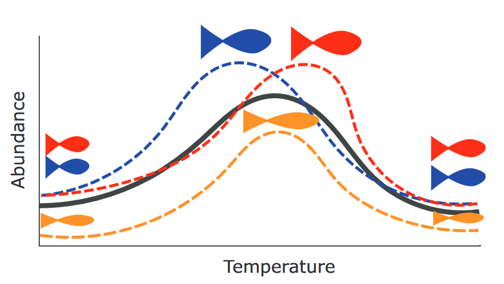
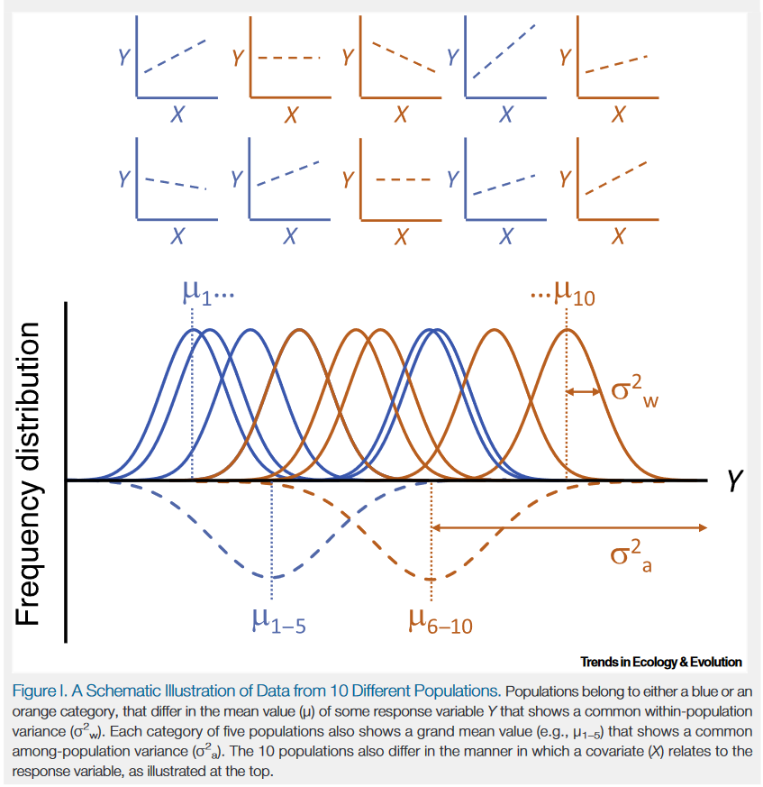

class: inverse, center, middle

# AlwaysR, Módulo III: Estadística en R

## Clase 4: Modelos lineales II. Efectos aleatorios.

### Dr. Giancarlo M. Correa


---

```{r setup, include=FALSE}
options(htmltools.dir.version = FALSE)
```

class: inverse, center, middle

# Modelos lineales II

```{r xaringan-logo, echo=FALSE}
xaringanExtra::use_logo(
  image_url = "LOGO06.png", position = xaringanExtra::css_position(bottom = '-3em', left = 0),
  link_url = 'https://cousteau-group.com/', width = "70px"
)
```

---

# Problemas con datos

### Multicolinealidad

- No genera problemas estadísticos, sin embargo, genera problemas en la interpretación.

--

- No tiene sentido interpretar *el efecto de $X_1$ manteniendo otras variables independientes constante* porque nosotros hemos observado una relación entre $X_1$ y otras variables.

---

```{r, message=FALSE, warning=FALSE, echo=FALSE}
library(sjPlot)
library(sjmisc)
library(ggplot2)
library(faraway)
library(Sleuth3)
library(nlme)
library(olsrr)
library(lme4)
mtcars$am = factor(mtcars$am)
```

```{css, echo=FALSE}
/* code without language names */
.foobar code[class="remark-code"] {
  max-height: 500px;
}
```

.foobar[
```{r}
mod2 = lm(hipcenter ~ ., data = seatpos)
summary(mod2)
```
]

---

# Problemas con datos

La matriz de correlación entre *todas* las variables:

```{r}
round(cor(seatpos), digits = 2)
```

---

# Problemas con datos

¿Qué podemos hacer cuando tenemos variables correlacionadas?

- Seleccionar las variables más importantes

--

- Identificar las variables correlacionadas claves para el modelo: variance inflation factors (VIF)

--

```{r}
round(vif(mod2), digits = 2)
```

Valores $VIF_j >10$ indican una alta colinealidad.

--

Eliminar algunas variables no significa que ellas no están asociadas con la variable respuesta, solo que no las necesitamos para predecir la respuesta.

---

# Datos faltantes

Podemos hablar de dos casos:

* **Caso faltante**: cuando no tenemos información de *todas* las variables en una observación en el conjunto de datos.

--

* **Valores faltantes**: cuando no tenemos información de *algunas* variables en una observación en el conjunto de datos.

--

```{r}
head(chmiss, n = 10)
```

---

# Datos faltantes

Hay dos enfoques para lidiar con esto:

- **Métodos de supresión**: eliminar las observaciones con algun tipo de datos faltantes.

--

- **Métodos de retención**: retienen las observaciones con datos faltantes para implementar una regresión modificada para datos faltantes.

--

### Método de supresión

Simplemente eliminar las observaciones con datos faltantes e implementar el modelo luego. R hace esto por nosotros automaticamente.

```{r, echo =FALSE}
head(chmiss, n = 7)
```

---

### Método de retención

- **Imputación**: completar los datos perdidos con la media de cada variable. Se puede usar también la mediana, moda, etc. *Problemas*: Introduce error. Métodos de estimación de parámetros pueden estar sesgados.

--

- **Imputación a partir de regresión**: Implementar un modelo lineal con las observaciones completas. Luego, predecir valores cuando hayan datos faltantes. En este caso, la variable respuesta será la variable que tiene datos faltantes y las variables independientes todas las demás variables. 

---

# Selección de modelos

El proceso de seleccionar tan pocas variables como sea posible para incluir en el modelo lineal (principio de parsimonia).

--

```{r}
head(case1201)
```

---

```{r}
mod3 = lm(SAT ~ Takers + Income + Years + Public + Expend + Rank, data=case1201)
summary(mod3)
```

---

# Selección de modelos

Con esta base de datos, el modelo más simple que podemos implementar es:

$$SAT_i=\beta_0+\epsilon_i$$

--

El modelo más complicado es:

$$SAT_i=\beta_0+ \beta_1 Income_i+ \beta_2 Takers_i + \beta_3 Years_i + \beta_4 Rank_i + \beta_5 Expend_i + \beta_6 Public_i + \epsilon_i$$

--

¿Cuantos modelos podemos implementar con esta base de datos?

--

$2^6$ modelos posibles! (sin considerar interacciones!)

---

# Selección de modelos

- **Eliminación hacia atrás**: Comienza con el full model. Elimina la variable con mayor *p-value* y corre el modelo nuevamente. Repite este proceso hasta que el modelo solo contiene variables con *p-value* por dejabo de nivel de significancia $\alpha$.

--

- **Selección hacia adelante**: Comienza con el modelo más sencillo (solo contiene intercepto). Añade la variable con menor *p-value* por debajo de nivel de significancia $\alpha$. Repetir hasta que no haya variable que pueda ser añadida con *p-value* por debajo de nivel de significancia $\alpha$.

--

### Limitaciones

- Inclusión en el modelo no necesariamente significa que la variable es importante. 
- Exclusión no necesariamente significa que la variable no sea importante. 
- Se tiende a elegir los modelos más pequeños que los óptimos para predicción.

---

```{r}
mod3 = lm(SAT ~ Takers + Income + Years + Public + Expend + Rank, data=case1201)
backmod = ols_step_backward_p(mod3, prem=0.05, progress=FALSE) # Seleccion hacia atras
summary(backmod$model)
```


---

```{r}
mod3 = lm(SAT ~ Takers + Income + Years + Public + Expend + Rank, data=case1201)
forwardmod = ols_step_forward_p(mod3, penter=0.05, progress=FALSE) # Seleccion hacia adelante
summary(forwardmod$model)
```

---

# Selección de modelos

Métodos basados en criterio:

- $AIC$: Criterio de información de Akaike. Toma en cuenta el número de observaciones, parámetros, y suma de residuales. Normalmente el menor $AIC$ nos indica un mejor modelo.

- $BIC$: Criterio de información Bayesiana. Toma en cuenta el número de observaciones, parámetros, y suma de residuales. Normalmente el menor $BIC$ nos indica un mejor modelo.

- $R^2-adj$: El mayor valor nos indica el mejor modelo.

--

Si deseas obtener el mejor modelo, se recomienda usar $BIC$.

Si deseas usar el modelo para hacer predicciones, se recomienda usar $AIC$.

Los modelos no necesitan ser anidados para ser comparados (pero si deben contener los mismos datos).

---

```{r}
mod4 = lm(SAT ~ Years + Expend + Rank, data=case1201)
summ4 = summary(mod4)
mod5 = lm(SAT ~ Income + Years + Expend + Rank, data=case1201)
summ5 = summary(mod5)
```

Comparar modelos con $R^2-adj$:

```{r}
summ4$adj.r.squared
summ5$adj.r.squared
```

---

Comparar modelos con $AIC$:

```{r}
AIC(mod4)
AIC(mod5)
```

--

Comparar modelos con $BIC$:

```{r}
BIC(mod4)
BIC(mod5)
```

---

# Problemas con supuestos

--

### Linealidad de la asociación

- Consecuencia depende en el grado de no-linealidad.

- Buscar alternativas (e.g. modelos aditivos generalizados, splines, etc.)

--

### Independencia

- Un modelo lineal no es robusto a la no independencia de observaciones.

- Alternativa, usar la función `gls` en caso de dependencia temporal (siempre y cuando se conozca la estructura del error).

---

### Ejemplo: Dependencia temporal

```{r}
head(globwarm)
```

---

### Ejemplo: Dependencia temporal

```{r, out.width=400, fig.align="center"}
lmod = lm(nhtemp ~ wusa + jasper + westgreen + chesapeake + tornetrask + urals + mongolia + tasman, data=globwarm)
plot(lmod$residuals)
```

---

```{r}
glmod = gls(nhtemp ~ wusa + jasper + westgreen + chesapeake +
                tornetrask + urals + mongolia + tasman,
                correlation=corAR1(form=~year),
                data=na.omit(globwarm),
                method="ML")
print(glmod)
```

---

# Problemas con supuestos

### Normalidad

- Si se tiene un muestreo grande $n$, este supuesto no causa problemas importantes.

- Se recomienda usar ejercicios de simulación para saber los efectos de la no-normalidad de residuos sobre los parámetros estimados.

---

# Problemas con supuestos

### Normalidad

```{r echo = FALSE, out.width=600, fig.align="center"}

```

---

# Problemas con supuestos

### Normalidad

```{r echo = FALSE, out.width=600, fig.align="center"}

```

---

# Transformaciones

Pueden ayudar en el ajuste del modelo y cumplir los supuestos de la regresión lineal (e.g. supuesto de varianza constante).

--

En vez de $Y_i = \beta_0+\beta_1 X_i + \epsilon_i$, podemos escribir:

$$log(Y_i) = \beta_0 + \beta_1 X_i + \epsilon_i$$

--

Despues de ajustar el modelo, tenemos que volver a la escala original:

$$Y_i = exp(\beta_0 + \beta_1 X_i)exp(\epsilon_i)$$

--

Obtener la variable respuesta en su escala original no es muy complicado. Sin embargo, los coeficientes estimados ya no tienen la misma interpretación. Por ejemplo:

- Un incremento en una unidad en $X_1$ ahora multiplicaría la respuesta media (en su escala original) por $e^{\hat{\beta_1}}$.

---

```{r}
head(gala)
```

---

```{r , out.width=500, fig.align="center"}
lmod = lm(Species ~ Area + Elevation + Nearest + Scruz + Adjacent, data=gala)
plot(lmod, which=1)
```

---

```{r , out.width=500, fig.align="center"}
gala$logSpecies = log(gala$Species)
lmod = lm(logSpecies ~ Area + Elevation + Nearest + Scruz + Adjacent, data=gala)
plot(lmod, which=1)
```

---

class: inverse, center, middle

# Efectos aleatorios

---

# Efectos aleatorios

- Modelo de efectos mixtos: cuando tenemos efectos fijos (como hemos visto hasta el momento) y efectos mixtos (como describiremos aquí).

--

- **Efecto fijo**: Se asume que no hay relación entre los diferentes niveles de una variable. Ejemplo: un efecto para hembras y un efecto para machos, pero estos efectos no interactúan uno con el otro.

--

- **Efecto aleatorio**: Nos da información acerca de niveles específicos (similar a un efecto fijo), pero también a nivel poblacional. Los niveles o grupos en un efecto aleatorio puede ser pensado como una muestra de niveles de una población más grande de niveles.

---

# Efectos aleatorios

Ejemplo: Investigar el efecto de temperatura sobre la abundancia de peces que viven en un lago. En nuestra muestra, nosotros podemos tener 3 especies de peces, y vemos que el efecto de la temperatura es diferente para cada especie. Además, queremos hacer inferencia acerca de todos los peces (i.e. todas las especies) que viven en el lago.

```{r echo = FALSE, out.width=550, fig.align="center"}

```

**Ejemplo con asociación no lineal**.

---

# Efectos aleatorios

```{r echo = FALSE, out.width=480, fig.align="center"}

```

---

# Efectos aleatorios

```{r echo = FALSE, out.width=600, fig.align="center"}

```

---

# Efectos aleatorios

Tomar en cuenta:

- No usar efectos aleatorios cuando el número de niveles es bajo (3 o menor).
- No usar efectos aleatorios cuando no se quiere asumir que estos niveles vienen de una distribución común en la población.

--

¿En qué casos debo incorporar efectos aleatorios?

1. ¿Los factores pueden ser considerados como una muestra aleatoria de una distribución de probabilidad?

2. ¿La investigación tiene por objetivo hacer inferencia a una población mayor a la incluida en el modelo?

3. ¿Hay una falta de independencia estadística debido a múltiples observaciones para un mismo nivel?


---

# Efectos aleatorios

```{r}
head(sleepstudy, n = 15)
```

---

Un modelo con efecto aleatorio en el intercepto:

```{r}
lmod1 = lmer ( Reaction ~ Days + ( 1 | Subject ) , data= sleepstudy )
summary(lmod1)
```

---

Un modelo con efecto aleatorio en el intercepto:

```{r}
coef(lmod1)$Subject
```


---

Un modelo con efecto aleatorio en la pendiente:

```{r}
lmod2 = lmer ( Reaction ~ Days + ( 0 + Days | Subject ) , data= sleepstudy )
summary(lmod2)
```

---

Un modelo con efecto aleatorio en la pendiente:

```{r}
coef(lmod2)$Subject
```

---

Un modelo con efecto aleatorio en el intercepto y la pendiente:

```{r}
lmod3 = lmer ( Reaction ~ Days + ( Days | Subject ) , data= sleepstudy )
summary(lmod3)
```

---

Un modelo con efecto aleatorio en el intercepto y la pendiente:

```{r}
coef(lmod3)$Subject
```

---

# Resultados

Efectos fijos:

```{r}
sjPlot::plot_model(lmod1)
```

---

# Resultados

Efectos aleatorios (intercepto):

```{r}
sjPlot::plot_model(lmod1, type = 're')
```

---

# Resultados

Efectos aleatorios (pendiente):

```{r}
sjPlot::plot_model(lmod2, type = 're')
```

---

# Resultados

Asociación:

```{r}
sjPlot::plot_model(lmod2, type = "eff", terms = "Days")
```

---

# Resultados

```{r}
sjPlot::tab_model(lmod1)
```

--

ICC cercano a cero nos sugiere que un modelo con efectos aleatorios no es necesario.

---

class: inverse, center, middle

# Gracias!

Contacto: [**cursos@cousteau-group.com**](mailto:cursos@cousteau-group.com)

```{r echo = FALSE, out.width=450, fig.align="center"}
knitr::include_graphics("LOGO05.png")
```
