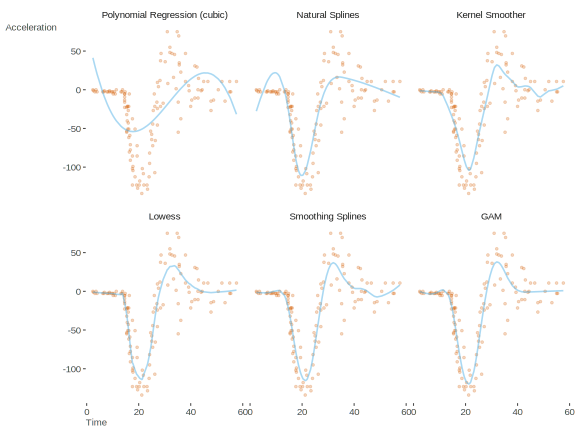
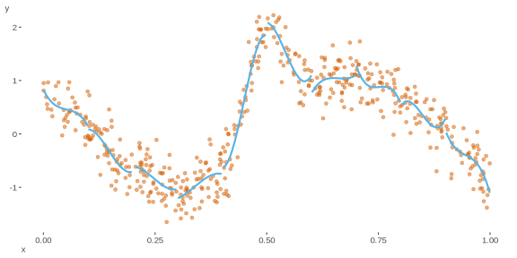

class: inverse, center, middle

# AlwaysR, Módulo III: Estadística en R

## Clase 5: Introducción a modelos lineales y aditivos generalizados (GLM y GAM)

### Dr. Giancarlo M. Correa


---

```{r setup, include=FALSE}
options(htmltools.dir.version = FALSE)
```

class: inverse, center, middle

# Modelos lineales generalizados (GLM)

```{r xaringan-logo, echo=FALSE}
xaringanExtra::use_logo(
  image_url = "LOGO06.png", position = xaringanExtra::css_position(bottom = '-3em', left = 0),
  link_url = 'https://cousteau-group.com/', width = "70px"
)
```

---

# Librerías a utilizar

A lo largo de esta clase, utilizaremos:

```{r eval= FALSE}
library(sjPlot)
library(sjmisc)
library(ggplot2)
library(faraway)
library(Sleuth3)
library(nlme)
library(lme4)
library(statmod)
library(MASS)
library(GLMsData)
library(ggeffects)
library(psych)
require(visibly)
```

---

# GLM

Un modelo lineal simple puede ser expresado como:

$$y \sim N(\mu , \sigma^2)$$

$$\mu=\beta_0+\beta_1 x_1 + \beta_2 x_2 + ... + \beta_p x_p$$

--

Un GLM es una opción cuando la varianza de la variable respuesta no es constante o no está normalmente distribuida.

--

GLM transforma la variable respuesta para que el método de estimación de parámetros siga *funcionando bien* (mediante una función *link*).

--

Al momento de implementar un GLM, debemos decidir dos cosas:

1. La distribución a utilizar
2. La función *link* (esto normalmente está por defecto en R).

$$y \sim EDM(\mu, etc)$$

$$g(\mu) = \beta_0 + \sum_{j=1}^p \beta_j x_{j}$$

---

# GLM

Por ejemplo, podemos tener:

```{r echo = FALSE, message=FALSE, warning=FALSE}
library(sjPlot)
library(sjmisc)
library(ggplot2)
library(faraway)
library(Sleuth3)
library(nlme)
library(lme4)
library(statmod)
library(MASS)
library(GLMsData)
library(ggeffects)
library(psych)
require(visibly)
```

```{r}
data(quilpie)
head(quilpie)
```

Para este caso, si `y` es la variable respuesta, entonces podemos usar:

$$y_i \sim Binom(\mu_i, m_i)$$

$$log\frac{\mu_i}{1-\mu_i} = \beta_0 + \beta_1 SOI_i$$

---

# GLM: respuesta binaria

Para una variable de respuesta binaria (e.g. 0/1 - presencia/asusencia - hembra/macho), tipicamente la modelamos con una función *link* tipo *logit* y función de varianza $\mu (1-\mu)$. La respuesta modelada son las probabilidades de registro predichas (*predicted log odds*) del evento de interés.

--

```{r}
head(hsb)
```

--

Para este ejemplo, modelaremos el registro de `hsb$prog == academic`. 

---

# GLM: respuesta binaria

En R vamos a usar:

```{r}
hsb$obj_var = ifelse(test = hsb$prog == 'academic', yes = 1, no = 0)
mod1 = glm(obj_var ~ read, family = binomial, data = hsb)
```

--

Aquí, la variable respuesta es una variable indicadora (binaria):

```{r}
hsb$obj_var[1:20]
```

---

```{r, size='tiny'}
summary(mod1)
```


---

# GLM: respuesta binaria

Vemos un par de términos nuevos:

* **Null deviance**: nos indica que tan bien la variable respuesta puede ser predicha por un modelo que solo contenga el intercepto. 

* **Residual deviance**: nos indica que tan bien la variable respuesta es predicha por el modelo implementado. 

--

Se recomienda explorar `?family` para conocer las funciones link de cada distribución.

---

# GLM: respuesta binaria

La revisión de supuestos en un GLM no es tan sencilla. Podemos revisar la independencia de observaciones (especialmente importante cuando tenemos datos que vienen con posible dependencia temporal o espacial):

```{r, out.width=370, fig.align="center"}
plot(statmod::qresid(mod1))
```

---

# GLM: respuesta binaria

```{r echo = FALSE, out.width=600, fig.align="center"}
knitr::include_graphics("images/fig27.png")
```


---

# GLM: respuesta binaria

Revisar los valores observados y ajustados:

```{r, out.width=350, fig.align="center", message=FALSE, warning=FALSE}
plot_model(model = mod1, type = 'pred', show.data = TRUE)
```

---

# GLM: respuesta binaria

Revisar distribucion asumida:

```{r, out.width=400, fig.align="center"}
qqnorm(qresid(mod1))
qqline(qresid(mod1))
```


---

# GLM: respuesta binaria

Revisar observaciones influyentes:

```{r, out.width=400, fig.align="center"}
plot(cooks.distance(mod1), type='h')
```

---

# GLM: datos de conteo

Cuando tenemos una variable discreta (e.g. conteo de individuos, de especies, etc.), es recomendable implementar el modelo usando la familia de distribuciones Poisson. 

```{r, echo = FALSE}
cases <-  
structure(list(Days = c(1L, 2L, 3L, 3L, 4L, 4L, 4L, 6L, 7L, 8L, 
8L, 8L, 8L, 12L, 14L, 15L, 17L, 17L, 17L, 18L, 19L, 19L, 20L, 
23L, 23L, 23L, 24L, 24L, 25L, 26L, 27L, 28L, 29L, 34L, 36L, 36L, 
42L, 42L, 43L, 43L, 44L, 44L, 44L, 44L, 45L, 46L, 48L, 48L, 49L, 
49L, 53L, 53L, 53L, 54L, 55L, 56L, 56L, 58L, 60L, 63L, 65L, 67L, 
67L, 68L, 71L, 71L, 72L, 72L, 72L, 73L, 74L, 74L, 74L, 75L, 75L, 
80L, 81L, 81L, 81L, 81L, 88L, 88L, 90L, 93L, 93L, 94L, 95L, 95L, 
95L, 96L, 96L, 97L, 98L, 100L, 101L, 102L, 103L, 104L, 105L, 
106L, 107L, 108L, 109L, 110L, 111L, 112L, 113L, 114L, 115L), 
    Students = c(6L, 8L, 12L, 9L, 3L, 3L, 11L, 5L, 7L, 3L, 8L, 
    4L, 6L, 8L, 3L, 6L, 3L, 2L, 2L, 6L, 3L, 7L, 7L, 2L, 2L, 8L, 
    3L, 6L, 5L, 7L, 6L, 4L, 4L, 3L, 3L, 5L, 3L, 3L, 3L, 5L, 3L, 
    5L, 6L, 3L, 3L, 3L, 3L, 2L, 3L, 1L, 3L, 3L, 5L, 4L, 4L, 3L, 
    5L, 4L, 3L, 5L, 3L, 4L, 2L, 3L, 3L, 1L, 3L, 2L, 5L, 4L, 3L, 
    0L, 3L, 3L, 4L, 0L, 3L, 3L, 4L, 0L, 2L, 2L, 1L, 1L, 2L, 0L, 
    2L, 1L, 1L, 0L, 0L, 1L, 1L, 2L, 2L, 1L, 1L, 1L, 1L, 0L, 0L, 
    0L, 1L, 1L, 0L, 0L, 0L, 0L, 0L)), .Names = c("Days", "Students"
), class = "data.frame", row.names = c(NA, -109L))
```

--

```{r}
head(cases)
```

---

# GLM: datos de conteo

Exploremos la que será la variable respuesta en nuestro modelo:

```{r, out.width=400, fig.align="center"}
hist(cases$Students)
```


---

```{r}
mod2 = glm(Students ~ Days, family = poisson, data = cases)
summary(mod2)
```

---

# GLM: datos de conteo

Verificar independencia de residuos:

```{r, out.width=400, fig.align="center"}
plot(qresid(mod2))
```

---

# GLM: datos de conteo

Revisar los valores observados y ajustados:

```{r, out.width=350, fig.align="center", warning=FALSE, message='hide'}
plot_model(model = mod2, type = 'pred', show.data = TRUE)
```

---

# GLM: datos de conteo

Revisar distribucion asumida:

```{r, out.width=400, fig.align="center"}
qqnorm(qresid(mod2))
qqline(qresid(mod2))
```

---

# GLM: datos de conteo

Revisar observaciones influyentes:

```{r, out.width=400, fig.align="center"}
plot(cooks.distance(mod2), type='h')
```

---

# GLM: datos de conteo con sobredispersión

Exploremos una nueva base de datos:

```{r, echo = FALSE}
data(discoveries)
disc = data.frame(count = as.numeric(discoveries),
                   year = seq(0, (length(discoveries) - 1)))
disc$yearSqr <- disc$year^2
```


```{r}
head(disc)
```


---

# GLM: datos de conteo con sobredispersión

Exploremos la que ahora será nuestra variable explicativa:

```{r, out.width=400, fig.align="center"}
hist(disc$count)
```

---

```{r}
mod3 = glm(count ~ year + yearSqr, family = "poisson", data = disc)
summary(mod3)
```

---

```{r}
mod4 = glm(count ~ year + yearSqr, family = "quasipoisson", data = disc)
summary(mod4)
```


---

# GLM: datos de conteo con sobredispersión

El parámetro de overdispersion ( $\phi$ ) nos indica si una distribución quasipoisson es adecuada. Si $\phi > 1$, entonces nos sugiere usa una quasipoisson, si $\phi < 1$, una quasipoisson no es necesaria.

---

# GLM: datos de conteo con sobredispersión

Revisamos los residuos:

```{r, out.width=400, fig.align="center"}
qqnorm(qresid(mod4))
qqline(qresid(mod4))
```

---

```{r}
mod5 = MASS::glm.nb(count ~ year + yearSqr, data = disc)
summary(mod5)
```

---

# GLM: datos de conteo con sobredispersión

Podemos decidir usar una distribución binomial negativa cuando, en un GLM Poisson, el ratio de Residual deviance/degrees of freedom es mayor a 1.

--

Revisamos los residuos:

```{r, out.width=350, fig.align="center"}
qqnorm(qresid(mod5))
qqline(qresid(mod5))
```

---

# GLM: respuesta gamma

Dada nuestra base de datos:

```{r}
head(case1202)
```

---

# GLM: respuesta gamma

Modelo lineal para modelar `units` como la variable respuesta:

```{r}
mod6 = lm(Exper ~ Age, data=case1202)
summary(mod6)
```

---

# GLM: respuesta gamma

Veamos los valores ajustados:

```{r,  out.width=350, fig.align="center"}
plot_model(mod6, type = 'pred', show.data = TRUE)
```

---

# GLM: respuesta gamma

Exploremos la distribución de la variable respuesta:

```{r, out.width=400, fig.align="center"}
hist(case1202$Exper)
```

---

# GLM: respuesta gamma

¿Qué alternativas tenemos?

--

Podemos implementar un GLM con respuesta gamma (solo valores positivos):

```{r}
mod7 = glm(Exper + 1 ~ Age, data = case1202, family = Gamma(link = "log"))
```

---

```{r}
summary(mod7)
```

---

# GLM: respuesta gamma

```{r,  out.width=400, fig.align="center", message=FALSE, warning=FALSE}
plot_model(mod7, type = 'pred', show.data = TRUE)
```

---

class: inverse, center, middle

# Modelos aditivos generalizados (GAM)

---

# GAM


Hay casos en donde la asociación lineal entre las variables no se cumple. Para casos donde no se tenga una relación lineal entre la variable respuesta y variables independientes, podemos utilizar un modelo aditivo generalizado:


$$y \sim EDM(\mu, etc)$$

$$g(\mu) = \beta_0 + f(x_{1}) + f(x_{2}) + ... + f(x_{p})$$

$$E(y) \sim \mu$$
--

Variables independientes ahora incorporan una función de suavizamiento (basis function, $f$ ), lo que permite relaciones no lineales entre las variables.

---

Por ejemplo:

```{r echo = FALSE, fig.align='center'}
set.seed(552)
simfunc <- function(x) {sin(2*pi*x^3)^3+0.8}
x <- seq(0, 1, by=0.01)
y <- simfunc(x) + rnorm(n=length(x), sd=0.2)
simdata <- data.frame(x, y)
ggplot(simdata, aes(x=x, y=y)) + 
  geom_point() + 
  theme_bw()
```

---

¿Podríamos implementar un ANOVA o algún modelo lineal?

```{r echo = FALSE, fig.align='center'}
set.seed(552)
simfunc <- function(x) {sin(2*pi*x^3)^3+0.8}
x <- seq(0, 1, by=0.01)
y <- simfunc(x) + rnorm(n=length(x), sd=0.2)
simdata <- data.frame(x, y)
ggplot(simdata, aes(x=x, y=y)) + 
  geom_point() + 
  theme_bw() +
geom_vline(xintercept=c(0.5, 0.85), color="red", linetype="dashed")
```

---

Una función como esta nos puede ayudar mucho:

```{r echo = FALSE, fig.align='center'}
set.seed(552)
simfunc <- function(x) {sin(2*pi*x^3)^3+0.8}
x <- seq(0, 1, by=0.01)
y <- simfunc(x) + rnorm(n=length(x), sd=0.2)
simdata <- data.frame(x, y)
ggplot(simdata, aes(x=x, y=y)) + 
  geom_point() + 
  theme_bw() +
geom_vline(xintercept=c(0.5, 0.85), color="red", linetype="dashed") +
stat_function(fun=simfunc, color="gray")
```

---

```{r echo = FALSE, out.width=700, fig.align="center"}

```

---

¿Qué es un nodo (knots)?

```{r echo = FALSE, out.width=700, fig.align="center"}

```

--

A mayor cantidad de nodos, mejor ajuste (cuidado con oversmoothing!).

---

De una forma general:

$$g(\mu) = \beta_0 + f(x_{1}) + f(x_{2}) + ... + f(x_{p})$$

--

Luego:

$$f(x_1) = \beta_0 + \beta_1x^1 + ... + \beta_dx^d$$
--

Podemos producir cualquier función polinomial!

---

# GAM en R

```{r warnings=FALSE, messages='hide'}
library(mgcv)
isit = read.csv('ISIT.csv')
isit$Season <- as.factor(isit$Season)
head(isit)
```

---

```{r}
fit_gam = gam(Sources ~ Season + s(SampleDepth), data = isit)
summary(fit_gam)
```

---

# GAM en R

Aquí hay algunos términos nuevos:

* **edf**: effective degrees of freedom. Es un resultados de la penalidad aplicada al grado de suavizamiento (detalles estadísticos en bibliografía!). Evita un over-suavizamiento o under-suavizamiento. Puede interpretarse como el nivel de suavizamiento aplicado a una variable.

* **GCV**: generalized cross validation. Es un proxy del error de predicción cuadrático medio (mean square prediction error). Esto se basa en un método llamado *leave-one-out cross validation*. Utilizado para comparar modelos (similar a *AIC*), donde el modelo con menor *GCV* es el mejor.

* **Deviance explained**: es una generalización del $R^2$ (sin ajustar).

* **Scale est.**: equivalente a la suma de cuadrado de los residuales.

---

```{r fig.align='center'}
plot(fit_gam, pages=1)
```

---

También podemos observarlo en escala de las variable respuesta:

```{r fig.align='center'}
myEffect = ggeffects::ggpredict(fit_gam, terms = "Season")
plot(myEffect)
```
---

También podemos observarlo en escala de las variable respuesta:

```{r fig.align='center'}
myEffect = ggeffects::ggpredict(fit_gam, terms = "SampleDepth")
plot(myEffect)
```

---

# GAM en R

Existen diferentes formas de suavizar una variable (smooth term), los cuales pueden ser explorados [aquí](https://stat.ethz.ch/R-manual/R-devel/library/mgcv/html/smooth.terms.html). El método por defecto es: thin plate regression splines (funciona bien en la mayoría de los casos) `bs = "tp"`.

---

También debemos revisar los supuestos de un GAM:

```{r fig.align='center'}
par(mfrow = c(2,2))
gam.check(fit_gam)
```

---

También revisamos el nivel de suavizamiento que hemos usado usando `gam.check()`. Es decir, el número de nodos (`k`) en la función `s()`. Recuerden que el valor por defecto es `s(..., k = 10)`. 

```{r echo = FALSE}
k.check(b = fit_gam)
```

--

Lo mas importante es ver el $p-value$. Un valor $p-value$ muy pequeño nos dice que no hemos usado un `k` suficientemente alto. 

---

# GAM en R: respuesta binomial

Hasta el momento hemos visto una respuesta Gaussiana (normal) con una función link igual a la identidad (`identity`). En GAMs también podemos incorporar diferentes familias:

--

```{r}
cricketer = read.csv('cricketr.csv')
cricketer$hand = NA
cricketer$hand = ifelse(test = cricketer$left == 'left', yes = 1, no = 0)
head(cricketer)
```

---

Para implementar el modelo:

```{r}
hand.gam = gam(hand ~ s(year), data=cricketer, family=binomial)
summary(hand.gam)
```

---

Revisamos los efectos:

```{r fig.align='center'}
plot(ggeffects::ggpredict(hand.gam), facets = TRUE)
```

---

# GAM en R: respuesta Poisson

Podemos transformar los datos de la siguiente forma:

```{r}
rtlef = data.frame(with(cricketer, as(table(year, left),"matrix")))
rtlef$year = as.numeric(rownames(rtlef))
head(rtlef)
```

--

Luego:

```{r}
hand.gam2 = gam(left ~ s(year), data=rtlef, family=poisson)
```

---

```{r fig.align='center'}
plot(ggeffects::ggpredict(hand.gam2), facets = TRUE)
```

--

Hay mucha información sobre GAMs. Se recomienda [esta fuente](http://r.qcbs.ca/workshop08/book-en/introduction-to-gams.html).

---

class: inverse, center, middle

# Gracias!

Contacto: [**cursos@cousteau-group.com**](mailto:cursos@cousteau-group.com)

```{r echo = FALSE, out.width=450, fig.align="center"}
knitr::include_graphics("LOGO05.png")
```
