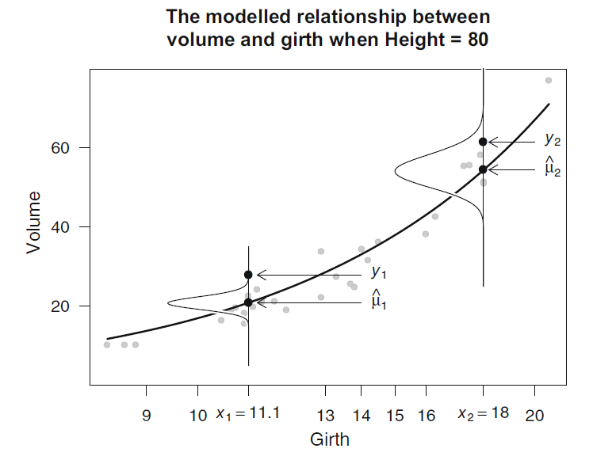

class: inverse, center, middle

# AlwaysR, Módulo III: Estadística en R

## Clase 5: Efectos aleatorios. Introducción a GLM.

### Giancarlo M. Correa


---

```{r setup, include=FALSE}
options(htmltools.dir.version = FALSE)
```

class: inverse, center, middle

# Efectos aleatorios

```{r xaringan-logo, echo=FALSE}
xaringanExtra::use_logo(
  image_url = "LOGO06.png", position = xaringanExtra::css_position(bottom = '-3em', left = 0),
  link_url = 'https://cousteau-group.com/', width = "70px"
)
```

---

# Efectos aleatorios

```{r, message=FALSE, warning=FALSE, echo=FALSE}
library(sjPlot)
library(sjmisc)
library(ggplot2)
library(faraway)
library(Sleuth3)
library(nlme)
library(lme4)
library(statmod)
library(MASS)
library(GLMsData)
library(psych)
data(hsb)
```

Veamos los datos:

```{r, echo = FALSE}
load("dragons.RData")
dragons$bodyLength2 <- scale(dragons$bodyLength, center = TRUE, scale = TRUE)[,1]
```

```{r}
head(dragons)
```

```{r}
str(dragons)
```

---

# Efectos aleatorios

Podemos implementar un modelo lineal:

```{r}
basic_lm = lm(testScore ~ bodyLength2, data = dragons)
summary(basic_lm)
```

---

# Efectos aleatorios

Podemos graficar los resultados:

```{r, out.width=370, fig.align="center"}
plot_model(model = basic_lm, type = 'pred', show.data = TRUE)
```

---

# Efectos aleatorios

Podemos obtener mas figuras para revisar los supuestos. Ahora veamos:

```{r, out.width=400, fig.align="center"}
boxplot(testScore ~ mountainRange, data = dragons)
```

---

# Efectos aleatorios

```{r, out.width=500, fig.align="center", echo = FALSE}
(split_plot <- ggplot(aes(bodyLength, testScore), data = dragons) + 
  geom_point() + 
  facet_wrap(~ mountainRange) + 
  xlab("bodyLength") + 
  ylab("test score"))
```


---

# Efectos aleatorios

La variable `mountainRange` es una variable agrupadora! Este es un caso perfecto para incorporar un efecto aleatorio.

--

En este caso, si incluimos `mountainRange` dentro del modelo, nosotros estaríamos controlando el efecto que esta variable pueda tener sobre la variable respuesta y explicativa. 

--

Implementemos el modelo de efectos mixtos:

```{r, warning=FALSE,message=FALSE}
mixed_lmer = lmer(testScore ~ bodyLength2 + (1 + bodyLength2|mountainRange), data = dragons)
```

---

```{r}
summary(mixed_lmer)
```

---

# Efectos aleatorios

Revisar los supuestos: varianza constante

```{r, out.width=400, fig.align="center"}
plot(mixed_lmer)
```

---

# Efectos aleatorios

Revisar los supuestos: distribución normal

```{r, out.width=400, fig.align="center"}
qqnorm(resid(mixed_lmer))
qqline(resid(mixed_lmer))
```

---

# Efectos aleatorios

Podemos plotear la línea estimada:

```{r, out.width=350, fig.align="center"}
plot_model(model = mixed_lmer, type = 'pred', show.data = TRUE)
```


---

# Efectos aleatorios

Pero también podemos hacerlo por categoría:

```{r, out.width=450, fig.align="center", echo = FALSE}
(mm_plot = ggplot(dragons, aes(x = bodyLength, y = testScore, colour = site)) +
      facet_wrap(~mountainRange, nrow=2) +  
      geom_point(alpha = 0.5) +
      theme_classic() +
      geom_line(data = cbind(dragons, pred = predict(mixed_lmer)), aes(y = pred), size = 1) + 
      theme(legend.position = "none",
            panel.spacing = unit(2, "lines"))  
)
```

---

# Efectos aleatorios

Otra gráfica para evaluar resultados:

```{r, out.width=400, fig.align="center", warning=FALSE, message=FALSE}
plot_model(mixed_lmer, type = 're')
```


---

# Efectos aleatorios

¿Qué otra variable puedo incluir en el modelo como efecto aleatorio?

```{r}
headTail(dragons)
```

--

**Site**: Se ha muestreado en 3 sitios de muestreo dentro de cada `montainRange`.


---

# Efectos aleatorios

Implementamos un segundo modelo:

```{r, warning=FALSE,message=FALSE}
mixed_lmer2 = lmer(testScore ~ bodyLength2 + (1 + bodyLength2|mountainRange/site), data = dragons)
```

---

```{r}
summary(mixed_lmer2)
```

---

# Efectos aleatorios

Podemos plotear la línea estimada:

```{r, out.width=350, fig.align="center"}
plot_model(model = mixed_lmer2, type = 'pred', show.data = TRUE)
```

---

# Efectos aleatorios

Pero también podemos hacerlo por categoría:

```{r, out.width=450, fig.align="center", echo = FALSE}
(mm_plot = ggplot(dragons, aes(x = bodyLength, y = testScore, colour = site)) +
      facet_wrap(~mountainRange, nrow=2) +  
      geom_point(alpha = 0.5) +
      theme_classic() +
      geom_line(data = cbind(dragons, pred = predict(mixed_lmer2)), aes(y = pred), size = 1) + 
      theme(legend.position = "none",
            panel.spacing = unit(2, "lines"))  
)
```

---

# Efectos aleatorios

Ir a [sitio web](https://mfviz.com/hierarchical-models/).

---

class: inverse, center, middle

# Modelos lineales generalizados (GLM)

---

# GLM

Se emplea estos modelos cuando la varianza de la variable respuesta no es constante o no está normalmente distribuida.

--

GLM transforma la variable respuesta para que el método de estimación de parámetros siga *funcionando bien*.

--

Esta transformación hecha sobre la variable respuesta es definida por la función *link*.

--

Al momento de implementar un GLM, debemos decidir dos cosas:

1. La distribución a utilizar
2. La función *link*.

$$y_i \sim EDM(\mu_i, \phi/ \omega_i)$$

$$g(\mu_i) = o_i + \beta_0 + \sum_{j=1}^p \beta_j x_{ji}$$

---

# GLM

Por ejemplo, podemos tener:

```{r}
data(quilpie)
head(quilpie)
```

Para este caso, si `y` es la variable respuesta, entonces podemos usar:

$$y_i \sim Binom(\mu_i, m_i)$$

$$log\frac{\mu_i}{1-\mu_i} = \beta_0 + \beta_1 SOI_i$$

---

# GLM: respuesta binaria

Para una variable de respuesta binaria (e.g. 0/1 - presencia/asusencia - hembra/macho), tipicamente la modelamos con una función *link* tipo *logit* y función de varianza $\mu (1-\mu)$. La respuesta modelada son las probabilidades de registro predichas (*predicted log odds*) del evento de interés.

--

```{r}
head(hsb)
```

--

Para este ejemplo, modelaremos el registro de `hsb$prog == academic`. 

---

# GLM: respuesta binaria

En R vamos a usar:

```{r}
hsb$obj_var = ifelse(test = hsb$prog == 'academic', yes = 1, no = 0)
mod1 = glm(obj_var ~ read, family = binomial(), data = hsb)
```

--

Aquí, la variable respuesta es una variable indicadora (binaria):

```{r}
hsb$obj_var[1:20]
```

---

```{r, size='tiny'}
summary(mod1)
```

---

# GLM: respuesta binaria

La revisión de supuestos en un GLM no es tan sencilla. Podemos revisar la independencia de observaciones (especialmente importante cuando tenemos datos que vienen con posible dependencia temporal o espacial):

```{r, out.width=370, fig.align="center"}
plot(qresid(mod1))
```

---

# GLM: respuesta binaria

```{r echo = FALSE, out.width=600, fig.align="center"}

```


---

# GLM: respuesta binaria

Revisar los valores observados y ajustados:

```{r, out.width=350, fig.align="center", warning=FALSE, message=FALSE}
plot_model(model = mod1, type = 'pred', show.data = TRUE)
```

---

# GLM: respuesta binaria

Revisar distribucion asumida:

```{r, out.width=400, fig.align="center"}
qqnorm(qresid(mod1))
qqline(qresid(mod1))
```


---

# GLM: respuesta binaria

Revisar observaciones influyentes:

```{r, out.width=400, fig.align="center"}
plot(cooks.distance(mod1), type='h')
```

---

# GLM: datos de conteo

Cuando tenemos una variable discreta (e.g. conteo de individuos, de especies, etc.), es recomendable implementar el modelo usando la familia de distribuciones Poisson. 

```{r, echo = FALSE}
cases <-  
structure(list(Days = c(1L, 2L, 3L, 3L, 4L, 4L, 4L, 6L, 7L, 8L, 
8L, 8L, 8L, 12L, 14L, 15L, 17L, 17L, 17L, 18L, 19L, 19L, 20L, 
23L, 23L, 23L, 24L, 24L, 25L, 26L, 27L, 28L, 29L, 34L, 36L, 36L, 
42L, 42L, 43L, 43L, 44L, 44L, 44L, 44L, 45L, 46L, 48L, 48L, 49L, 
49L, 53L, 53L, 53L, 54L, 55L, 56L, 56L, 58L, 60L, 63L, 65L, 67L, 
67L, 68L, 71L, 71L, 72L, 72L, 72L, 73L, 74L, 74L, 74L, 75L, 75L, 
80L, 81L, 81L, 81L, 81L, 88L, 88L, 90L, 93L, 93L, 94L, 95L, 95L, 
95L, 96L, 96L, 97L, 98L, 100L, 101L, 102L, 103L, 104L, 105L, 
106L, 107L, 108L, 109L, 110L, 111L, 112L, 113L, 114L, 115L), 
    Students = c(6L, 8L, 12L, 9L, 3L, 3L, 11L, 5L, 7L, 3L, 8L, 
    4L, 6L, 8L, 3L, 6L, 3L, 2L, 2L, 6L, 3L, 7L, 7L, 2L, 2L, 8L, 
    3L, 6L, 5L, 7L, 6L, 4L, 4L, 3L, 3L, 5L, 3L, 3L, 3L, 5L, 3L, 
    5L, 6L, 3L, 3L, 3L, 3L, 2L, 3L, 1L, 3L, 3L, 5L, 4L, 4L, 3L, 
    5L, 4L, 3L, 5L, 3L, 4L, 2L, 3L, 3L, 1L, 3L, 2L, 5L, 4L, 3L, 
    0L, 3L, 3L, 4L, 0L, 3L, 3L, 4L, 0L, 2L, 2L, 1L, 1L, 2L, 0L, 
    2L, 1L, 1L, 0L, 0L, 1L, 1L, 2L, 2L, 1L, 1L, 1L, 1L, 0L, 0L, 
    0L, 1L, 1L, 0L, 0L, 0L, 0L, 0L)), .Names = c("Days", "Students"
), class = "data.frame", row.names = c(NA, -109L))
```

--

```{r}
head(cases)
```

---

# GLM: datos de conteo

Exploremos la que será la variable respuesta en nuestro modelo:

```{r, out.width=400, fig.align="center"}
hist(cases$Students)
```


---

```{r}
mod2 = glm(Students ~ Days, family = "poisson", data = cases)
summary(mod2)
```

---

# GLM: datos de conteo

Verificar independencia de residuos:

```{r, out.width=400, fig.align="center"}
plot(qresid(mod2))
```

---

# GLM: datos de conteo

Revisar los valores observados y ajustados:

```{r, out.width=350, fig.align="center"}
plot_model(model = mod2, type = 'pred', show.data = TRUE)
```

---

# GLM: datos de conteo

Revisar distribucion asumida:

```{r, out.width=400, fig.align="center"}
qqnorm(qresid(mod2))
qqline(qresid(mod2))
```

---

# GLM: datos de conteo

Revisar observaciones influyentes:

```{r, out.width=400, fig.align="center"}
plot(cooks.distance(mod2), type='h')
```

---

# GLM: datos de conteo con sobredispersión

Exploremos una nueva base de datos:

```{r, echo = FALSE}
data(discoveries)
disc = data.frame(count = as.numeric(discoveries),
                   year = seq(0, (length(discoveries) - 1)))
disc$yearSqr <- disc$year^2
```


```{r}
head(disc)
```


---

# GLM: datos de conteo con sobredispersión

Exploremos la que ahora será nuestra variable explicativa:

```{r, out.width=400, fig.align="center"}
hist(disc$count)
```

---

Implementemos un modelo Poisson

```{r}
mod3 = glm(count ~ year + yearSqr, family = "poisson", data = disc)
summary(mod3)
```

---

Implementemos un modelo quasi-Poisson

```{r}
mod4 = glm(count ~ year + yearSqr, family = "quasipoisson", data = disc)
summary(mod4)
```

---

# GLM: datos de conteo con sobredispersión

Revisamos los residuos:

```{r, out.width=400, fig.align="center"}
qqnorm(qresid(mod4))
qqline(qresid(mod4))
```

---

# GLM: datos de conteo con sobredispersión

Para la misma base de datos `disc`, implementemos un modelo negativo binomial, usado también cuando tenemos casos de sobredispersión.

```{r}
mod5 = glm.nb(count ~ year + yearSqr, data = disc)
summary(mod5)
```

---

# GLM: datos de conteo con sobredispersión

Revisamos los residuos:

```{r, out.width=400, fig.align="center"}
qqnorm(qresid(mod5))
qqline(qresid(mod5))
```

---

# GLM: respuesta gamma

Dada nuestra base de datos:

```{r}
head(case1202)
```

---

# GLM: respuesta gamma

Modelo lineal para modelar `units` como la variable respuesta:

```{r}
mod6 = lm(Exper ~ Age, data=case1202)
summary(mod6)
```

---

# GLM: respuesta gamma

Veamos los valores ajustados:

```{r,  out.width=350, fig.align="center"}
plot_model(mod6, type = 'pred', show.data = TRUE)
```

---

# GLM: respuesta gamma

Exploremos la distribución de la variable respuesta:

```{r, out.width=400, fig.align="center"}
hist(case1202$Exper)
```

---

# GLM: respuesta gamma

¿Qué alternativas tenemos?

--

Podemos implementar un GLM con respuesta gamma (solo valores positivos):

```{r}
mod7 = glm(Exper + 1 ~ Age, data = case1202, family = Gamma(link = "log"))
```

---

```{r}
summary(mod7)
```

---

# GLM: respuesta gamma

```{r,  out.width=400, fig.align="center"}
plot_model(mod7, type = 'pred', show.data = TRUE)
```

---

class: inverse, center, middle

# Gracias!

Contacto: [**cursos@cousteau-group.com**](mailto:cursos@cousteau-group.com)

```{r echo = FALSE, out.width=450, fig.align="center"}

```
