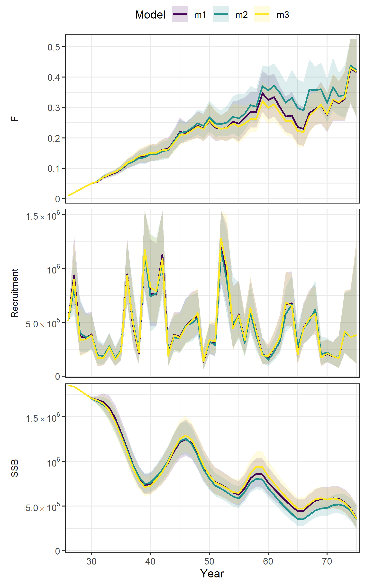
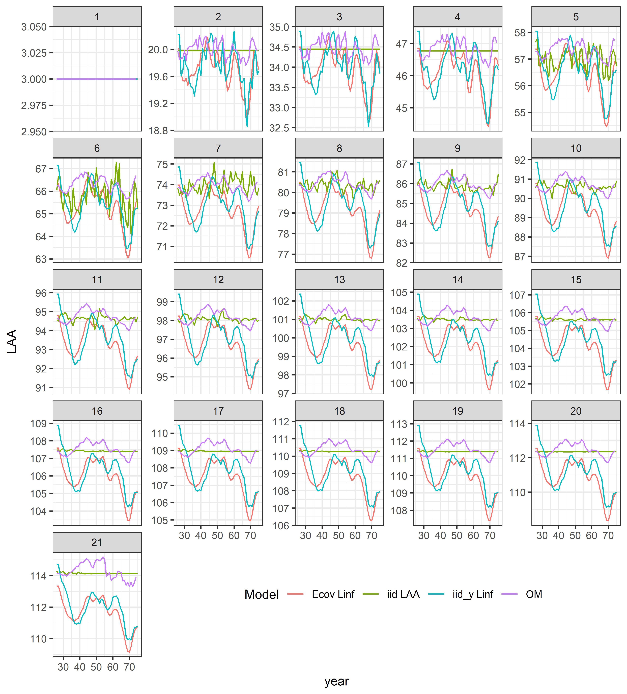
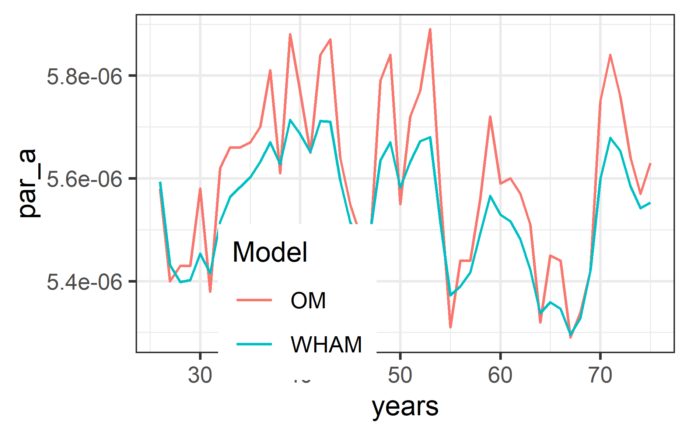

```{r setup, include=FALSE}
knitr::opts_chunk$set(echo = TRUE)
mainDir = 'C:/Users/moroncog/Documents/Postdoc_UW/test_size-info' # change this
setwd(mainDir)
```

I simulate data using Stock Synthesis 3.30.18 (operating model - OM), which is then included in WHAM (**growth** branch). The OM always simulates data for one fishery and one survey during 50 years for didactic purposes. All the files and information needed to run these examples can be found in [this GitHub repository](https://github.com/gmoroncorrea/WHAM-growth-testing). 

Install WHAM:

```{r eval = FALSE}
remotes::install_github(repo = 'gmoroncorrea/wham', ref='growth', INSTALL_opts = c("--no-docs", "--no-multiarch", "--no-demo"))
```

Then:

```{r eval = FALSE}
library(wham)
library(r4ss)
library(ggplot2)
library(TMB)
library(fields)
require(reshape2)
```

# Example 1: growth variability

For this example we simulate length compositions for the fishery and survey and year-specific temporal variability in asymptotic length using the PDO index as the driver. 

Then, read simulated data and define some model information:

```{r eval = FALSE}
data_file = r4ss::SS_readdat_3.30(file = 'SS_sim/D4-E0-F0-R0-cod/10/em/ss3.dat') # from EM
SS_report = r4ss::SS_output(dir = 'SS_sim/D4-E0-F0-R0-cod/10/om', covar = FALSE) # from OM
SS_reportEM = r4ss::SS_output(dir = 'SS_sim/D4-E0-F0-R0-cod/10/em', covar = FALSE) # from EM
# Define some important information:
min_year = SS_report$startyr
max_year = SS_report$endyr
n_ages = length(SS_report$agebins)
fish_len = SS_report$lbins
n_years = length(min_year:max_year)
```

Also, we will also need the numbers-at-age and mean length-at-age information from the OM:

```{r eval = FALSE}
NAA_SS = SS_report$natage[SS_report$natage$`Beg/Mid` == 'B' & SS_report$natage$Yr >= min_year & SS_report$natage$Yr <= max_year, 13:ncol(SS_report$natage)]
LAA_SS = SS_report$growthseries[SS_report$growthseries$Yr >= min_year & SS_report$growthseries$Yr <= max_year, 5:ncol(SS_report$growthseries)]
```

Prepare the data object for WHAM (this will eventually be a function in the future):

```{r eval = FALSE}
wham_data = list()
# Basic information:
wham_data$ages = 1:n_ages
wham_data$lengths = fish_len
wham_data$years = min_year:max_year
wham_data$n_fleets = 1L
wham_data$n_indices = 1L
# Catch information:
wham_data$agg_catch = as.matrix(data_file$catch[2:(n_years+1), 4])
wham_data$catch_cv = as.matrix(data_file$catch[2:(n_years+1), 5])
catch_pal_num = data_file$lencomp[data_file$lencomp$FltSvy == 1, 7:(7+length(wham_data$lengths)-1)]
catch_pal_prop = t(apply(as.matrix(catch_pal_num),1, function(x) x/sum(x)))
wham_data$catch_pal = catch_pal_prop
wham_data$catch_NeffL = as.matrix(as.double(data_file$lencomp[data_file$lencomp$FltSvy == 1, 6]))
wham_data$use_catch_pal = matrix(1, nrow = length(wham_data$years), ncol = wham_data$n_fleets)
# Index information:
wham_data$agg_indices = as.matrix(data_file$CPUE[,4])
wham_data$index_cv = as.matrix(data_file$CPUE[,5])
wham_data$fracyr_indices = matrix(0.01, ncol = 1, nrow = (max_year - min_year + 1))
index_pal_num = data_file$lencomp[data_file$lencomp$FltSvy == 2, 7:(7+length(wham_data$lengths)-1)]
index_pal_prop = t(apply(as.matrix(index_pal_num),1, function(x) x/sum(x)))
wham_data$index_pal = array(data = index_pal_prop, dim = c(1,dim(index_pal_prop)[1],dim(index_pal_prop[2])))
wham_data$index_NeffL =  as.matrix(as.double(data_file$lencomp[data_file$lencomp$FltSvy == 2, 6]))
wham_data$use_index_pal = matrix(1, ncol = 1, nrow = (max_year - min_year + 1))
wham_data$units_indices = rep(0L, times = 1) # numbers
# Selectivity and fishing mortality:
wham_data$selblock_pointer_fleets = matrix(1L, ncol = 1, nrow = (max_year - min_year + 1))
wham_data$selblock_pointer_indices = matrix(2L, ncol = 1, nrow = (max_year - min_year + 1))
wham_data$F = matrix(apply(X = SS_report$fatage[SS_report$fatage$Yr >= min_year & 
                                                  SS_report$fatage$Yr <= max_year,
                                                8:ncol(SS_report$fatage)], MARGIN = 1, FUN = max),
                     ncol = 1)
# Empirical weight-at-age:
waa_matrix = as.matrix(SS_report$wtatage[SS_report$wtatage$Fleet == -1 & SS_report$wtatage$Yr <= max_year, 7:(7+n_ages-1)])
waa_matrix_ini = as.matrix(SS_report$wtatage[SS_report$wtatage$Fleet == 0 & SS_report$wtatage$Yr <= max_year, 7:(7+n_ages-1)])
waa_tot_matrix = rbind(waa_matrix, waa_matrix_ini, waa_matrix, waa_matrix_ini)
dim(waa_tot_matrix) = c(max_year-min_year+1,4,n_ages)
waa_tot_matrix2 = aperm(waa_tot_matrix, c(2,1,3))
wham_data$waa = waa_tot_matrix2
# Maturity:
wham_data$maturity = matrix(rep(SS_report$endgrowth[,19], times = max_year - min_year + 1),
                            ncol = n_ages, nrow = max_year - min_year + 1, byrow = TRUE) 
# Another inputs:
wham_data$fracyr_SSB = rep(0, times = max_year - min_year + 1)
wham_data$Fbar_ages = c(5L,21L)
wham_data$percentSPR = 40
wham_data$percentFXSPR = 100
wham_data$percentFMSY = 100
wham_data$XSPR_R_avg_yrs = 1:n_years
wham_data$XSPR_R_opt = 2
wham_data$simulate_period = c(1,0)
wham_data$bias_correct_process = 1
wham_data$bias_correct_observation = 1
```

Now we are ready to create the input data object to run WHAM. Here, we will explore three strategies to account for the temporal variability in one of the growth parameters.

## Random effects on growth parameter

We estimate random effects on the asymptotic length parameter (by year):

```{r eval = FALSE}
my_input1 = prepare_wham_input(model_name="Ex: Growth VB",
                              selectivity=list(model=rep("age-specific",2),
                                               re=rep("none",2),
                                               initial_pars=list(c(rep(0, 4), rep(1, 17)),
                                                                 c(rep(0, 1), rep(1, 20))),
                                               fix_pars = list(1:21, 1:21),
                                               n_selblocks = 2),
                              M = list(model = 'constant', re = 'none',
                                       initial_means = 0.36),
                              NAA_re = list(sigma="rec", cor = 'iid', N1_model = 0,
                                            recruit_model = 2,
                                            N1_pars = as.vector(as.matrix(NAA_SS[1,])),
                                            recruit_pars = c(500000)),
                              growth = list(model = 'vB_classic',
                                            re = c('none', 'iid_y', 'none', 'none', 'none'),
                                            init_vals = c(0.16, 117.9, 3, 0.1, 0.1)), 
                              catchability = list(re = 'none', initial_q = 1, q_lower = 0,
                                                  q_upper = 1000, prior_sd = NA),
                              age_comp = 'multinomial',
                              len_comp = 'multinomial',
                              basic_info = wham_data)
```

Make some extra changes to fix some parameters:

```{r eval = FALSE}
my_input1$par$log_NAA = as.matrix(log(NAA_SS[-1,])) # set initial rec devs as OM
my_input1$par$mean_rec_pars = mean(log(NAA_SS[,1])) # mean recruitment as OM
my_input1$map$log_N1_pars = factor(rep(NA, times = n_ages)) # fix N1
my_input1$map$log_F1 = factor(c(NA)) # fix F1
my_input1$map$logit_q = factor(NA) # fix q
```

Run WHAM model and check for convergence:

```{r eval = FALSE}
my_model_1 = fit_wham(my_input1, do.osa = FALSE, do.fit =TRUE, do.retro = FALSE)
check_convergence(my_model_1)
```

## Random effects on mean length-at-age

```{r eval = FALSE}
my_input2 = prepare_wham_input(model_name="Ex: Growth LAA",
                              selectivity=list(model=rep("age-specific",2), 
                                               re=rep("none",2), 
                                               initial_pars=list(c(rep(0, 4), rep(1, 17)),
                                                                 c(rep(0, 1), rep(1, 20))),
                                               fix_pars = list(1:21, 1:21),
                                               n_selblocks = 2),
                              M = list(model = 'constant', re = 'none', 
                                       initial_means = 0.36),
                              NAA_re = list(sigma="rec", cor = 'iid', N1_model = 0,
                                            recruit_model = 2,
                                            N1_pars = as.vector(as.matrix(NAA_SS[1,])), 
                                            recruit_pars = c(500000)),
                              growth = list(model = 'LAA',
                                            re = c('none', 'none'), 
                                            init_vals = c(0.1, 0.1)), #  CV1, CVA
                              LAA = list(LAA_vals = as.vector(as.matrix(LAA_SS[1,])),
                                         re = c('iid')),
                              catchability = list(re = 'none', initial_q = 1, q_lower = 0,
                                                  q_upper = 1000, prior_sd = NA),
                              age_comp = 'multinomial',
                              len_comp = 'multinomial',
                              basic_info = wham_data)
```

Make some extra changes to fix some parameters:

```{r eval = FALSE}
my_input2$par$log_NAA = as.matrix(log(NAA_SS[-1,])) # set initial rec devs as OM
my_input2$par$mean_rec_pars = mean(log(NAA_SS[,1])) # mean recruitment as OM
my_input2$map$log_N1_pars = factor(rep(NA, times = n_ages)) # fix N1
my_input2$map$log_F1 = factor(c(NA)) # fix F1
my_input2$map$logit_q = factor(NA) # fix q
```

Run WHAM model and check for convergence:

```{r eval = FALSE}
my_model_2 = fit_wham(my_input2, do.osa = FALSE, do.fit =TRUE, do.retro = FALSE)
check_convergence(my_model_2)
```

## Include environmental covariate

We will include the PDO index and link it to the asymptotic length parameter.

```{r eval = FALSE}
envindex = read.csv('SS_sim/aux_files/PDO_annual_1970_2019.csv')
envindex = envindex[envindex$years >= min_year & envindex$years <= max_year, ]
# Create ecov object:
ecov <- list(
  label = "PDO",
  mean = as.matrix(envindex$index),
  logsigma = 'est_1',
  year = envindex$years,
  use_obs = matrix(1, ncol=1, nrow=dim(envindex)[1]),
  lag = 0, 
  process_model = 'ar1', 
  where = 'growth', 
  where_subindex = 2, # Linf
  how = 1) 
```

Then:

```{r eval = FALSE}
my_input3 = prepare_wham_input(model_name="Ex: Growth Ecov",
                              selectivity=list(model=rep("age-specific",2),
                                               re=rep("none",2),
                                               initial_pars=list(c(rep(0, 4), rep(1, 17)),
                                                                 c(rep(0, 1), rep(1, 20))),
                                               fix_pars = list(1:21, 1:21),
                                               n_selblocks = 2),
                              ecov = ecov,
                              M = list(model = 'constant', re = 'none',
                                       initial_means = 0.36),
                              NAA_re = list(sigma="rec", cor = 'iid', N1_model = 0,
                                            recruit_model = 2,
                                            N1_pars = as.vector(as.matrix(NAA_SS[1,])),
                                            recruit_pars = c(500000)),
                              growth = list(model = 'vB_classic',
                                            re = c('none', 'none', 'none', 'none', 'none'),
                                            init_vals = c(0.16, 117.9, 3, 0.1, 0.1)), 
                              catchability = list(re = 'none', initial_q = 1, q_lower = 0,
                                                  q_upper = 1000, prior_sd = NA),
                              age_comp = 'multinomial',
                              len_comp = 'multinomial',
                              basic_info = wham_data)
```

Make some extra changes to fix some parameters:

```{r eval = FALSE}
my_input3$par$log_NAA = as.matrix(log(NAA_SS[-1,])) # set initial rec devs as OM
my_input3$par$mean_rec_pars = mean(log(NAA_SS[,1])) # mean recruitment as OM
my_input3$map$log_N1_pars = factor(rep(NA, times = n_ages)) # fix N1
my_input3$map$log_F1 = factor(c(NA)) # fix F1
my_input3$map$logit_q = factor(NA) # fix q
```

Run WHAM model and check for convergence:

```{r eval = FALSE}
my_model_3 = fit_wham(my_input3, do.osa = FALSE, do.fit =TRUE, do.retro = FALSE)
check_convergence(my_model_3)
```

```{r include=FALSE}
my_model_1 = readRDS('my_model_1.rds')
my_model_2 = readRDS('my_model_2.rds')
my_model_3 = readRDS('my_model_3.rds')
```

Now we can compare these three models:

```{r eval = FALSE}
all_models = list(my_model_1,my_model_2,my_model_3)
dir.create('growth_models')
compare_wham_models(all_models, fdir = 'growth_models', do.table = FALSE)
```

and check SSB:

{width=80%}

We can also compare the estimated mean length-at-age between these models and the OM:

```{r eval=FALSE}
# Prepare data:
LAA_SS = as.matrix(LAA_SS)
rownames(LAA_SS) = min_year:(max_year-1)
data_0 = setNames(reshape2::melt(LAA_SS), c('year', 'age', 'LAA'))
data_0$age = data_0$age
data_0$type = 'OM'

LAA_data_1 = my_model_1$rep$LAA
rownames(LAA_data_1) = min_year:max_year
colnames(LAA_data_1) = 1:n_ages
data_1 = setNames(reshape2::melt(LAA_data_1), c('year', 'age', 'LAA'))
data_1$type = 'iid_y Linf'

LAA_data_2 = my_model_2$rep$LAA
rownames(LAA_data_2) = min_year:max_year
colnames(LAA_data_2) = 1:n_ages
data_2 = setNames(reshape2::melt(LAA_data_2), c('year', 'age', 'LAA'))
data_2$type = 'iid LAA'

LAA_data_3 = my_model_3$rep$LAA
rownames(LAA_data_3) = min_year:max_year
colnames(LAA_data_3) = 1:n_ages
data_3 = setNames(reshape2::melt(LAA_data_3), c('year', 'age', 'LAA'))
data_3$type = 'Ecov Linf'
#Merge data:
plot_data = rbind(data_0, data_1, data_2, data_3)

# Plot:
ggplot(data = plot_data, aes(x = year, y = LAA, color = factor(type))) +
  geom_line() +
  theme_bw() +
  labs(color = 'Model') +
  theme(legend.position = c(0.6, 0.1), legend.direction="horizontal") +
  facet_wrap(. ~ factor(age), nrow = 5, scales = 'free_y')
```

{width=80%}


# Example 2: CAAL data

For this example we simulate length compositions for the fishery and conditional age-at-length information for the survey. Also, a length double-normal selectivity is specified for the fishery and length-logistic for the survey.

Read simulated data and define some model information:

```{r eval = FALSE}
data_file = r4ss::SS_readdat_3.30(file = 'SS_sim/D6-E0-F0-R0-cod/10/em/ss3.dat') # from EM
SS_report = r4ss::SS_output(dir = 'SS_sim/D6-E0-F0-R0-cod/10/om', covar = FALSE) # from OM
SS_reportEM = r4ss::SS_output(dir = 'SS_sim/D6-E0-F0-R0-cod/10/em', covar = FALSE) # from EM
# Define some important information:
min_year = SS_report$startyr
max_year = SS_report$endyr
n_ages = length(SS_report$agebins)
fish_len = SS_report$lbins
n_years = length(min_year:max_year)
```

Also, we will also need the numbers-at-age and mean length-at-age information from the OM:

```{r eval = FALSE}
NAA_SS = SS_report$natage[SS_report$natage$`Beg/Mid` == 'B' & SS_report$natage$Yr >= min_year & SS_report$natage$Yr <= max_year, 13:ncol(SS_report$natage)]
```

Prepare the data object for WHAM (this will eventually be a function in the future):

```{r eval = FALSE}
wham_data = list()
# Basic information:
wham_data$ages = 1:n_ages
wham_data$lengths = fish_len
wham_data$years = min_year:max_year
wham_data$n_fleets = 1L
wham_data$n_indices = 1L
# Catch information:
wham_data$agg_catch = as.matrix(data_file$catch[2:(n_years+1), 4])
wham_data$catch_cv = as.matrix(data_file$catch[2:(n_years+1), 5])
catch_pal_num = data_file$lencomp[data_file$lencomp$FltSvy == 1, 7:(7+length(wham_data$lengths)-1)]
catch_pal_prop = t(apply(as.matrix(catch_pal_num),1, function(x) x/sum(x)))
wham_data$catch_pal = catch_pal_prop
wham_data$catch_NeffL = as.matrix(as.double(data_file$lencomp[data_file$lencomp$FltSvy == 1, 6]))
wham_data$use_catch_pal = matrix(1, nrow = length(wham_data$years), ncol = wham_data$n_fleets)
# Index information:
wham_data$agg_indices = as.matrix(data_file$CPUE[,4])
wham_data$index_cv = as.matrix(data_file$CPUE[,5])
wham_data$fracyr_indices = matrix(0.01, ncol = 1, nrow = (max_year - min_year + 1))
wham_data$units_indices = rep(0L, times = 1) # numbers
## index CAAL information (use/not use):
use_index_alk = array(0, dim = c(wham_data$n_fleets, length(wham_data$years), length(wham_data$lengths)))
all_years_lengths = expand.grid(Lbin_lo = wham_data$lengths, Yr = wham_data$years)
alk_info = data_file$agecomp[data_file$agecomp$FltSvy == 2, ] # for survey
temp1 = dplyr::left_join(all_years_lengths, alk_info, c("Lbin_lo", 'Yr'))
temp2 = reshape2::dcast(temp1, Yr ~ Lbin_lo, value.var = 'Ageerr')
temp2[is.na(temp2)] = 0
use_index_alk[1,,] = as.matrix(temp2[,-1])
wham_data$use_index_caal = t(ifelse(test = apply(use_index_alk, c(1,2), sum) > 0, yes = 1, no = 0))
## index CAAL information (Neff):
index_alk_Neff = array(0, dim = c(length(wham_data$years), wham_data$n_fleets, length(wham_data$lengths)))
all_years_lengths = expand.grid(Lbin_lo = wham_data$lengths, Yr = wham_data$years)
alk_info = data_file$agecomp[data_file$agecomp$FltSvy == 2, ] # for survey
temp1 = dplyr::left_join(all_years_lengths, alk_info, c("Lbin_lo", 'Yr'))
temp2 = reshape2::dcast(temp1, Yr ~ Lbin_lo, value.var = 'Nsamp')
temp2[is.na(temp2)] = 0
index_alk_Neff[,1,] = as.matrix(temp2[,-1])
wham_data$index_caal_Neff = index_alk_Neff
## index CAAL:
index_alk = array(0, dim = c(wham_data$n_indices, length(wham_data$years), length(wham_data$lengths), length(wham_data$ages)))
all_years_lengths = expand.grid(Lbin_lo = wham_data$lengths, Yr = wham_data$years)
alk_info = data_file$agecomp[data_file$agecomp$FltSvy == 2, ]
temp1 = dplyr::left_join(all_years_lengths, alk_info, c("Lbin_lo", 'Yr'))
for(i in seq_along(wham_data$years)) {  
  tmpData = temp1[temp1$Yr == wham_data$years[i], 10:(10+n_ages-1)]
  tmpData = t(apply(as.matrix(tmpData),1, function(x) x/sum(x))) # prop
  tmpData[is.na(tmpData)] = 0
  index_alk[1,i,,] = as.matrix(tmpData)
}
wham_data$index_caal = index_alk
# Selectivity and fishing mortality:
wham_data$selblock_pointer_indices = matrix(2L, ncol = 1, nrow = (max_year - min_year + 1))
wham_data$selblock_pointer_fleets = matrix(1L, ncol = 1, nrow = (max_year - min_year + 1))
wham_data$F = matrix(apply(X = SS_report$fatage[SS_report$fatage$Yr >= min_year & 
                                                  SS_report$fatage$Yr <= max_year,
                                                8:ncol(SS_report$fatage)], MARGIN = 1, FUN = max),
                     ncol = 1)
# Empirical weight-at-age:
waa_matrix = as.matrix(SS_report$wtatage[SS_report$wtatage$Fleet == 1 & SS_report$wtatage$Yr <= max_year, 7:(7+n_ages-1)])
waa_matrix_ini = as.matrix(SS_report$wtatage[SS_report$wtatage$Fleet == 0 & SS_report$wtatage$Yr <= max_year, 7:(7+n_ages-1)])
waa_tot_matrix = rbind(waa_matrix, waa_matrix_ini, waa_matrix, waa_matrix_ini)
dim(waa_tot_matrix) = c(max_year-min_year+1,4,n_ages)
waa_tot_matrix2 = aperm(waa_tot_matrix, c(2,1,3))
wham_data$waa = waa_tot_matrix2
# Maturity:
wham_data$maturity = matrix(rep(SS_report$endgrowth[,19], times = max_year - min_year + 1),
                            ncol = n_ages, nrow = max_year - min_year + 1, byrow = TRUE) 
# Another inputs:
wham_data$fracyr_SSB = rep(0, times = max_year - min_year + 1)
wham_data$Fbar_ages = c(5L,21L)
wham_data$percentSPR = 40
wham_data$percentFXSPR = 100
wham_data$percentFMSY = 100
wham_data$XSPR_R_avg_yrs = 1:n_years
wham_data$XSPR_R_opt = 2
wham_data$simulate_period = c(1,0)
wham_data$bias_correct_process = 1
wham_data$bias_correct_observation = 1
```

Now we are ready to create the input data object to run WHAM:

```{r eval = FALSE}
my_input4 = prepare_wham_input(model_name="Ex_Selectivity_CAAL",
                              selectivity=list(model=c("len-double-normal","len-logistic"), 
                                               re=rep("none",2), 
                                               initial_pars=list(c(45,0.7,-1,1,-6,-6),
                                                                 c(15,3)),
                                               fix_pars = list(2:6, 2), # Estimate L50
                                               n_selblocks = 2),
                              M = list(model = 'constant', re = 'none', 
                                       initial_means = 0.36),
                              NAA_re = list(sigma="rec", cor = 'iid', N1_model = 0,
                                            recruit_model = 2,
                                            N1_pars = as.vector(as.matrix(NAA_SS[1,])), 
                                            recruit_pars = c(500000)),
                              growth = list(model = 'vB_classic',
                                            re = c('none', 'none', 'none', 'none', 'none'), 
                                            init_vals = c(0.16, 117.9, 3, 0.1, 0.1), 
                                            est_pars = c(1)),  # estimate K 
                              catchability = list(re = 'none', initial_q = 1, q_lower = 0,
                                                  q_upper = 1000, prior_sd = NA),
                              age_comp = 'multinomial', # also used for ALK
                              len_comp = 'multinomial',
                              basic_info = wham_data)
```

Make some extra changes to fix some parameters:

```{r eval = FALSE}
my_input4$par$log_NAA = as.matrix(log(NAA_SS[-1,])) # set initial rec devs as OM
my_input4$par$mean_rec_pars = mean(log(NAA_SS[,1])) # mean recruitment as OM
my_input4$map$log_N1_pars = factor(rep(NA, times = n_ages)) # fix N1
my_input4$map$log_F1 = factor(c(NA)) # fix F1
my_input4$map$logit_q = factor(NA) # fix q
```

Run WHAM model and check for convergence:

```{r eval = FALSE}
my_model_4 = fit_wham(my_input4, do.osa = FALSE, do.fit =TRUE, do.retro = FALSE)
check_convergence(my_model_4)
```

```{r include=FALSE}
my_model_4 = readRDS('my_model_4.rds')
```

Plot results:

```{r eval = FALSE}
dir.create(path = 'my_model_4')
plot_wham_output(mod = my_model_4, dir.main = 'my_model_4', res = 300, out.type = 'png')
```
Now we can explore the results. Especially, we might be interested in the selectivity-at-length:

{width=80%}

# Example 3: length-weight variability

For this example we simulate length compositions for the fishery and marginal age compositions for the survey. Moreover, we simulate temporal variability in the condition factor (*a* parameter of the length-weight relationship).

Then, read simulated data and define some model information:

```{r eval = FALSE}
data_file = r4ss::SS_readdat_3.30(file = 'SS_sim/D7-E0-F0-R0-cod/10/em/ss3.dat') # from EM
SS_report = r4ss::SS_output(dir = 'SS_sim/D7-E0-F0-R0-cod/10/om', covar = FALSE) # from OM
SS_reportEM = r4ss::SS_output(dir = 'SS_sim/D7-E0-F0-R0-cod/10/em', covar = FALSE) # from EM
# Define some important information:
min_year = SS_report$startyr
max_year = SS_report$endyr
n_ages = length(SS_report$agebins)
fish_len = SS_report$lbins
n_years = length(min_year:max_year)
```

Also, we will also need the numbers-at-age and mean length-at-age information from the OM:

```{r eval = FALSE}
NAA_SS = SS_report$natage[SS_report$natage$`Beg/Mid` == 'B' & SS_report$natage$Yr >= min_year & SS_report$natage$Yr <= max_year, 13:ncol(SS_report$natage)]
```

Prepare the data object for WHAM (this will eventually be a function in the future):

```{r eval = FALSE}
wham_data = list()
# Basic information:
wham_data$ages = 1:n_ages
wham_data$lengths = fish_len
wham_data$years = min_year:max_year
wham_data$n_fleets = 1L
wham_data$n_indices = 1L
# Catch information:
wham_data$agg_catch = as.matrix(data_file$catch[2:(n_years+1), 4])
wham_data$catch_cv = as.matrix(data_file$catch[2:(n_years+1), 5])
catch_pal_num = data_file$lencomp[data_file$lencomp$FltSvy == 1, 7:(7+length(wham_data$lengths)-1)]
catch_pal_prop = t(apply(as.matrix(catch_pal_num),1, function(x) x/sum(x)))
wham_data$catch_pal = catch_pal_prop
wham_data$catch_NeffL = as.matrix(as.double(data_file$lencomp[data_file$lencomp$FltSvy == 1, 6]))
wham_data$use_catch_pal = matrix(1, nrow = length(wham_data$years), ncol = wham_data$n_fleets)
# Index information:
wham_data$agg_indices = as.matrix(data_file$CPUE[,4])
wham_data$index_cv = as.matrix(data_file$CPUE[,5])
wham_data$fracyr_indices = matrix(0.01, ncol = 1, nrow = (max_year - min_year + 1))
index_paa_num = data_file$agecomp[data_file$agecomp$FltSvy == 2, 10:(10+n_ages-1)]
index_paa_prop = t(apply(as.matrix(index_paa_num),1, function(x) x/sum(x)))
wham_data$index_paa = array(data = index_paa_prop, dim = c(1,max_year-min_year+1,n_ages))
wham_data$index_Neff =  as.matrix(as.double(data_file$agecomp[data_file$agecomp$FltSvy == 2, 9]))
wham_data$use_index_paa = matrix(1, ncol = 1, nrow = (max_year - min_year + 1))
wham_data$units_indices = rep(0L, times = 1) # numbers
# Selectivity and fishing mortality:
wham_data$selblock_pointer_fleets = matrix(1L, ncol = 1, nrow = (max_year - min_year + 1))
wham_data$selblock_pointer_indices = matrix(2L, ncol = 1, nrow = (max_year - min_year + 1))
wham_data$F = matrix(apply(X = SS_report$fatage[SS_report$fatage$Yr >= min_year & 
                                                  SS_report$fatage$Yr <= max_year,
                                                8:ncol(SS_report$fatage)], MARGIN = 1, FUN = max),
                     ncol = 1)
# Empirical weight-at-age:
waa_matrix = as.matrix(SS_report$wtatage[SS_report$wtatage$Fleet == -1 & SS_report$wtatage$Yr <= max_year, 7:(7+n_ages-1)])
waa_matrix_ini = as.matrix(SS_report$wtatage[SS_report$wtatage$Fleet == 0 & SS_report$wtatage$Yr <= max_year, 7:(7+n_ages-1)])
waa_tot_matrix = rbind(waa_matrix, waa_matrix_ini, waa_matrix, waa_matrix_ini)
dim(waa_tot_matrix) = c(max_year-min_year+1,4,n_ages)
waa_tot_matrix2 = aperm(waa_tot_matrix, c(2,1,3))
wham_data$waa = waa_tot_matrix2
# Maturity:
wham_data$maturity = matrix(rep(SS_report$endgrowth[,19], times = max_year - min_year + 1),
                            ncol = n_ages, nrow = max_year - min_year + 1, byrow = TRUE) 
# Another inputs:
wham_data$fracyr_SSB = rep(0, times = max_year - min_year + 1)
wham_data$Fbar_ages = c(5L,21L)
wham_data$percentSPR = 40
wham_data$percentFXSPR = 100
wham_data$percentFMSY = 100
wham_data$XSPR_R_avg_yrs = 1:n_years
wham_data$XSPR_R_opt = 2
wham_data$simulate_period = c(1,0)
wham_data$bias_correct_process = 1
wham_data$bias_correct_observation = 1
```

Now we are ready to create the input data object to run WHAM. Here we estimate random effects on the condition factor (AR1):

```{r eval = FALSE}
my_input5 = prepare_wham_input(model_name="Ex_LW",
                              selectivity=list(model=rep("age-specific",2), 
                                               re=rep("none",2), 
                                               initial_pars=list(c(rep(0, 4), rep(1, 17)),
                                                                 c(rep(0, 1), rep(1, 20))),
                                               fix_pars = list(1:21, 1:21),
                                               n_selblocks = 2),
                              M = list(model = 'constant', re = 'none', 
                                       initial_means = 0.36),
                              NAA_re = list(sigma="rec", cor = 'iid', N1_model = 0,
                                            recruit_model = 2,
                                            N1_pars = as.vector(as.matrix(NAA_SS[1,])), 
                                            recruit_pars = c(500000)),
                              growth = list(model = 'vB_classic',
                                            re = c('none', 'none', 'none', 'none', 'none'), 
                                            init_vals = c(0.16, 117.9, 3, 0.1, 0.1)),
                              catchability = list(re = 'none', initial_q = 1, q_lower = 0,
                                                  q_upper = 1000, prior_sd = NA),
                              LW = list(re = c('ar1_y', 'none'),
                                        init_vals = c(5.58883e-06, 3.18851)),
                              age_comp = 'multinomial',
                              len_comp = 'multinomial',
                              basic_info = wham_data)
```

Make some extra changes to fix some parameters. See that the empirical weight-at-age matrix is used in the WAA likelihood component:

```{r eval = FALSE}
my_input5$par$log_NAA = as.matrix(log(NAA_SS[-1,])) # set initial rec devs as OM
my_input5$par$mean_rec_pars = mean(log(NAA_SS[,1])) # mean recruitment as OM
my_input5$map$log_N1_pars = factor(rep(NA, times = n_ages)) # fix N1
my_input5$map$log_F1 = factor(c(NA)) # fix F1
my_input5$map$logit_q = factor(NA) # fix q
my_input5$data$waa_type = 3 # use empirical WAA
my_input5$data$waa_cv[1:2,,] = 0.1 # WAA CV
```

Run WHAM model and check for convergence:

```{r eval = FALSE}
my_model_5 = fit_wham(my_input5, do.osa = FALSE, do.fit =TRUE, do.retro = FALSE)
check_convergence(my_model_5)
```

```{r include=FALSE}
my_model_5 = readRDS('my_model_5.rds')
```

Plot results:

```{r eval = FALSE}
dir.create(path = 'my_model_5')
plot_wham_output(mod = my_model_5, dir.main = 'my_model_5', res = 300, out.type = 'pdf')
```

I am also interested in exploring the trends in the *a* parameter estimated by WHAM and the OM (Stock Synthesis):

```{r eval = FALSE}
parameter_variability = read.csv('SS_sim/D7-E0-F0-R0-cod/Growth_parameters.csv')
plot_data = data.frame(years = rep(min_year:max_year, times = 2),
                       par_a = c(parameter_variability$WtLen1, my_model_5$rep$LW_par[,1,1]),
                       type = rep(c('OM', 'WHAM'), each = n_years))
# Plot:
ggplot(data = plot_data, aes(x = years, y = par_a, color = factor(type))) +
  geom_line() +
  theme_bw() +
  labs(color = 'Model') +
  theme(legend.direction="horizontal", legend.position = 'bottom')
```

{width=80%}
