```{r setup, include=FALSE}
knitr::opts_chunk$set(echo = TRUE)
mainDir = 'C:/Users/moroncog/Documents/Postdoc_UW/test_size-info' # change this
setwd(mainDir)
```

I simulate data using Stock Synthesis 3.30.18 (operating model - OM), which is then included in several versions of WHAM to test the new changes that I am doing. The OM includes one fishing fleet and one survey. 

First, we need some libraries:

```{r eval=FALSE}
library(r4ss)
library(ggplot2)
library(TMB)
library(fields)
```

# Fixed effects

In this first section I focus on the estimates of the new features implemented in WHAM, so I do not care about random effects here.

## Test 1 (WHAM-devel): only age information

For this first step, we need to make sure we have the *devel* branch of WHAM, which can be installed from:

```{r eval = FALSE}
devtools::install_github("timjmiller/wham", dependencies=TRUE, ref="devel")
```

Then:

```{r}
library(wham)
```

As we know, the standard WHAM only accepts age information, therefore we simulate age information for one fishing fleet and one survey:


Then, read simulated data and define some model information:

```{r eval = FALSE}
data_file = r4ss::SS_readdat_3.30(file = 'SS_sim/D0-E0-F0-R0-cod/10/em/ss3.dat') # from EM
SS_report = r4ss::SS_output(dir = 'SS_sim/D0-E0-F0-R0-cod/10/om', covar = FALSE) # from OM
SS_reportEM = r4ss::SS_output(dir = 'SS_sim/D0-E0-F0-R0-cod/10/em', covar = FALSE) # from EM
min_year = SS_report$startyr
max_year = SS_report$endyr
n_ages = length(SS_report$agebins)
```

Also, we will also need the numbers-at-age information from the OM:

```{r eval = FALSE}
NAA_SS = SS_report$natage[SS_report$natage$`Beg/Mid` == 'B' & 
                            SS_report$natage$Yr >= min_year & 
                            SS_report$natage$Yr <= max_year, 13:ncol(SS_report$natage)]
```

Prepare the data object for WHAM. Here is the detailed code (in the future, this will be a function):

```{r eval = FALSE}
wham_data = list()
wham_data$ages = 1:n_ages
wham_data$years = min_year:max_year

wham_data$n_fleets = 1L
wham_data$agg_catch = as.matrix(data_file$catch[2:(n_years+1), 4])
catch_paa_num = data_file$agecomp[data_file$agecomp$FltSvy == 1, 10:(10+n_ages-1)]
catch_paa_prop = t(apply(as.matrix(catch_paa_num),1, function(x) x/sum(x)))
wham_data$catch_paa = array(data = catch_paa_prop, dim = c(1,max_year-min_year+1,n_ages))
wham_data$catch_cv = as.matrix(data_file$catch[2:(n_years+1), 5])
wham_data$catch_Neff = as.matrix(as.double(data_file$agecomp[data_file$agecomp$FltSvy == 1, 9]))
wham_data$use_catch_paa = matrix(1, ncol = 1, nrow = (max_year - min_year + 1))
wham_data$selblock_pointer_fleets = matrix(1L, ncol = 1, nrow = (max_year - min_year + 1))
wham_data$F = matrix(apply(X = SS_report$fatage[SS_report$fatage$Yr >= min_year & SS_report$fatage$Yr <= max_year,
                                                8:ncol(SS_report$fatage)], MARGIN = 1, FUN = max), ncol = 1)
  
wham_data$n_indices = 1L
wham_data$agg_indices = as.matrix(data_file$CPUE[,4])
index_paa_num = data_file$agecomp[data_file$agecomp$FltSvy == 2, 10:(10+n_ages-1)]
index_paa_prop = t(apply(as.matrix(index_paa_num),1, function(x) x/sum(x)))
wham_data$index_paa = array(data = index_paa_prop, dim = c(1,max_year-min_year+1,n_ages))
wham_data$index_cv = as.matrix(data_file$CPUE[,5])
wham_data$index_Neff =  as.matrix(as.double(data_file$agecomp[data_file$agecomp$FltSvy == 2, 9]))
wham_data$units_indices = rep(0L, times = 1) # numbers
wham_data$units_index_paa = rep(2L, times = 1) # numbers
wham_data$use_index_paa = matrix(1, ncol = 1, nrow = (max_year - min_year + 1))

wham_data$selblock_pointer_indices = matrix(2L, ncol = 1, nrow = (max_year - min_year + 1))
wham_data$fracyr_indices = matrix(0.01, ncol = 1, nrow = (max_year - min_year + 1))
waa_matrix = as.matrix(SS_report$wtatage[SS_report$wtatage$Fleet == 1 & SS_report$wtatage$Yr <= max_year, 7:(7+n_ages-1)])
waa_matrix_ini = as.matrix(SS_report$wtatage[SS_report$wtatage$Fleet == 0 & SS_report$wtatage$Yr <= max_year, 7:(7+n_ages-1)])
waa_tot_matrix = rbind(waa_matrix, waa_matrix, waa_matrix, waa_matrix_ini)
dim(waa_tot_matrix) = c(max_year-min_year+1,4,n_ages)
waa_tot_matrix2 = aperm(waa_tot_matrix, c(2,1,3))
wham_data$waa = waa_tot_matrix2
wham_data$maturity = matrix(rep(SS_report$endgrowth[,19], times = max_year - min_year + 1),
                            ncol = n_ages, nrow = max_year - min_year + 1, byrow = TRUE) # multiply by 0.5?
wham_data$fracyr_SSB = rep(0, times = max_year - min_year + 1)
wham_data$Fbar_ages = c(5L,21L)
wham_data$percentSPR = 20
wham_data$percentFXSPR = n_years
wham_data$percentFMSY = n_years
wham_data$XSPR_R_avg_yrs = 1:n_years
wham_data$XSPR_R_opt = 2
wham_data$simulate_process_error = rep(1, times = 5)
wham_data$simulate_observation_error = rep(1, times = 3)
wham_data$simulate_period = rep(1, times = 2)
wham_data$bias_correct_process = 0
wham_data$bias_correct_observation = 0
```

Define the input data object. Natural mortality, selectivity, and catchability parameters values are the same as in the OM:

```{r eval = FALSE}
my_input = prepare_wham_input(model_name="whamBase",
                              selectivity=list(model=rep("age-specific",2), 
                                               re=rep("none",2), 
                                               initial_pars=list(c(rep(0, 4), rep(1, 17)),
                                                                 c(rep(0, 1), rep(1, 20))),
                                               fix_pars = list(1:21, 1:21),
                                               n_selblocks = 2),
                              M = list(model = 'constant', re = 'none', 
                                       initial_means = 0.36),
                              NAA_re = list(sigma="rec", cor = 'iid', N1_model = 0,
                                            recruit_model = 2,
                                            N1_pars = as.vector(as.matrix(NAA_SS[1,])), 
                                            recruit_pars = c(500000)),
                              catchability = list(re = 'none', initial_q = 1, q_lower = 0,
                                                  q_upper = 1000, prior_sd = NA),
                              age_comp = 'multinomial',
                              basic_info = wham_data)
```

Make some changes to `my_input` to fix some parameters:

```{r eval = FALSE}
my_input$par$log_NAA = as.matrix(log(NAA_SS[-1,])) # set initial rec devs as OM
my_input$par$mean_rec_pars = mean(log(NAA_SS[,1])) # mean recruitment as OM
my_input$map$log_N1_pars = factor(rep(NA, times = n_ages)) # fix N1
my_input$map$log_F1 = factor(c(NA)) # fix F1
my_input$map$logit_q = factor(NA) # fix q
my_input$random = NULL 
```

Run WHAM model and check for convergence:

```{r eval = FALSE}
my_model = fit_wham(my_input, do.osa = FALSE, do.fit = TRUE)
check_convergence(my_model) # make sure it converges
```

Compare SSB estimates from OM and WHAM. The goal is not to compare similarities/differences between WHAM and SS, but to make sure that WHAM is producing *reasonable* results:

```{r eval = FALSE}
this_model = my_model
this_name = deparse(substitute(my_model))
# Make plot:
OM_SSB = SS_reportEM$timeseries[SS_reportEM$timeseries$Yr >= min_year & 
                                SS_reportEM$timeseries$Yr <= max_year, 'SpawnBio']
WHAM_SSB = this_model$rep$SSB 
data_plot = data.frame(year = rep(min_year:max_year, times = 2), 
                       SSB = c(OM_SSB*1e-06, WHAM_SSB*1e-06),
                       type = c(rep('OM', times = length(min_year:max_year)), 
                                rep('WHAM', times = length(min_year:max_year))))
p1 = ggplot(data = data_plot, aes(x = year, y = SSB, color = factor(type))) +
  geom_line() + 
  ylab('SSB (1e+06)') +
  theme_bw() +
  guides(color = guide_legend(title = 'model')) +
  theme(legend.position = c(0.8, 0.8))
```

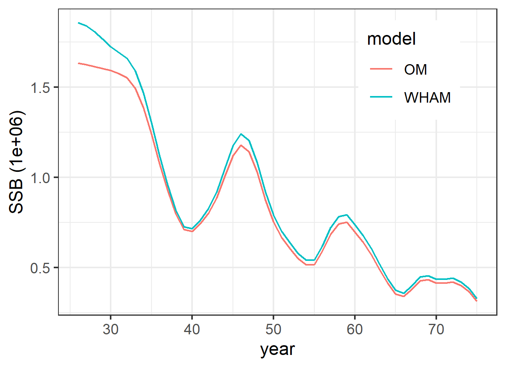

As we observed, SSB estimates of both models follow a similar trends over years. 

## Test 2 (WHAM-growth): only age information

Hereafter, we will start testing the modified WHAM code that accepts length information and estimates growth parameters. To do this, we need to install this branch:

```{r eval = FALSE}
remotes::install_github(repo = 'gmoroncorrea/wham', ref='growth', INSTALL_opts = c("--no-docs", "--no-multiarch", "--no-demo"))
```

Then:

```{r eval = FALSE}
library(wham)
```

First, we only include age information and turn off the length compositions and growth estimation. We use the same data generated in the previous section (`D0-E0-F0-R0-cod`):

```{r eval = FALSE}
data_file = r4ss::SS_readdat_3.30(file = 'SS_sim/D0-E0-F0-R0-cod/10/em/ss3.dat') # from EM
SS_report = r4ss::SS_output(dir = 'SS_sim/D0-E0-F0-R0-cod/10/om', covar = FALSE) # from OM
SS_reportEM = r4ss::SS_output(dir = 'SS_sim/D0-E0-F0-R0-cod/10/em', covar = FALSE) # from EM
min_year = SS_report$startyr
max_year = SS_report$endyr
n_ages = length(SS_report$agebins)
fish_len = SS_report$lbins
n_years = length(min_year:max_year)
```

Also, we will also need the numbers-at-age:

```{r eval = FALSE}
NAA_SS = SS_report$natage[SS_report$natage$`Beg/Mid` == 'B' & 
                            SS_report$natage$Yr >= min_year & 
                            SS_report$natage$Yr <= max_year, 13:ncol(SS_report$natage)]
```

Prepare the data object for WHAM. Here is the detailed code (in the future this will be a function). Please see the manual (TODO) and the new equations (attached to this manual) of the new features in WHAM beforehand:

```{r eval = FALSE}
wham_data = list()
wham_data$ages = 1:n_ages
wham_data$lengths = fish_len
wham_data$CV_len = c(0.1, 0.1) # age 1 and oldest
wham_data$years = min_year:max_year

wham_data$n_fleets = 1L
wham_data$agg_catch = as.matrix(data_file$catch[2:(n_years+1), 4])
catch_paa_num = data_file$agecomp[data_file$agecomp$FltSvy == 1, 10:(10+n_ages-1)]
catch_paa_prop = t(apply(as.matrix(catch_paa_num),1, function(x) x/sum(x)))
wham_data$catch_paa = array(data = catch_paa_prop, dim = c(1,max_year-min_year+1,n_ages))
wham_data$catch_cv = as.matrix(data_file$catch[2:(n_years+1), 5])
wham_data$catch_Neff = as.matrix(as.double(data_file$agecomp[data_file$agecomp$FltSvy == 1, 9]))
wham_data$use_catch_paa = matrix(1L, ncol = 1, nrow = (max_year - min_year + 1))

wham_data$selblock_pointer_fleets = matrix(1L, ncol = 1, nrow = (max_year - min_year + 1))
wham_data$F = matrix(apply(X = SS_report$fatage[SS_report$fatage$Yr >= min_year & 
                                                  SS_report$fatage$Yr <= max_year,
                                                8:ncol(SS_report$fatage)], MARGIN = 1, FUN = max),
                     ncol = 1)

wham_data$n_indices = 1L
wham_data$agg_indices = as.matrix(data_file$CPUE[,4])
index_paa_num = data_file$agecomp[data_file$agecomp$FltSvy == 2, 10:(10+n_ages-1)]
index_paa_prop = t(apply(as.matrix(index_paa_num),1, function(x) x/sum(x)))
wham_data$index_paa = array(data = index_paa_prop, dim = c(1,max_year-min_year+1,n_ages))
wham_data$index_cv = as.matrix(data_file$CPUE[,5])
wham_data$index_Neff =  as.matrix(as.double(data_file$agecomp[data_file$agecomp$FltSvy == 2, 9]))
wham_data$units_indices = rep(0L, times = 1) # numbers
wham_data$units_index_paa = rep(2L, times = 1) # numbers
wham_data$use_index_paa = matrix(1L, ncol = 1, nrow = (max_year - min_year + 1))

wham_data$selblock_pointer_indices = matrix(2L, ncol = 1, nrow = (max_year - min_year + 1))
wham_data$fracyr_indices = matrix(0.01, ncol = 1, nrow = (max_year - min_year + 1))
waa_matrix = as.matrix(SS_report$wtatage[SS_report$wtatage$Fleet == 1 & SS_report$wtatage$Yr <= max_year, 7:(7+n_ages-1)])
waa_matrix_ini = as.matrix(SS_report$wtatage[SS_report$wtatage$Fleet == 0 & SS_report$wtatage$Yr <= max_year, 7:(7+n_ages-1)])
waa_tot_matrix = rbind(waa_matrix, waa_matrix, waa_matrix, waa_matrix_ini)
dim(waa_tot_matrix) = c(max_year-min_year+1,4,n_ages)
waa_tot_matrix2 = aperm(waa_tot_matrix, c(2,1,3))
wham_data$waa = waa_tot_matrix2
wham_data$maturity = matrix(rep(SS_report$endgrowth[,19], times = max_year - min_year + 1),
                            ncol = n_ages, nrow = max_year - min_year + 1, byrow = TRUE) 
wham_data$fracyr_SSB = rep(0, times = max_year - min_year + 1)
wham_data$Fbar_ages = c(5L,21L)
wham_data$percentSPR = 20
wham_data$percentFXSPR = n_years
wham_data$percentFMSY = n_years
wham_data$XSPR_R_avg_yrs = 1:n_years
wham_data$XSPR_R_opt = 1
wham_data$simulate_process_error = rep(1, times = 6)
wham_data$simulate_observation_error = rep(1, times = 3)
wham_data$simulate_period = rep(1, times = 2)
wham_data$bias_correct_process = 0
wham_data$bias_correct_observation = 0
```

Define the input data object. Natural mortality, selectivity, growth, and catchability parameters are the same as in the OM:

```{r eval = FALSE}
my_input = prepare_wham_input(model_name="whamGrowth0",
                              selectivity=list(model=rep("age-specific",2), 
                                               re=rep("none",2), 
                                               initial_pars=list(c(rep(0, 4), rep(1, 17)),
                                                                 c(rep(0, 1), rep(1, 20))),
                                               fix_pars = list(1:21, 1:21),
                                               n_selblocks = 2),
                              M = list(model = 'constant', re = 'none', 
                                       initial_means = 0.36),
                              NAA_re = list(sigma="rec", cor = 'iid', N1_model = 0,
                                            recruit_model = 2,
                                            N1_pars = as.vector(as.matrix(NAA_SS[1,])), 
                                            recruit_pars = c(500000)),
                              growth = list(model = 'vB_classic',
                                            re = c('none', 'none', 'none'), 
                                            init_vals = c(0.16, 117.9, 0.835)), # K, Linf, t0
                              catchability = list(re = 'none', initial_q = 1, q_lower = 0,
                                                  q_upper = 1000, prior_sd = NA),
                              age_comp = 'multinomial',
                              len_comp = 'multinomial',
                              basic_info = wham_data)
```

Make some changes to `my_input` to fix some parameters:

```{r eval = FALSE}
my_input$par$log_NAA = as.matrix(log(NAA_SS[-1,])) # set initial rec devs as OM
my_input$par$mean_rec_pars = mean(log(NAA_SS[,1])) # mean recruitment as OM
my_input$map$log_N1_pars = factor(rep(NA, times = n_ages)) # fix N1
my_input$map$log_F1 = factor(c(NA)) # fix F1
my_input$map$logit_q = factor(NA) # fix q
my_input$random = NULL
```

Run WHAM model and check for convergence:

```{r eval = FALSE}
my_model_2 = fit_wham(my_input, do.osa = FALSE, do.fit = TRUE)
check_convergence(my_model_2)
```

This is a good moment to check that the length-specific information calculated into WHAM for the stock. First, look at the mean length-at-age for any year:

```{r eval = FALSE}
this_model = my_model_2
this_name = deparse(substitute(my_model_2))
# Make plot:
data_plot = data.frame(ages = 1:n_ages, mlen = this_model$rep$mLAA[1,]) # first year
ggplot(data = data_plot, aes(ages, mlen)) +
  geom_line() +
  geom_point() +
  xlab('Ages') +
  ylab('Mean length (cm)') +
  theme_bw()
```

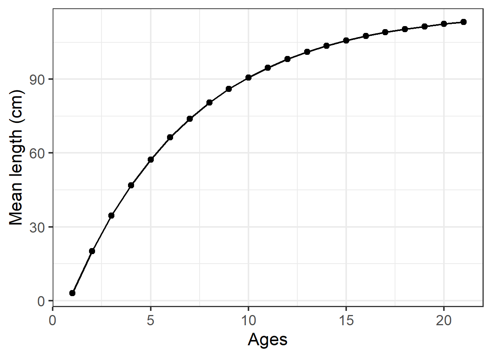

Also, we can check the proportions at length at age. This is what we call the transition matrix (unique for the stock):

```{r eval = FALSE}
par(mar = c(4,4,0.5,0.5))
matplot(this_model$rep$LAA[40,,], type = 'l', xlab = 'lengths', ylab = 'proportion') # 40th year
```

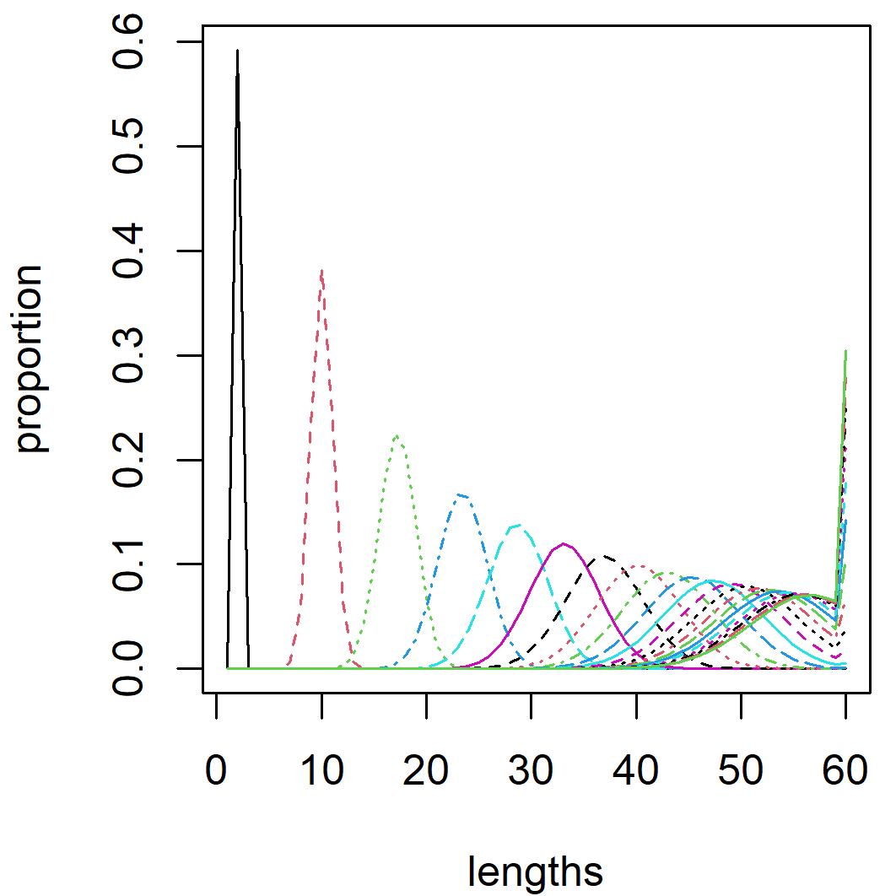

Finally, compare SSB estimates from OM and WHAM:

```{r eval = FALSE}
this_model = my_model_2
this_name = deparse(substitute(my_model_2))
#Plot:
OM_SSB = SS_reportEM$timeseries[SS_reportEM$timeseries$Yr >= min_year & 
                                SS_reportEM$timeseries$Yr <= max_year, 'SpawnBio']
WHAM_SSB = this_model$rep$SSB 
data_plot = data.frame(year = rep(min_year:max_year, times = 2), 
                       SSB = c(OM_SSB*1e-06, WHAM_SSB*1e-06),
                       type = c(rep('OM', times = length(min_year:max_year)), 
                                rep('WHAM', times = length(min_year:max_year))))
p1 = ggplot(data = data_plot, aes(x = year, y = SSB, color = factor(type))) +
  geom_line() + 
  ylab('SSB (1e+06)') +
  theme_bw() +
  guides(color = guide_legend(title = 'model')) +
  theme(legend.position = c(0.8, 0.8))
```


As we observe, the SSB estimates are the same as using the *devel* branch of WHAM. The changes in the WHAM code (WHAM-growth) are not altering the basic structure of the model.

## Test 3 (WHAM-growth): age and length information

We include age (survey) and length (fleet) information and do not estimate growth parameters. We use the data generated in `D1-E0-F0-R0-cod`:


```{r eval = FALSE}
data_file = r4ss::SS_readdat_3.30(file = 'SS_sim/D1-E0-F0-R0-cod/10/em/ss3.dat') # from EM
SS_report = r4ss::SS_output(dir = 'SS_sim/D1-E0-F0-R0-cod/10/om', covar = FALSE) # from OM
SS_reportEM = r4ss::SS_output(dir = 'SS_sim/D1-E0-F0-R0-cod/10/em', covar = FALSE) # from EM
min_year = SS_report$startyr
max_year = SS_report$endyr
n_ages = length(SS_report$agebins)
fish_len = SS_report$lbins
n_years = length(min_year:max_year)
```

Also, we will also need the numbers-at-age:

```{r eval = FALSE}
NAA_SS = SS_report$natage[SS_report$natage$`Beg/Mid` == 'B' & 
                            SS_report$natage$Yr >= min_year & 
                            SS_report$natage$Yr <= max_year, 13:ncol(SS_report$natage)]
```

Prepare the data object for WHAM:

```{r eval = FALSE}
wham_data = list()
wham_data$ages = 1:n_ages
wham_data$lengths = fish_len
wham_data$CV_len = c(0.1, 0.1) # age 1 and oldest
wham_data$years = min_year:max_year

wham_data$n_fleets = 1L
wham_data$agg_catch = as.matrix(data_file$catch[2:(n_years+1), 4])
wham_data$catch_cv = as.matrix(data_file$catch[2:(n_years+1), 5])
# Length information fleet
catch_pal_num = data_file$lencomp[data_file$lencomp$FltSvy == 1, 7:(7+length(wham_data$lengths)-1)]
catch_pal_prop = t(apply(as.matrix(catch_pal_num),1, function(x) x/sum(x)))
wham_data$catch_pal = catch_pal_prop
wham_data$catch_NeffL = as.matrix(as.double(data_file$lencomp[data_file$lencomp$FltSvy == 1, 6]))
wham_data$use_catch_pal = matrix(1, nrow = length(wham_data$years), ncol = wham_data$n_fleets)
wham_data$selblock_pointer_fleets = matrix(1L, ncol = 1, nrow = (max_year - min_year + 1))
wham_data$F = matrix(apply(X = SS_report$fatage[SS_report$fatage$Yr >= min_year & 
                                                  SS_report$fatage$Yr <= max_year,
                                                8:ncol(SS_report$fatage)], MARGIN = 1, FUN = max),
                     ncol = 1)

wham_data$n_indices = 1L
wham_data$agg_indices = as.matrix(data_file$CPUE[,4])
index_paa_num = data_file$agecomp[data_file$agecomp$FltSvy == 2, 10:(10+n_ages-1)]
index_paa_prop = t(apply(as.matrix(index_paa_num),1, function(x) x/sum(x)))
wham_data$index_paa = array(data = index_paa_prop, dim = c(1,max_year-min_year+1,n_ages))
wham_data$index_cv = as.matrix(data_file$CPUE[,5])
wham_data$index_Neff =  as.matrix(as.double(data_file$agecomp[data_file$agecomp$FltSvy == 2, 9]))
wham_data$units_indices = rep(0L, times = 1) # numbers
wham_data$units_index_paa = rep(2L, times = 1) # numbers
wham_data$use_index_paa = matrix(1, ncol = 1, nrow = (max_year - min_year + 1))

wham_data$selblock_pointer_indices = matrix(2L, ncol = 1, nrow = (max_year - min_year + 1))
wham_data$fracyr_indices = matrix(0.01, ncol = 1, nrow = (max_year - min_year + 1))
waa_matrix = as.matrix(SS_report$wtatage[SS_report$wtatage$Fleet == 1 & SS_report$wtatage$Yr <= max_year, 7:(7+n_ages-1)])
waa_matrix_ini = as.matrix(SS_report$wtatage[SS_report$wtatage$Fleet == 0 & SS_report$wtatage$Yr <= max_year, 7:(7+n_ages-1)])
waa_tot_matrix = rbind(waa_matrix, waa_matrix, waa_matrix, waa_matrix_ini)
dim(waa_tot_matrix) = c(max_year-min_year+1,4,n_ages)
waa_tot_matrix2 = aperm(waa_tot_matrix, c(2,1,3))
wham_data$waa = waa_tot_matrix2
wham_data$maturity = matrix(rep(SS_report$endgrowth[,19], times = max_year - min_year + 1),
                            ncol = n_ages, nrow = max_year - min_year + 1, byrow = TRUE) 
wham_data$fracyr_SSB = rep(0, times = max_year - min_year + 1)
wham_data$Fbar_ages = c(5L,21L)
wham_data$percentSPR = 20
wham_data$percentFXSPR = n_years
wham_data$percentFMSY = n_years
wham_data$XSPR_R_avg_yrs = 1:n_years
wham_data$XSPR_R_opt = 1
wham_data$simulate_process_error = rep(1, times = 6)
wham_data$simulate_observation_error = rep(1, times = 3)
wham_data$simulate_period = rep(1, times = 2)
wham_data$bias_correct_process = 0
wham_data$bias_correct_observation = 0
```

Define the input data object. Natural mortality, selectivity, growth, and catchability parameters are the same as in the OM:

```{r eval = FALSE}
my_input = prepare_wham_input(model_name="whamGrowth1",
                              selectivity=list(model=rep("age-specific",2), 
                                               re=rep("none",2), 
                                               initial_pars=list(c(rep(0, 4), rep(1, 17)),
                                                                 c(rep(0, 1), rep(1, 20))),
                                               fix_pars = list(1:21, 1:21),
                                               n_selblocks = 2),
                              M = list(model = 'constant', re = 'none', 
                                       initial_means = 0.36),
                              NAA_re = list(sigma="rec", cor = 'iid', N1_model = 0,
                                            recruit_model = 2,
                                            N1_pars = as.vector(as.matrix(NAA_SS[1,])), 
                                            recruit_pars = c(500000)),
                              growth = list(model = 'vB_classic',
                                            re = c('none', 'none', 'none'), 
                                            init_vals = c(0.16, 117.9, 0.835)), # K, Linf, t0
                              catchability = list(re = 'none', initial_q = 1, q_lower = 0,
                                                  q_upper = 1000, prior_sd = NA),
                              age_comp = 'multinomial',
                              len_comp = 'multinomial',
                              basic_info = wham_data)
```

Make some changes to `my_input` to fix some parameters:

```{r eval = FALSE}
my_input$par$log_NAA = as.matrix(log(NAA_SS[-1,])) # set initial rec devs as OM
my_input$par$mean_rec_pars = mean(log(NAA_SS[,1])) # mean recruitment as OM
my_input$map$log_N1_pars = factor(rep(NA, times = n_ages)) # fix N1
my_input$map$log_F1 = factor(c(NA)) # fix F1
my_input$map$logit_q = factor(NA) # fix q
my_input$random = NULL
```

Run WHAM model and check for convergence:

```{r eval = FALSE}
my_model_3 = fit_wham(my_input, do.osa = FALSE, do.fit = TRUE)
check_convergence(my_model_3)
```

Compare SSB estimates from OM and WHAM:

```{r eval = FALSE}
this_model = my_model_3
this_name = deparse(substitute(my_model_3))
#Plot:
OM_SSB = SS_reportEM$timeseries[SS_reportEM$timeseries$Yr >= min_year & 
                                SS_reportEM$timeseries$Yr <= max_year, 'SpawnBio']
WHAM_SSB = this_model$rep$SSB 
data_plot = data.frame(year = rep(min_year:max_year, times = 2), 
                       SSB = c(OM_SSB*1e-06, WHAM_SSB*1e-06),
                       type = c(rep('OM', times = length(min_year:max_year)), 
                                rep('WHAM', times = length(min_year:max_year))))
p1 = ggplot(data = data_plot, aes(x = year, y = SSB, color = factor(type))) +
  geom_line() + 
  ylab('SSB (1e+06)') +
  theme_bw() +
  guides(color = guide_legend(title = 'model')) +
  theme(legend.position = c(0.8, 0.8))
```

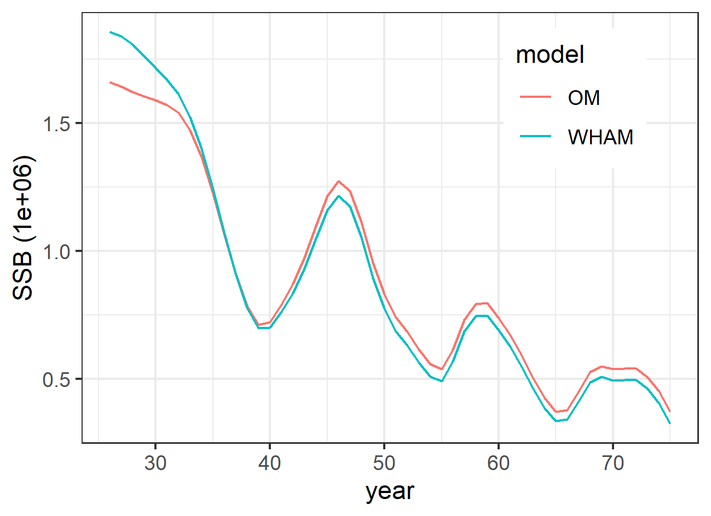

For this case, the SSB estimates are slightly different than those obtained in Test 2 because length information contributes to the NLL.

Also, you can check how the model fits the length information:

```{r eval = FALSE}
dir.create(path = paste0('WHAM_output/', this_name))
plot_wham_output(mod = this_model, dir.main = paste0('WHAM_output/', this_name), res = 300)
```

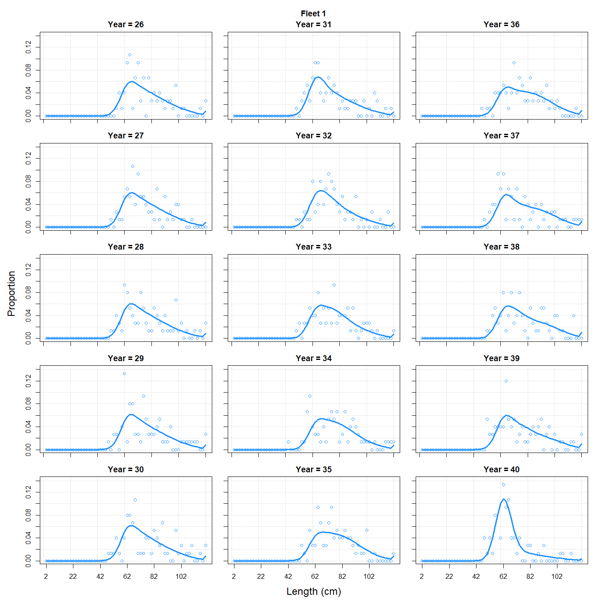

## Test 4 (WHAM-growth): age and length information

We use the same information as in Test 3, but we estimate two growth parameters:

```{r eval = FALSE}
my_input = prepare_wham_input(model_name="whamGrowth2",
                              selectivity=list(model=rep("age-specific",2), 
                                               re=rep("none",2), 
                                               initial_pars=list(c(rep(0, 4), rep(1, 17)),
                                                                 c(rep(0, 1), rep(1, 20))),
                                               fix_pars = list(1:21, 1:21),
                                               n_selblocks = 2),
                              M = list(model = 'constant', re = 'none', 
                                       initial_means = 0.36),
                              NAA_re = list(sigma="rec", cor = 'iid', N1_model = 0,
                                            recruit_model = 2,
                                            N1_pars = as.vector(as.matrix(NAA_SS[1,])), 
                                            recruit_pars = c(500000)),
                              growth = list(model = 'vB_classic',
                                            re = c('none', 'none', 'none'), 
                                            init_vals = c(0.16, 117.9, 0.835), # K, Linf, t0
                                            est_pars = c(1,2)), # Estimate K, Linf
                              catchability = list(re = 'none', initial_q = 1, q_lower = 0,
                                                  q_upper = 1000, prior_sd = NA),
                              age_comp = 'multinomial',
                              len_comp = 'multinomial',
                              basic_info = wham_data)
```

Make some changes to `my_input` to fix some parameters:

```{r eval = FALSE}
my_input$par$log_NAA = as.matrix(log(NAA_SS[-1,])) # set initial rec devs as OM
my_input$par$mean_rec_pars = mean(log(NAA_SS[,1])) # mean recruitment as OM
my_input$map$log_N1_pars = factor(rep(NA, times = n_ages)) # fix N1
my_input$map$log_F1 = factor(c(NA)) # fix F1
my_input$map$logit_q = factor(NA) # fix q
my_input$random = NULL
```

Run WHAM model and check for convergence:

```{r eval = FALSE}
my_model_4 = fit_wham(my_input, do.osa = FALSE, do.fit = TRUE)
check_convergence(my_model_4)
```

Compare SSB estimates from OM and WHAM:

```{r eval = FALSE}
this_model = my_model_4
this_name = deparse(substitute(my_model_4))
# Make plot:
OM_SSB = SS_reportEM$timeseries[SS_reportEM$timeseries$Yr >= min_year & 
                                SS_reportEM$timeseries$Yr <= max_year, 'SpawnBio']
WHAM_SSB = this_model$rep$SSB 
data_plot = data.frame(year = rep(min_year:max_year, times = 2), 
                       SSB = c(OM_SSB*1e-06, WHAM_SSB*1e-06),
                       type = c(rep('OM', times = length(min_year:max_year)), 
                                rep('WHAM', times = length(min_year:max_year))))
p1 = ggplot(data = data_plot, aes(x = year, y = SSB, color = factor(type))) +
  geom_line() + 
  ylab('SSB (1e+06)') +
  theme_bw() +
  guides(color = guide_legend(title = 'model')) +
  theme(legend.position = c(0.8, 0.8))
```

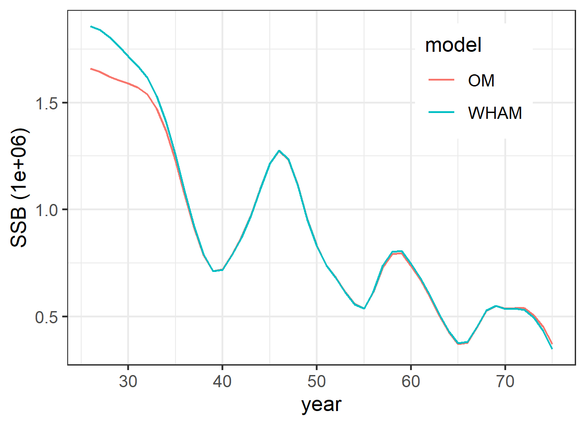

Also, check the growth parameter estimates:

```{r eval = FALSE}
exp(this_model$rep$growth_a[1:2,1]) # K and Linf
# ~ 0.147   122.0809
```

## Test 5 (WHAM-growth): age-length key information

We replace the marginal age compositions by age-length key per year for the survey. We use the data generated in `D2-E0-F0-R0-cod`:


Be aware that the OM is using length compositions for the survey as well, however, the WHAM model is not (see below). I could not remove the length compositions for the survey due to a bug with `ss3sim`.

```{r eval = FALSE}
data_file = r4ss::SS_readdat_3.30(file = 'SS_sim/D2-E0-F0-R0-cod/10/em/ss3.dat') # from EM
SS_report = r4ss::SS_output(dir = 'SS_sim/D2-E0-F0-R0-cod/10/om', covar = FALSE) # from OM
SS_reportEM = r4ss::SS_output(dir = 'SS_sim/D2-E0-F0-R0-cod/10/em', covar = FALSE) # from EM
min_year = SS_report$startyr
max_year = SS_report$endyr
n_ages = length(SS_report$agebins)
fish_len = SS_report$lbins
n_years = length(min_year:max_year)
```

Also, we will also need the numbers-at-age:

```{r eval = FALSE}
NAA_SS = SS_report$natage[SS_report$natage$`Beg/Mid` == 'B' & 
                            SS_report$natage$Yr >= min_year & 
                            SS_report$natage$Yr <= max_year, 13:ncol(SS_report$natage)]
```

Prepare the data object for WHAM:

```{r eval = FALSE}
wham_data = list()
wham_data$ages = 1:n_ages
wham_data$lengths = fish_len
wham_data$CV_len = c(0.1, 0.1)
wham_data$years = min_year:max_year

wham_data$n_fleets = 1L
wham_data$agg_catch = as.matrix(data_file$catch[2:(n_years+1), 4])
wham_data$catch_cv = as.matrix(data_file$catch[2:(n_years+1), 5])
catch_pal_num = data_file$lencomp[data_file$lencomp$FltSvy == 1, 7:(7+length(wham_data$lengths)-1)]
catch_pal_prop = t(apply(as.matrix(catch_pal_num),1, function(x) x/sum(x)))
wham_data$catch_pal = catch_pal_prop
wham_data$catch_NeffL = as.matrix(as.double(data_file$lencomp[data_file$lencomp$FltSvy == 1, 6]))
wham_data$use_catch_pal = matrix(1, nrow = length(wham_data$years), ncol = wham_data$n_fleets)
wham_data$selblock_pointer_fleets = matrix(1L, ncol = 1, nrow = (max_year - min_year + 1))
wham_data$F = matrix(apply(X = SS_report$fatage[SS_report$fatage$Yr >= min_year & 
                                                  SS_report$fatage$Yr <= max_year,
                                                8:ncol(SS_report$fatage)], MARGIN = 1, FUN = max),
                     ncol = 1)

wham_data$n_indices = 1L
wham_data$agg_indices = as.matrix(data_file$CPUE[,4])
wham_data$index_cv = as.matrix(data_file$CPUE[,5])
wham_data$units_indices = rep(0L, times = 1) # numbers
# -------------------------------------------------------------------------
# index ALK information (use/not use):
use_index_alk = array(0, dim = c(wham_data$n_fleets, length(wham_data$years), length(wham_data$lengths)))
all_years_lengths = expand.grid(Lbin_lo = wham_data$lengths, Yr = wham_data$years)
alk_info = data_file$agecomp[data_file$agecomp$FltSvy == 2, ] # for survey
temp1 = dplyr::left_join(all_years_lengths, alk_info, c("Lbin_lo", 'Yr'))
temp2 = reshape2::dcast(temp1, Yr ~ Lbin_lo, value.var = 'Ageerr')
temp2[is.na(temp2)] = 0
use_index_alk[1,,] = as.matrix(temp2[,-1])
wham_data$use_index_alk = t(ifelse(test = apply(use_index_alk, c(1,2), sum) > 0, yes = 1, no = 0))
# temp2 contains years and lengths in which we have data
# input data should be only fleet, yr, and lengths column, then calculated internally
# -------------------------------------------------------------------------
# index ALK information (Neff):
index_alk_Neff = array(0, dim = c(length(wham_data$years), wham_data$n_fleets, length(wham_data$lengths)))
all_years_lengths = expand.grid(Lbin_lo = wham_data$lengths, Yr = wham_data$years)
alk_info = data_file$agecomp[data_file$agecomp$FltSvy == 2, ] # for survey
temp1 = dplyr::left_join(all_years_lengths, alk_info, c("Lbin_lo", 'Yr'))
temp2 = reshape2::dcast(temp1, Yr ~ Lbin_lo, value.var = 'Nsamp')
temp2[is.na(temp2)] = 0
index_alk_Neff[,1,] = as.matrix(temp2[,-1])
wham_data$index_alk_Neff = index_alk_Neff
# temp2 contains years and lengths in which we have data
# input data should be only fleet, yr, and lengths column, then calculated internally
# -------------------------------------------------------------------------
# index ALK:
index_alk = array(0, dim = c(wham_data$n_indices, length(wham_data$years), length(wham_data$lengths), length(wham_data$ages)))
all_years_lengths = expand.grid(Lbin_lo = wham_data$lengths, Yr = wham_data$years)
alk_info = data_file$agecomp[data_file$agecomp$FltSvy == 2, ]
temp1 = dplyr::left_join(all_years_lengths, alk_info, c("Lbin_lo", 'Yr'))
for(i in seq_along(wham_data$years)) {  
  
  tmpData = temp1[temp1$Yr == wham_data$years[i], 10:(10+n_ages-1)]
  tmpData = t(apply(as.matrix(tmpData),1, function(x) x/sum(x))) # prop
  tmpData[is.na(tmpData)] = 0
  index_alk[1,i,,] = as.matrix(tmpData)

}
wham_data$index_alk = index_alk

# -------------------------------------------------------------------------
wham_data$selblock_pointer_indices = matrix(2L, ncol = 1, nrow = (max_year - min_year + 1))
wham_data$fracyr_indices = matrix(0.01, ncol = 1, nrow = (max_year - min_year + 1))
waa_matrix = as.matrix(SS_report$wtatage[SS_report$wtatage$Fleet == 1 & SS_report$wtatage$Yr <= max_year, 7:(7+n_ages-1)])
waa_matrix_ini = as.matrix(SS_report$wtatage[SS_report$wtatage$Fleet == 0 & SS_report$wtatage$Yr <= max_year, 7:(7+n_ages-1)])
waa_tot_matrix = rbind(waa_matrix, waa_matrix, waa_matrix, waa_matrix_ini)
dim(waa_tot_matrix) = c(max_year-min_year+1,4,n_ages)
waa_tot_matrix2 = aperm(waa_tot_matrix, c(2,1,3))
wham_data$waa = waa_tot_matrix2
wham_data$maturity = matrix(rep(SS_report$endgrowth[,19], times = max_year - min_year + 1),
                            ncol = n_ages, nrow = max_year - min_year + 1, byrow = TRUE) 
wham_data$fracyr_SSB = rep(0, times = max_year - min_year + 1)
wham_data$Fbar_ages = c(5L,21L)
wham_data$percentSPR = 20
wham_data$percentFXSPR = n_years
wham_data$percentFMSY = n_years
wham_data$XSPR_R_avg_yrs = 1:n_years
wham_data$XSPR_R_opt = 1
wham_data$simulate_process_error = rep(1, times = 6)
wham_data$simulate_observation_error = rep(1, times = 3)
wham_data$simulate_period = rep(1, times = 2)
wham_data$bias_correct_process = 0
wham_data$bias_correct_observation = 0
```

Define the input data object. Natural mortality, selectivity, growth, and catchability parameters are the same as in the OM:

```{r eval = FALSE}
my_input = prepare_wham_input(model_name="whamGrowth3",
                              selectivity=list(model=rep("age-specific",2), 
                                               re=rep("none",2), 
                                               initial_pars=list(c(rep(0, 4), rep(1, 17)),
                                                                 c(rep(0, 1), rep(1, 20))),
                                               fix_pars = list(1:21, 1:21),
                                               n_selblocks = 2),
                              M = list(model = 'constant', re = 'none', 
                                       initial_means = 0.36),
                              NAA_re = list(sigma="rec", cor = 'iid', N1_model = 0,
                                            recruit_model = 2,
                                            N1_pars = as.vector(as.matrix(NAA_SS[1,])), 
                                            recruit_pars = c(500000)),
                              growth = list(model = 'vB_classic',
                                            re = c('none', 'none', 'none'), 
                                            init_vals = c(0.16, 117.9, 0.835),# K, Linf, t0
                                            est_pars = c(1)),  # estimate K
                              catchability = list(re = 'none', initial_q = 1, q_lower = 0,
                                                  q_upper = 1000, prior_sd = NA),
                              age_comp = 'multinomial', # also used for ALK
                              len_comp = 'multinomial',
                              basic_info = wham_data)
```

Make some changes to `my_input` to fix some parameters:

```{r eval = FALSE}
my_input$par$log_NAA = as.matrix(log(NAA_SS[-1,])) # set initial rec devs as OM
my_input$par$mean_rec_pars = mean(log(NAA_SS[,1])) # mean recruitment as OM
my_input$map$log_N1_pars = factor(rep(NA, times = n_ages)) # fix N1
my_input$map$log_F1 = factor(c(NA)) # fix F1
my_input$map$logit_q = factor(NA) # fix q
my_input$random = NULL
```

Run WHAM model and check for convergence:

```{r eval = FALSE}
my_model_5 = fit_wham(my_input, do.osa = FALSE, do.fit = TRUE)
check_convergence(my_model_5)
```

Compare SSB estimates from OM and WHAM:

```{r eval = FALSE}
this_model = my_model_5
this_name = deparse(substitute(my_model_5))
#Plot:
EM_SSB = SS_reportEM$timeseries[SS_reportEM$timeseries$Yr >= min_year & 
                                SS_reportEM$timeseries$Yr <= max_year, 'SpawnBio']
WHAM_SSB = this_model$rep$SSB 
data_plot = data.frame(year = rep(min_year:max_year, times = 2), 
                       SSB = c(EM_SSB*1e-06, WHAM_SSB*1e-06),
                       type = c(rep('EM', times = length(min_year:max_year)), 
                                rep('WHAM', times = length(min_year:max_year))))
p1 = ggplot(data = data_plot, aes(x = year, y = SSB, color = factor(type))) +
  geom_line() + 
  ylab('SSB (1e+06)') +
  theme_bw() +
  guides(color = guide_legend(title = 'model')) +
  theme(legend.position = c(0.8, 0.8)) 
```

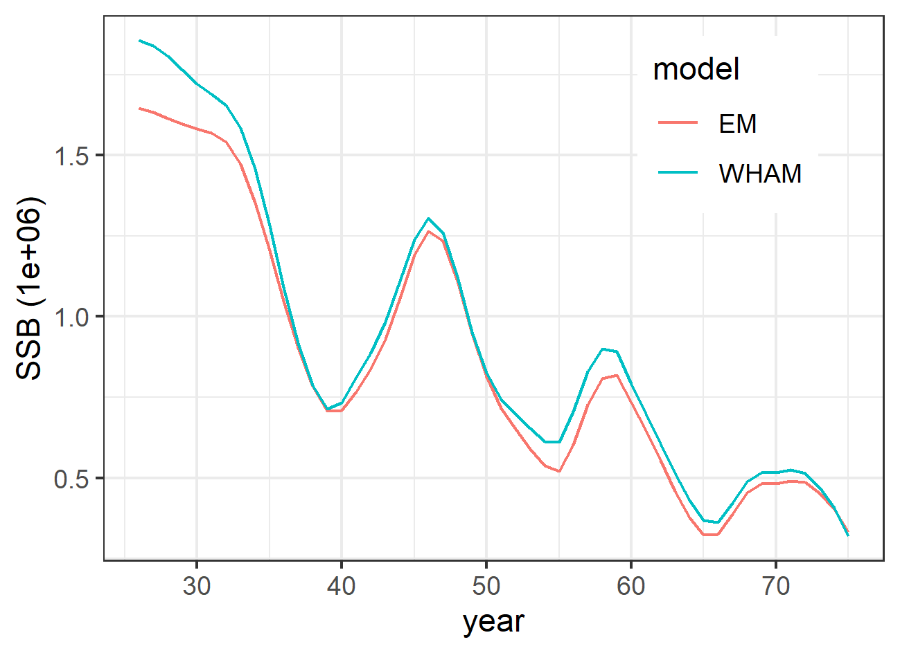

Also, we can check the growth rate (K) estimated:

```{r eval = FALSE}
exp(this_model$rep$growth_a[1,1])
# ~ 0.1544
```

## Test 6 (WHAM-growth): length-selectivity

We test the new selectivity-at-length functions, especifically the length-logistic. We use the data generated in `D3-E0-F0-R0-cod`:


```{r eval = FALSE}
data_file = r4ss::SS_readdat_3.30(file = 'SS_sim/D3-E0-F0-R0-cod/10/em/ss3.dat') # from EM
SS_report = r4ss::SS_output(dir = 'SS_sim/D3-E0-F0-R0-cod/10/om', covar = FALSE) # from OM
SS_reportEM = r4ss::SS_output(dir = 'SS_sim/D3-E0-F0-R0-cod/10/em', covar = FALSE) # from EM
min_year = SS_report$startyr
max_year = SS_report$endyr
n_ages = length(SS_report$agebins)
fish_len = SS_report$lbins
n_years = length(min_year:max_year)
```

Also, we will also need the numbers-at-age:

```{r eval = FALSE}
NAA_SS = SS_report$natage[SS_report$natage$`Beg/Mid` == 'B' & 
                            SS_report$natage$Yr >= min_year & 
                            SS_report$natage$Yr <= max_year, 13:ncol(SS_report$natage)]
```

Prepare the data object for WHAM:

```{r eval = FALSE}
wham_data = list()
wham_data$ages = 1:n_ages
wham_data$lengths = fish_len
wham_data$CV_len = c(0.1, 0.1)
wham_data$years = min_year:max_year

wham_data$n_fleets = 1L
wham_data$agg_catch = as.matrix(data_file$catch[2:(n_years+1), 4])
wham_data$catch_cv = as.matrix(data_file$catch[2:(n_years+1), 5])

catch_pal_num = data_file$lencomp[data_file$lencomp$FltSvy == 1, 7:(7+length(wham_data$lengths)-1)]
catch_pal_prop = t(apply(as.matrix(catch_pal_num),1, function(x) x/sum(x)))
wham_data$catch_pal = catch_pal_prop
wham_data$catch_NeffL = as.matrix(as.double(data_file$lencomp[data_file$lencomp$FltSvy == 1, 6]))
wham_data$use_catch_pal = matrix(1, nrow = length(wham_data$years), ncol = wham_data$n_fleets)
wham_data$selblock_pointer_fleets = matrix(1L, ncol = 1, nrow = (max_year - min_year + 1))
wham_data$F = matrix(apply(X = SS_report$fatage[SS_report$fatage$Yr >= min_year & 
                                                  SS_report$fatage$Yr <= max_year,
                                                8:ncol(SS_report$fatage)], MARGIN = 1, FUN = max),
                     ncol = 1)

wham_data$n_indices = 1L
wham_data$agg_indices = as.matrix(data_file$CPUE[,4])
index_paa_num = data_file$agecomp[data_file$agecomp$FltSvy == 2, 10:(10+n_ages-1)]
index_paa_prop = t(apply(as.matrix(index_paa_num),1, function(x) x/sum(x)))
wham_data$index_paa = array(data = index_paa_prop, dim = c(1,max_year-min_year+1,n_ages))
wham_data$index_cv = as.matrix(data_file$CPUE[,5])
wham_data$index_Neff =  as.matrix(as.double(data_file$agecomp[data_file$agecomp$FltSvy == 2, 9]))
wham_data$units_indices = rep(0L, times = 1) # numbers
wham_data$units_index_paa = rep(2L, times = 1) # numbers
wham_data$use_index_paa = matrix(1, ncol = 1, nrow = (max_year - min_year + 1))

wham_data$selblock_pointer_indices = matrix(2L, ncol = 1, nrow = (max_year - min_year + 1))
wham_data$fracyr_indices = matrix(0.01, ncol = 1, nrow = (max_year - min_year + 1))
waa_matrix = as.matrix(SS_report$wtatage[SS_report$wtatage$Fleet == 1 & SS_report$wtatage$Yr <= max_year, 7:(7+n_ages-1)])
waa_matrix_ini = as.matrix(SS_report$wtatage[SS_report$wtatage$Fleet == 0 & SS_report$wtatage$Yr <= max_year, 7:(7+n_ages-1)])
waa_tot_matrix = rbind(waa_matrix, waa_matrix, waa_matrix, waa_matrix_ini)
dim(waa_tot_matrix) = c(max_year-min_year+1,4,n_ages)
waa_tot_matrix2 = aperm(waa_tot_matrix, c(2,1,3))
wham_data$waa = waa_tot_matrix2
wham_data$maturity = matrix(rep(SS_report$endgrowth[,19], times = max_year - min_year + 1),
                            ncol = n_ages, nrow = max_year - min_year + 1, byrow = TRUE) 
wham_data$fracyr_SSB = rep(0, times = max_year - min_year + 1)
wham_data$Fbar_ages = c(5L,21L)
wham_data$percentSPR = 20
wham_data$percentFXSPR = n_years
wham_data$percentFMSY = n_years
wham_data$XSPR_R_avg_yrs = 1:n_years
wham_data$XSPR_R_opt = 1
wham_data$simulate_process_error = rep(1, times = 6)
wham_data$simulate_observation_error = rep(1, times = 3)
wham_data$simulate_period = rep(1, times = 2)
wham_data$bias_correct_process = 0
wham_data$bias_correct_observation = 0
```

Define the input data object. Natural mortality, selectivity, growth, and catchability parameters are the same as in the OM. We estimate L50 for both fleets:

```{r eval = FALSE}
my_input = prepare_wham_input(model_name="whamGrowth4",
                              selectivity=list(model=rep("len-logistic",2),  # len logistic
                                               re=rep("none",2), 
                                               initial_pars=list(c(40,5),
                                                                 c(15,3)),
                                               fix_pars = list(2,2), # Estimate L50
                                               n_selblocks = 2),
                              M = list(model = 'constant', re = 'none', 
                                       initial_means = 0.36),
                              NAA_re = list(sigma="rec", cor = 'iid', N1_model = 0,
                                            recruit_model = 2,
                                            N1_pars = as.vector(as.matrix(NAA_SS[1,])), 
                                            recruit_pars = c(500000)),
                              growth = list(model = 'vB_classic',
                                            re = c('none', 'none', 'none'), 
                                            init_vals = c(0.16, 117.9, 0.835)), # K, Linf, t0
                              catchability = list(re = 'none', initial_q = 1, q_lower = 0,
                                                  q_upper = 1000, prior_sd = NA),
                              age_comp = 'multinomial',
                              len_comp = 'multinomial',
                              basic_info = wham_data)
```

Make some changes to `my_input` to fix some parameters:

```{r eval = FALSE}
my_input$par$log_NAA = as.matrix(log(NAA_SS[-1,])) # set initial rec devs as OM
my_input$par$mean_rec_pars = mean(log(NAA_SS[,1])) # mean recruitment as OM
my_input$map$log_N1_pars = factor(rep(NA, times = n_ages)) # fix N1
my_input$map$log_F1 = factor(c(NA)) # fix F1
my_input$map$logit_q = factor(NA) # fix q
my_input$random = NULL
```

Run WHAM model and check for convergence:

```{r eval = FALSE}
my_model_6 = fit_wham(my_input, do.osa = FALSE, do.fit = TRUE)
check_convergence(my_model_6)
```

Compare SSB estimates from OM and WHAM:

```{r eval = FALSE}
this_model = my_model_6
this_name = deparse(substitute(my_model_6))
#Plot:
OM_SSB = SS_reportEM$timeseries[SS_reportEM$timeseries$Yr >= min_year & 
                                SS_reportEM$timeseries$Yr <= max_year, 'SpawnBio']
WHAM_SSB = this_model$rep$SSB 
data_plot = data.frame(year = rep(min_year:max_year, times = 2), 
                       SSB = c(OM_SSB*1e-06, WHAM_SSB*1e-06),
                       type = c(rep('OM', times = length(min_year:max_year)), 
                                rep('WHAM', times = length(min_year:max_year))))
p1 = ggplot(data = data_plot, aes(x = year, y = SSB, color = factor(type))) +
  geom_line() + 
  ylab('SSB (1e+06)') +
  theme_bw() +
  guides(color = guide_legend(title = 'model')) +
  theme(legend.position = c(0.8, 0.8)) 
```

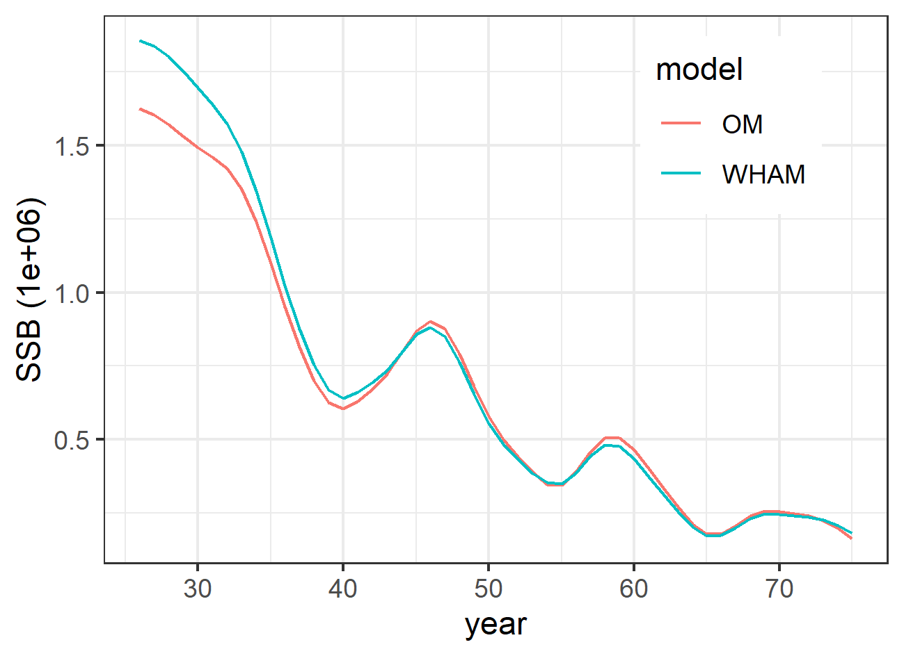

Check L50 estimates:

```{r eval = FALSE}
this_model$rep$selpars[[1]][1,1:2] # for fleet = 35.9
this_model$rep$selpars[[2]][1,1:2] # for survey = 15.57
```

# Random effects

Now that we are condifent that the new code is working properly, we can go beyond and start exploring random effects on recruitment and growth parameters. 

## Test 1 (WHAM-devel): only age information

We need to install the *devel* branch of WHAM (again, sorry!), which can be installed from:

```{r eval = FALSE}
devtools::install_github("timjmiller/wham", dependencies=TRUE, ref="devel")
```

Then:

```{r}
library(wham)
```

We follow the same steps as in the previous section:

```{r eval = FALSE}
data_file = r4ss::SS_readdat_3.30(file = 'SS_sim/D0-E0-F0-R0-cod/10/em/ss3.dat') # from EM
SS_report = r4ss::SS_output(dir = 'SS_sim/D0-E0-F0-R0-cod/10/om', covar = FALSE) # from OM
SS_reportEM = r4ss::SS_output(dir = 'SS_sim/D0-E0-F0-R0-cod/10/em', covar = FALSE) # from EM
min_year = SS_report$startyr
max_year = SS_report$endyr
n_ages = length(SS_report$agebins)
```

Also, we will also need the numbers-at-age information from the OM:

```{r eval = FALSE}
NAA_SS = SS_report$natage[SS_report$natage$`Beg/Mid` == 'B' & 
                            SS_report$natage$Yr >= min_year & 
                            SS_report$natage$Yr <= max_year, 13:ncol(SS_report$natage)]
```

Prepare the data object for WHAM. Here is the detailed code (in the future, this will be a function):

```{r eval = FALSE}
wham_data = list()
wham_data$ages = 1:n_ages
wham_data$years = min_year:max_year

wham_data$n_fleets = 1L
wham_data$agg_catch = as.matrix(data_file$catch[2:(n_years+1), 4])
catch_paa_num = data_file$agecomp[data_file$agecomp$FltSvy == 1, 10:(10+n_ages-1)]
catch_paa_prop = t(apply(as.matrix(catch_paa_num),1, function(x) x/sum(x)))
wham_data$catch_paa = array(data = catch_paa_prop, dim = c(1,max_year-min_year+1,n_ages))
wham_data$catch_cv = as.matrix(data_file$catch[2:(n_years+1), 5])
wham_data$catch_Neff = as.matrix(as.double(data_file$agecomp[data_file$agecomp$FltSvy == 1, 9]))
wham_data$use_catch_paa = matrix(1, ncol = 1, nrow = (max_year - min_year + 1))
wham_data$selblock_pointer_fleets = matrix(1L, ncol = 1, nrow = (max_year - min_year + 1))
wham_data$F = matrix(apply(X = SS_report$fatage[SS_report$fatage$Yr >= min_year & SS_report$fatage$Yr <= max_year,
                                                8:ncol(SS_report$fatage)], MARGIN = 1, FUN = max), ncol = 1)
  
wham_data$n_indices = 1L
wham_data$agg_indices = as.matrix(data_file$CPUE[,4])
index_paa_num = data_file$agecomp[data_file$agecomp$FltSvy == 2, 10:(10+n_ages-1)]
index_paa_prop = t(apply(as.matrix(index_paa_num),1, function(x) x/sum(x)))
wham_data$index_paa = array(data = index_paa_prop, dim = c(1,max_year-min_year+1,n_ages))
wham_data$index_cv = as.matrix(data_file$CPUE[,5])
wham_data$index_Neff =  as.matrix(as.double(data_file$agecomp[data_file$agecomp$FltSvy == 2, 9]))
wham_data$units_indices = rep(0L, times = 1) # numbers
wham_data$units_index_paa = rep(2L, times = 1) # numbers
wham_data$use_index_paa = matrix(1, ncol = 1, nrow = (max_year - min_year + 1))

wham_data$selblock_pointer_indices = matrix(2L, ncol = 1, nrow = (max_year - min_year + 1))
wham_data$fracyr_indices = matrix(0.01, ncol = 1, nrow = (max_year - min_year + 1))
waa_matrix = as.matrix(SS_report$wtatage[SS_report$wtatage$Fleet == 1 & SS_report$wtatage$Yr <= max_year, 7:(7+n_ages-1)])
waa_matrix_ini = as.matrix(SS_report$wtatage[SS_report$wtatage$Fleet == 0 & SS_report$wtatage$Yr <= max_year, 7:(7+n_ages-1)])
waa_tot_matrix = rbind(waa_matrix, waa_matrix, waa_matrix, waa_matrix_ini)
dim(waa_tot_matrix) = c(max_year-min_year+1,4,n_ages)
waa_tot_matrix2 = aperm(waa_tot_matrix, c(2,1,3))
wham_data$waa = waa_tot_matrix2
wham_data$maturity = matrix(rep(SS_report$endgrowth[,19], times = max_year - min_year + 1),
                            ncol = n_ages, nrow = max_year - min_year + 1, byrow = TRUE) # multiply by 0.5?
wham_data$fracyr_SSB = rep(0, times = max_year - min_year + 1)
wham_data$Fbar_ages = c(5L,21L)
wham_data$percentSPR = 20
wham_data$percentFXSPR = n_years
wham_data$percentFMSY = n_years
wham_data$XSPR_R_avg_yrs = 1:n_years
wham_data$XSPR_R_opt = 2
wham_data$simulate_process_error = rep(1, times = 5)
wham_data$simulate_observation_error = rep(1, times = 3)
wham_data$simulate_period = rep(1, times = 2)
wham_data$bias_correct_process = 0
wham_data$bias_correct_observation = 0
```

Define the input data object. Natural mortality, selectivity, and catchability parameters values are the same as in the OM:

```{r eval = FALSE}
my_input = prepare_wham_input(model_name="whamBase",
                              selectivity=list(model=rep("age-specific",2), 
                                               re=rep("none",2), 
                                               initial_pars=list(c(rep(0, 4), rep(1, 17)),
                                                                 c(rep(0, 1), rep(1, 20))),
                                               fix_pars = list(1:21, 1:21),
                                               n_selblocks = 2),
                              M = list(model = 'constant', re = 'none', 
                                       initial_means = 0.36),
                              NAA_re = list(sigma="rec", cor = 'iid', N1_model = 0,
                                            recruit_model = 2,
                                            N1_pars = as.vector(as.matrix(NAA_SS[1,])), 
                                            recruit_pars = c(500000)),
                              catchability = list(re = 'none', initial_q = 1, q_lower = 0,
                                                  q_upper = 1000, prior_sd = NA),
                              age_comp = 'multinomial',
                              basic_info = wham_data)
```

Make some changes to `my_input` to fix some parameters. Note that random effects for recruitments are on:

```{r eval = FALSE}
my_input$par$log_NAA = as.matrix(log(NAA_SS[-1,])) # set initial rec devs as OM
my_input$par$mean_rec_pars = mean(log(NAA_SS[,1])) # mean recruitment as OM
my_input$map$log_N1_pars = factor(rep(NA, times = n_ages)) # fix N1
my_input$map$log_F1 = factor(c(NA)) # fix F1
my_input$map$logit_q = factor(NA) # fix q
```

Run WHAM model and check for convergence:

```{r eval = FALSE}
my_model_7 = fit_wham(my_input, do.osa = FALSE, do.fit = TRUE)
check_convergence(my_model_7)
```

Compare SSB estimates from OM and WHAM. The goal is not to compare similarities/differences between WHAM and SS, but to make sure that WHAM is producing *reasonable* results:

```{r eval = FALSE}
this_model = my_model_7
this_name = deparse(substitute(my_model_7))
# Make plot:
OM_SSB = SS_reportEM$timeseries[SS_reportEM$timeseries$Yr >= min_year & 
                                SS_reportEM$timeseries$Yr <= max_year, 'SpawnBio']
WHAM_SSB = this_model$rep$SSB 
data_plot = data.frame(year = rep(min_year:max_year, times = 2), 
                       SSB = c(OM_SSB*1e-06, WHAM_SSB*1e-06),
                       type = c(rep('OM', times = length(min_year:max_year)), 
                                rep('WHAM', times = length(min_year:max_year))))
p1 = ggplot(data = data_plot, aes(x = year, y = SSB, color = factor(type))) +
  geom_line() + 
  ylab('SSB (1e+06)') +
  theme_bw() +
  guides(color = guide_legend(title = 'model')) +
  theme(legend.position = c(0.8, 0.8))
```

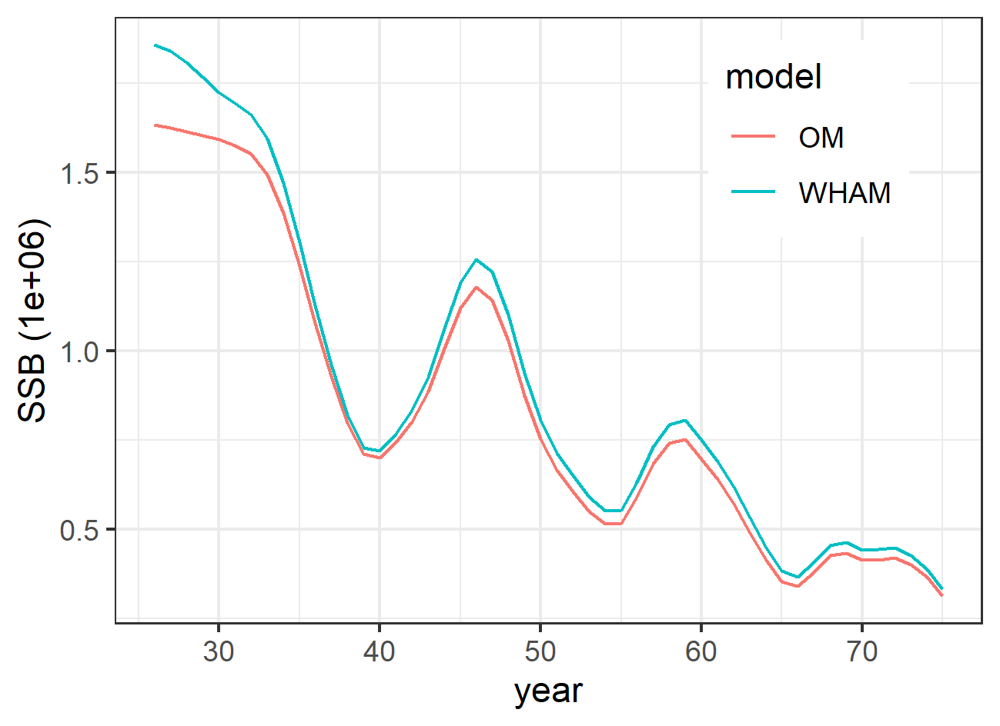

As we observed, SSB estimates of both models follow a similar trends over years. 

Also, we need to check the sparseness of the Hessian matrix:

```{r eval = FALSE}
my_hessian = this_model$env$spHess(random = TRUE)
par(mar=c(3,2,1,5))
image(my_hessian)
```

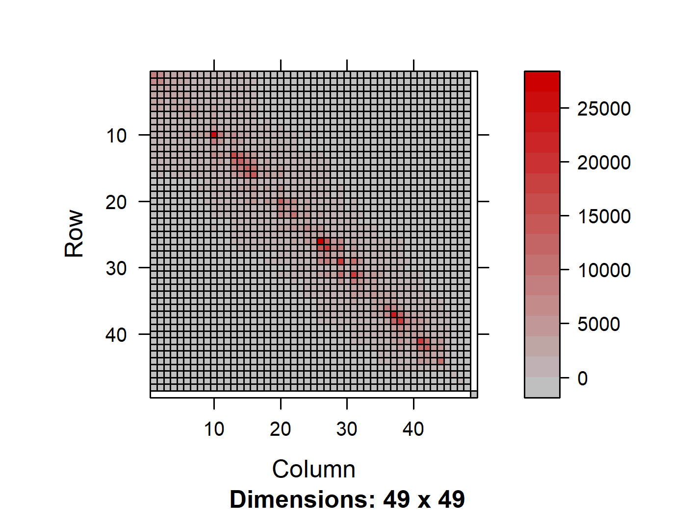


## Test 2 (WHAM-growth): only age information

We come back to the new WHAM version. To do this, we need to install this branch:

```{r eval = FALSE}
remotes::install_github(repo = 'gmoroncorrea/wham', ref='growth', INSTALL_opts = c("--no-docs", "--no-multiarch", "--no-demo"))
```

Then:

```{r eval = FALSE}
library(wham)
```

We follow the same steps as before: 

```{r eval = FALSE}
data_file = r4ss::SS_readdat_3.30(file = 'SS_sim/D0-E0-F0-R0-cod/10/em/ss3.dat') # from EM
SS_report = r4ss::SS_output(dir = 'SS_sim/D0-E0-F0-R0-cod/10/om', covar = FALSE) # from OM
SS_reportEM = r4ss::SS_output(dir = 'SS_sim/D0-E0-F0-R0-cod/10/em', covar = FALSE) # from EM
min_year = SS_report$startyr
max_year = SS_report$endyr
n_ages = length(SS_report$agebins)
fish_len = SS_report$lbins
n_years = length(min_year:max_year)
```

Also, we will also need the numbers-at-age:

```{r eval = FALSE}
NAA_SS = SS_report$natage[SS_report$natage$`Beg/Mid` == 'B' & 
                            SS_report$natage$Yr >= min_year & 
                            SS_report$natage$Yr <= max_year, 13:ncol(SS_report$natage)]
```

Prepare the data object for WHAM. Here is the detailed code (in the future this will be a function). Please see the manual (TODO) and the new equations (attached to this manual) of the new features in WHAM beforehand:

```{r eval = FALSE}
wham_data = list()
wham_data$ages = 1:n_ages
wham_data$lengths = fish_len
wham_data$CV_len = c(0.1, 0.1) # age 1 and oldest
wham_data$years = min_year:max_year

wham_data$n_fleets = 1L
wham_data$agg_catch = as.matrix(data_file$catch[2:(n_years+1), 4])
catch_paa_num = data_file$agecomp[data_file$agecomp$FltSvy == 1, 10:(10+n_ages-1)]
catch_paa_prop = t(apply(as.matrix(catch_paa_num),1, function(x) x/sum(x)))
wham_data$catch_paa = array(data = catch_paa_prop, dim = c(1,max_year-min_year+1,n_ages))
wham_data$catch_cv = as.matrix(data_file$catch[2:(n_years+1), 5])
wham_data$catch_Neff = as.matrix(as.double(data_file$agecomp[data_file$agecomp$FltSvy == 1, 9]))
wham_data$use_catch_paa = matrix(1L, ncol = 1, nrow = (max_year - min_year + 1))

wham_data$selblock_pointer_fleets = matrix(1L, ncol = 1, nrow = (max_year - min_year + 1))
wham_data$F = matrix(apply(X = SS_report$fatage[SS_report$fatage$Yr >= min_year & 
                                                  SS_report$fatage$Yr <= max_year,
                                                8:ncol(SS_report$fatage)], MARGIN = 1, FUN = max),
                     ncol = 1)

wham_data$n_indices = 1L
wham_data$agg_indices = as.matrix(data_file$CPUE[,4])
index_paa_num = data_file$agecomp[data_file$agecomp$FltSvy == 2, 10:(10+n_ages-1)]
index_paa_prop = t(apply(as.matrix(index_paa_num),1, function(x) x/sum(x)))
wham_data$index_paa = array(data = index_paa_prop, dim = c(1,max_year-min_year+1,n_ages))
wham_data$index_cv = as.matrix(data_file$CPUE[,5])
wham_data$index_Neff =  as.matrix(as.double(data_file$agecomp[data_file$agecomp$FltSvy == 2, 9]))
wham_data$units_indices = rep(0L, times = 1) # numbers
wham_data$units_index_paa = rep(2L, times = 1) # numbers
wham_data$use_index_paa = matrix(1L, ncol = 1, nrow = (max_year - min_year + 1))

wham_data$selblock_pointer_indices = matrix(2L, ncol = 1, nrow = (max_year - min_year + 1))
wham_data$fracyr_indices = matrix(0.01, ncol = 1, nrow = (max_year - min_year + 1))
waa_matrix = as.matrix(SS_report$wtatage[SS_report$wtatage$Fleet == 1 & SS_report$wtatage$Yr <= max_year, 7:(7+n_ages-1)])
waa_matrix_ini = as.matrix(SS_report$wtatage[SS_report$wtatage$Fleet == 0 & SS_report$wtatage$Yr <= max_year, 7:(7+n_ages-1)])
waa_tot_matrix = rbind(waa_matrix, waa_matrix, waa_matrix, waa_matrix_ini)
dim(waa_tot_matrix) = c(max_year-min_year+1,4,n_ages)
waa_tot_matrix2 = aperm(waa_tot_matrix, c(2,1,3))
wham_data$waa = waa_tot_matrix2
wham_data$maturity = matrix(rep(SS_report$endgrowth[,19], times = max_year - min_year + 1),
                            ncol = n_ages, nrow = max_year - min_year + 1, byrow = TRUE) 
wham_data$fracyr_SSB = rep(0, times = max_year - min_year + 1)
wham_data$Fbar_ages = c(5L,21L)
wham_data$percentSPR = 20
wham_data$percentFXSPR = n_years
wham_data$percentFMSY = n_years
wham_data$XSPR_R_avg_yrs = 1:n_years
wham_data$XSPR_R_opt = 1
wham_data$simulate_process_error = rep(1, times = 6)
wham_data$simulate_observation_error = rep(1, times = 3)
wham_data$simulate_period = rep(1, times = 2)
wham_data$bias_correct_process = 0
wham_data$bias_correct_observation = 0
```

Define the input data object. Natural mortality, selectivity, growth, and catchability parameters are the same as in the OM:

```{r eval = FALSE}
my_input = prepare_wham_input(model_name="whamGrowth0",
                              selectivity=list(model=rep("age-specific",2), 
                                               re=rep("none",2), 
                                               initial_pars=list(c(rep(0, 4), rep(1, 17)),
                                                                 c(rep(0, 1), rep(1, 20))),
                                               fix_pars = list(1:21, 1:21),
                                               n_selblocks = 2),
                              M = list(model = 'constant', re = 'none', 
                                       initial_means = 0.36),
                              NAA_re = list(sigma="rec", cor = 'iid', N1_model = 0,
                                            recruit_model = 2,
                                            N1_pars = as.vector(as.matrix(NAA_SS[1,])), 
                                            recruit_pars = c(500000)),
                              growth = list(model = 'vB_classic',
                                            re = c('none', 'none', 'none'), 
                                            init_vals = c(0.16, 117.9, 0.835)), # K, Linf, t0
                              catchability = list(re = 'none', initial_q = 1, q_lower = 0,
                                                  q_upper = 1000, prior_sd = NA),
                              age_comp = 'multinomial',
                              len_comp = 'multinomial',
                              basic_info = wham_data)
```

Make some changes to `my_input` to fix some parameters:

```{r eval = FALSE}
my_input$par$log_NAA = as.matrix(log(NAA_SS[-1,])) # set initial rec devs as OM
my_input$par$mean_rec_pars = mean(log(NAA_SS[,1])) # mean recruitment as OM
my_input$map$log_N1_pars = factor(rep(NA, times = n_ages)) # fix N1
my_input$map$log_F1 = factor(c(NA)) # fix F1
my_input$map$logit_q = factor(NA) # fix q
```

Run WHAM model and check for convergence:

```{r eval = FALSE}
my_model_8 = fit_wham(my_input, do.osa = FALSE, do.fit = TRUE)
check_convergence(my_model_8)
```

Compare SSB estimates from OM and WHAM:

```{r eval = FALSE}
this_model = my_model_8
this_name = deparse(substitute(my_model_8))
#Plot:
OM_SSB = SS_reportEM$timeseries[SS_reportEM$timeseries$Yr >= min_year & 
                                SS_reportEM$timeseries$Yr <= max_year, 'SpawnBio']
WHAM_SSB = this_model$rep$SSB 
data_plot = data.frame(year = rep(min_year:max_year, times = 2), 
                       SSB = c(OM_SSB*1e-06, WHAM_SSB*1e-06),
                       type = c(rep('OM', times = length(min_year:max_year)), 
                                rep('WHAM', times = length(min_year:max_year))))
p1 = ggplot(data = data_plot, aes(x = year, y = SSB, color = factor(type))) +
  geom_line() + 
  ylab('SSB (1e+06)') +
  theme_bw() +
  guides(color = guide_legend(title = 'model')) +
  theme(legend.position = c(0.8, 0.8))
```


As we observe, the SSB estimates are the same as using the *devel* branch of WHAM. The changes in the WHAM code (WHAM-growth) are not altering the random effects estimation of the model.

Also, we need to check the sparseness of the Hessian matrix:

```{r eval = FALSE}
my_hessian = this_model$env$spHess(random = TRUE)
par(mar=c(3,2,1,5))
image(my_hessian)
```


This matrix is the same as obtained in the previous step.

## Test 3 (WHAM-growth): age and length information

From here, the models start to run a bit slower. We follow the same steps as before:

```{r eval = FALSE}
data_file = r4ss::SS_readdat_3.30(file = 'SS_sim/D1-E0-F0-R0-cod/10/em/ss3.dat') # from EM
SS_report = r4ss::SS_output(dir = 'SS_sim/D1-E0-F0-R0-cod/10/om', covar = FALSE) # from OM
SS_reportEM = r4ss::SS_output(dir = 'SS_sim/D1-E0-F0-R0-cod/10/em', covar = FALSE) # from EM
min_year = SS_report$startyr
max_year = SS_report$endyr
n_ages = length(SS_report$agebins)
fish_len = SS_report$lbins
n_years = length(min_year:max_year)
```

Also, we will also need the numbers-at-age:

```{r eval = FALSE}
NAA_SS = SS_report$natage[SS_report$natage$`Beg/Mid` == 'B' & 
                            SS_report$natage$Yr >= min_year & 
                            SS_report$natage$Yr <= max_year, 13:ncol(SS_report$natage)]
```

Prepare the data object for WHAM:

```{r eval = FALSE}
wham_data = list()
wham_data$ages = 1:n_ages
wham_data$lengths = fish_len
wham_data$CV_len = c(0.1, 0.1) # age 1 and oldest
wham_data$years = min_year:max_year

wham_data$n_fleets = 1L
wham_data$agg_catch = as.matrix(data_file$catch[2:(n_years+1), 4])
wham_data$catch_cv = as.matrix(data_file$catch[2:(n_years+1), 5])
# Length information fleet
catch_pal_num = data_file$lencomp[data_file$lencomp$FltSvy == 1, 7:(7+length(wham_data$lengths)-1)]
catch_pal_prop = t(apply(as.matrix(catch_pal_num),1, function(x) x/sum(x)))
wham_data$catch_pal = catch_pal_prop
wham_data$catch_NeffL = as.matrix(as.double(data_file$lencomp[data_file$lencomp$FltSvy == 1, 6]))
wham_data$use_catch_pal = matrix(1, nrow = length(wham_data$years), ncol = wham_data$n_fleets)
wham_data$selblock_pointer_fleets = matrix(1L, ncol = 1, nrow = (max_year - min_year + 1))
wham_data$F = matrix(apply(X = SS_report$fatage[SS_report$fatage$Yr >= min_year & 
                                                  SS_report$fatage$Yr <= max_year,
                                                8:ncol(SS_report$fatage)], MARGIN = 1, FUN = max),
                     ncol = 1)

wham_data$n_indices = 1L
wham_data$agg_indices = as.matrix(data_file$CPUE[,4])
index_paa_num = data_file$agecomp[data_file$agecomp$FltSvy == 2, 10:(10+n_ages-1)]
index_paa_prop = t(apply(as.matrix(index_paa_num),1, function(x) x/sum(x)))
wham_data$index_paa = array(data = index_paa_prop, dim = c(1,max_year-min_year+1,n_ages))
wham_data$index_cv = as.matrix(data_file$CPUE[,5])
wham_data$index_Neff =  as.matrix(as.double(data_file$agecomp[data_file$agecomp$FltSvy == 2, 9]))
wham_data$units_indices = rep(0L, times = 1) # numbers
wham_data$units_index_paa = rep(2L, times = 1) # numbers
wham_data$use_index_paa = matrix(1, ncol = 1, nrow = (max_year - min_year + 1))

wham_data$selblock_pointer_indices = matrix(2L, ncol = 1, nrow = (max_year - min_year + 1))
wham_data$fracyr_indices = matrix(0.01, ncol = 1, nrow = (max_year - min_year + 1))
waa_matrix = as.matrix(SS_report$wtatage[SS_report$wtatage$Fleet == 1 & SS_report$wtatage$Yr <= max_year, 7:(7+n_ages-1)])
waa_matrix_ini = as.matrix(SS_report$wtatage[SS_report$wtatage$Fleet == 0 & SS_report$wtatage$Yr <= max_year, 7:(7+n_ages-1)])
waa_tot_matrix = rbind(waa_matrix, waa_matrix, waa_matrix, waa_matrix_ini)
dim(waa_tot_matrix) = c(max_year-min_year+1,4,n_ages)
waa_tot_matrix2 = aperm(waa_tot_matrix, c(2,1,3))
wham_data$waa = waa_tot_matrix2
wham_data$maturity = matrix(rep(SS_report$endgrowth[,19], times = max_year - min_year + 1),
                            ncol = n_ages, nrow = max_year - min_year + 1, byrow = TRUE) 
wham_data$fracyr_SSB = rep(0, times = max_year - min_year + 1)
wham_data$Fbar_ages = c(5L,21L)
wham_data$percentSPR = 20
wham_data$percentFXSPR = n_years
wham_data$percentFMSY = n_years
wham_data$XSPR_R_avg_yrs = 1:n_years
wham_data$XSPR_R_opt = 1
wham_data$simulate_process_error = rep(1, times = 6)
wham_data$simulate_observation_error = rep(1, times = 3)
wham_data$simulate_period = rep(1, times = 2)
wham_data$bias_correct_process = 0
wham_data$bias_correct_observation = 0
```

Define the input data object. Natural mortality, selectivity, growth, and catchability parameters are the same as in the OM:

```{r eval = FALSE}
my_input = prepare_wham_input(model_name="whamGrowth1",
                              selectivity=list(model=rep("age-specific",2), 
                                               re=rep("none",2), 
                                               initial_pars=list(c(rep(0, 4), rep(1, 17)),
                                                                 c(rep(0, 1), rep(1, 20))),
                                               fix_pars = list(1:21, 1:21),
                                               n_selblocks = 2),
                              M = list(model = 'constant', re = 'none', 
                                       initial_means = 0.36),
                              NAA_re = list(sigma="rec", cor = 'iid', N1_model = 0,
                                            recruit_model = 2,
                                            N1_pars = as.vector(as.matrix(NAA_SS[1,])), 
                                            recruit_pars = c(500000)),
                              growth = list(model = 'vB_classic',
                                            re = c('none', 'none', 'none'), 
                                            init_vals = c(0.16, 117.9, 0.835)), # K, Linf, t0
                              catchability = list(re = 'none', initial_q = 1, q_lower = 0,
                                                  q_upper = 1000, prior_sd = NA),
                              age_comp = 'multinomial',
                              len_comp = 'multinomial',
                              basic_info = wham_data)
```

Make some changes to `my_input` to fix some parameters:

```{r eval = FALSE}
my_input$par$log_NAA = as.matrix(log(NAA_SS[-1,])) # set initial rec devs as OM
my_input$par$mean_rec_pars = mean(log(NAA_SS[,1])) # mean recruitment as OM
my_input$map$log_N1_pars = factor(rep(NA, times = n_ages)) # fix N1
my_input$map$log_F1 = factor(c(NA)) # fix F1
my_input$map$logit_q = factor(NA) # fix q
```

Run WHAM model and check for convergence:

```{r eval = FALSE}
my_model_9 = fit_wham(my_input, do.osa = FALSE, do.fit = TRUE)
check_convergence(my_model_9)
```

Compare SSB estimates from OM and WHAM:

```{r eval = FALSE}
this_model = my_model_9
this_name = deparse(substitute(my_model_9))
#Plot:
OM_SSB = SS_reportEM$timeseries[SS_reportEM$timeseries$Yr >= min_year & 
                                SS_reportEM$timeseries$Yr <= max_year, 'SpawnBio']
WHAM_SSB = this_model$rep$SSB 
data_plot = data.frame(year = rep(min_year:max_year, times = 2), 
                       SSB = c(OM_SSB*1e-06, WHAM_SSB*1e-06),
                       type = c(rep('OM', times = length(min_year:max_year)), 
                                rep('WHAM', times = length(min_year:max_year))))
p1 = ggplot(data = data_plot, aes(x = year, y = SSB, color = factor(type))) +
  geom_line() + 
  ylab('SSB (1e+06)') +
  theme_bw() +
  guides(color = guide_legend(title = 'model')) +
  theme(legend.position = c(0.8, 0.8))
```

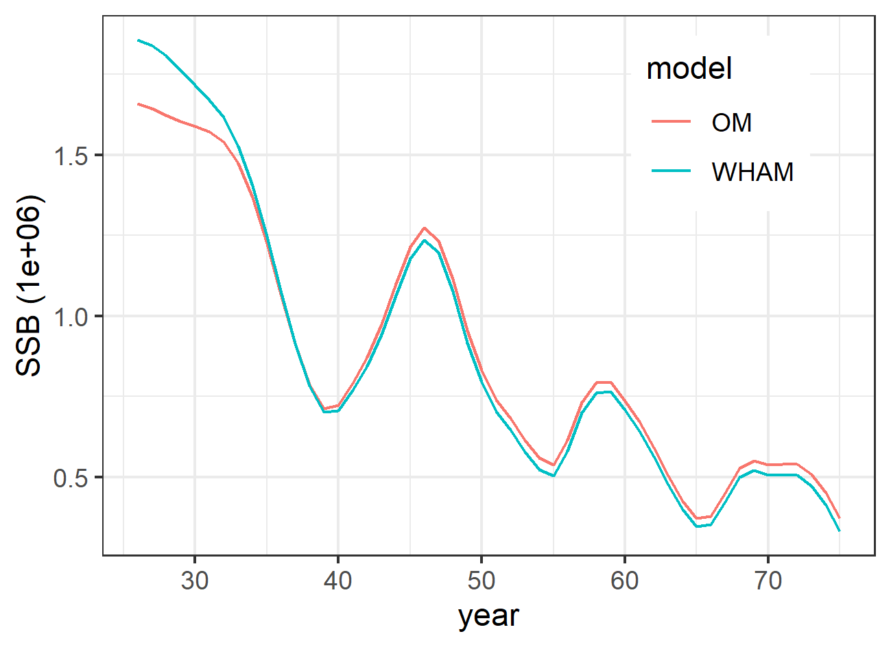

Also, we need to check the sparseness of the Hessian matrix:

```{r eval = FALSE}
my_hessian = this_model$env$spHess(random = TRUE)
par(mar=c(3,2,1,5))
image(my_hessian)
```


## Test 4 (WHAM-growth): age and length information - Variable K

We simulate time-variable K using SS:

```{r eval = FALSE}
data_file = r4ss::SS_readdat_3.30(file = 'SS_sim/D4-E0-F0-R0-cod/10/em/ss3.dat') # from EM
SS_report = r4ss::SS_output(dir = 'SS_sim/D4-E0-F0-R0-cod/10/om', covar = FALSE) # from OM
SS_reportEM = r4ss::SS_output(dir = 'SS_sim/D4-E0-F0-R0-cod/10/em', covar = FALSE) # from EM
min_year = SS_report$startyr
max_year = SS_report$endyr
n_ages = length(SS_report$agebins)
fish_len = SS_report$lbins
n_years = length(min_year:max_year)
```

Also, we will also need the numbers-at-age:

```{r eval = FALSE}
NAA_SS = SS_report$natage[SS_report$natage$`Beg/Mid` == 'B' & 
                            SS_report$natage$Yr >= min_year & 
                            SS_report$natage$Yr <= max_year, 13:ncol(SS_report$natage)]
```

Prepare the data object for WHAM:

```{r eval = FALSE}
wham_data = list()
wham_data$ages = 1:n_ages
wham_data$lengths = fish_len
wham_data$CV_len = c(0.1, 0.1) # age 1 and oldest
wham_data$years = min_year:max_year

wham_data$n_fleets = 1L
wham_data$agg_catch = as.matrix(data_file$catch[2:(n_years+1), 4])
wham_data$catch_cv = as.matrix(data_file$catch[2:(n_years+1), 5])
# Length information fleet
catch_pal_num = data_file$lencomp[data_file$lencomp$FltSvy == 1, 7:(7+length(wham_data$lengths)-1)]
catch_pal_prop = t(apply(as.matrix(catch_pal_num),1, function(x) x/sum(x)))
wham_data$catch_pal = catch_pal_prop
wham_data$catch_NeffL = as.matrix(as.double(data_file$lencomp[data_file$lencomp$FltSvy == 1, 6]))
wham_data$use_catch_pal = matrix(1, nrow = length(wham_data$years), ncol = wham_data$n_fleets)
wham_data$selblock_pointer_fleets = matrix(1L, ncol = 1, nrow = (max_year - min_year + 1))
wham_data$F = matrix(apply(X = SS_report$fatage[SS_report$fatage$Yr >= min_year & 
                                                  SS_report$fatage$Yr <= max_year,
                                                8:ncol(SS_report$fatage)], MARGIN = 1, FUN = max),
                     ncol = 1)

wham_data$n_indices = 1L
wham_data$agg_indices = as.matrix(data_file$CPUE[,4])
index_paa_num = data_file$agecomp[data_file$agecomp$FltSvy == 2, 10:(10+n_ages-1)]
index_paa_prop = t(apply(as.matrix(index_paa_num),1, function(x) x/sum(x)))
wham_data$index_paa = array(data = index_paa_prop, dim = c(1,max_year-min_year+1,n_ages))
wham_data$index_cv = as.matrix(data_file$CPUE[,5])
wham_data$index_Neff =  as.matrix(as.double(data_file$agecomp[data_file$agecomp$FltSvy == 2, 9]))
wham_data$units_indices = rep(0L, times = 1) # numbers
wham_data$units_index_paa = rep(2L, times = 1) # numbers
wham_data$use_index_paa = matrix(1, ncol = 1, nrow = (max_year - min_year + 1))

wham_data$selblock_pointer_indices = matrix(2L, ncol = 1, nrow = (max_year - min_year + 1))
wham_data$fracyr_indices = matrix(0.01, ncol = 1, nrow = (max_year - min_year + 1))
waa_matrix = as.matrix(SS_report$wtatage[SS_report$wtatage$Fleet == 1 & SS_report$wtatage$Yr <= max_year, 7:(7+n_ages-1)])
waa_matrix_ini = as.matrix(SS_report$wtatage[SS_report$wtatage$Fleet == 0 & SS_report$wtatage$Yr <= max_year, 7:(7+n_ages-1)])
waa_tot_matrix = rbind(waa_matrix, waa_matrix, waa_matrix, waa_matrix_ini)
dim(waa_tot_matrix) = c(max_year-min_year+1,4,n_ages)
waa_tot_matrix2 = aperm(waa_tot_matrix, c(2,1,3))
wham_data$waa = waa_tot_matrix2
wham_data$maturity = matrix(rep(SS_report$endgrowth[,19], times = max_year - min_year + 1),
                            ncol = n_ages, nrow = max_year - min_year + 1, byrow = TRUE) 
wham_data$fracyr_SSB = rep(0, times = max_year - min_year + 1)
wham_data$Fbar_ages = c(5L,21L)
wham_data$percentSPR = 20
wham_data$percentFXSPR = n_years
wham_data$percentFMSY = n_years
wham_data$XSPR_R_avg_yrs = 1:n_years
wham_data$XSPR_R_opt = 1
wham_data$simulate_process_error = rep(1, times = 6)
wham_data$simulate_observation_error = rep(1, times = 3)
wham_data$simulate_period = rep(1, times = 2)
wham_data$bias_correct_process = 0
wham_data$bias_correct_observation = 0
```

Define the input data object. Natural mortality, selectivity, growth, and catchability parameters are the same as in the OM:

```{r eval = FALSE}
my_input = prepare_wham_input(model_name="whamGrowth1",
                              selectivity=list(model=rep("age-specific",2), 
                                               re=rep("none",2), 
                                               initial_pars=list(c(rep(0, 4), rep(1, 17)),
                                                                 c(rep(0, 1), rep(1, 20))),
                                               fix_pars = list(1:21, 1:21),
                                               n_selblocks = 2),
                              M = list(model = 'constant', re = 'none', 
                                       initial_means = 0.36),
                              NAA_re = list(sigma="rec", cor = 'iid', N1_model = 0,
                                            recruit_model = 2,
                                            N1_pars = as.vector(as.matrix(NAA_SS[1,])), 
                                            recruit_pars = c(500000)),
                              growth = list(model = 'vB_classic',
                                            re = c('iid_y', 'none', 'none'), # iid_y
                                            init_vals = c(0.16, 117.9, 0.835)), # K, Linf, t0
                              catchability = list(re = 'none', initial_q = 1, q_lower = 0,
                                                  q_upper = 1000, prior_sd = NA),
                              age_comp = 'multinomial',
                              len_comp = 'multinomial',
                              basic_info = wham_data)
```

Make some changes to `my_input` to fix some parameters:

```{r eval = FALSE}
my_input$par$log_NAA = as.matrix(log(NAA_SS[-1,])) # set initial rec devs as OM
my_input$par$mean_rec_pars = mean(log(NAA_SS[,1])) # mean recruitment as OM
my_input$map$log_N1_pars = factor(rep(NA, times = n_ages)) # fix N1
my_input$map$log_F1 = factor(c(NA)) # fix F1
my_input$map$logit_q = factor(NA) # fix q
```

Run WHAM model and check for convergence:

```{r eval = FALSE}
my_model_10 = fit_wham(my_input, do.osa = FALSE, do.fit = TRUE)
check_convergence(my_model_10)
```

Warning: this model takes a while (!) and does not converge, this error appears:

```{r eval = FALSE}
# Error in newton(par = c(log_NAA = 13.4665171210624, log_NAA = 13.282834832068,  : 
#   Newton failed to find minimum.
# In addition: Warning message:
# In stats::nlminb(model$par, model$fn, model$gr, control = list(iter.max = 1000,  :
#   NA/NaN function evaluation
# Error in ff(x, order = 1) : 
#   inner newton optimization failed during gradient calculation
```

We can analyze the results anyways, compare SSB estimates from OM and WHAM:

```{r eval = FALSE}
this_model = my_model_10
this_name = deparse(substitute(my_model_10))
#Plot:
OM_SSB = SS_reportEM$timeseries[SS_reportEM$timeseries$Yr >= min_year & 
                                SS_reportEM$timeseries$Yr <= max_year, 'SpawnBio']
WHAM_SSB = this_model$rep$SSB 
data_plot = data.frame(year = rep(min_year:max_year, times = 2), 
                       SSB = c(OM_SSB*1e-06, WHAM_SSB*1e-06),
                       type = c(rep('OM', times = length(min_year:max_year)), 
                                rep('WHAM', times = length(min_year:max_year))))
p1 = ggplot(data = data_plot, aes(x = year, y = SSB, color = factor(type))) +
  geom_line() + 
  ylab('SSB (1e+06)') +
  theme_bw() +
  guides(color = guide_legend(title = 'model')) +
  theme(legend.position = c(0.8, 0.8))
```

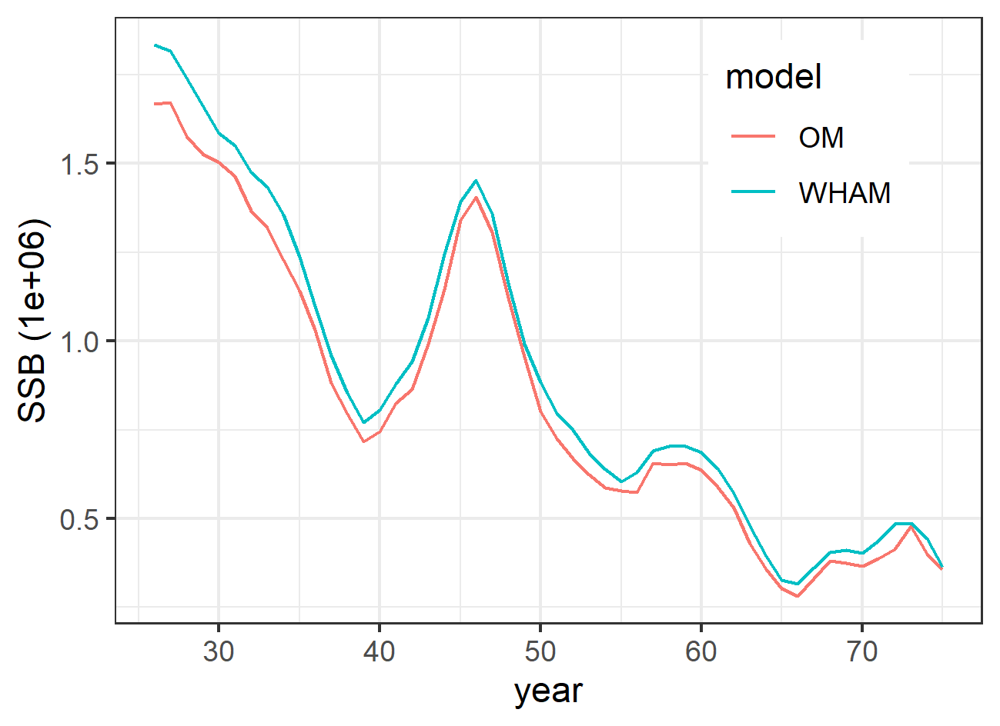

We also check how K varies over years:

```{r eval = FALSE}
WHAM_K = this_model$rep$GW_par[,1,1]
OM_K = SS_reportEM$parameters[4,'Value']*exp(0.5*SS_reportEM$parameters[84:133,'Value'])

data_plot = data.frame(year = rep(min_year:max_year, times = 2), 
                       K = c(OM_K, WHAM_K),
                       type = c(rep('OM', times = length(min_year:max_year)), 
                                rep('WHAM', times = length(min_year:max_year))))
p2 = ggplot(data = data_plot, aes(x = year, y = K, color = factor(type))) +
  geom_line() + 
  ylab('K') +
  theme_bw() +
  guides(color = guide_legend(title = 'model')) +
  theme(legend.position = c(0.8, 0.8))
```

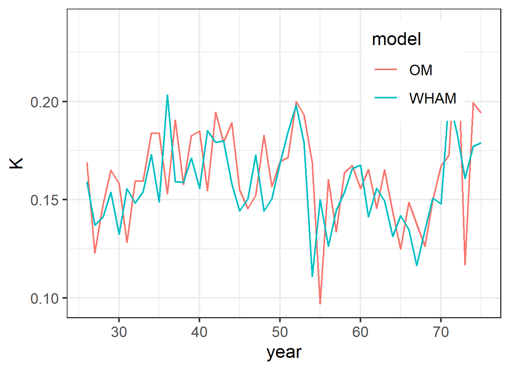

Fairly close?

Also, we need to check the sparseness of the Hessian matrix:

```{r eval = FALSE}
my_hessian = this_model$env$spHess(random = TRUE)
par(mar=c(3,2,1,5))
image(my_hessian)
```

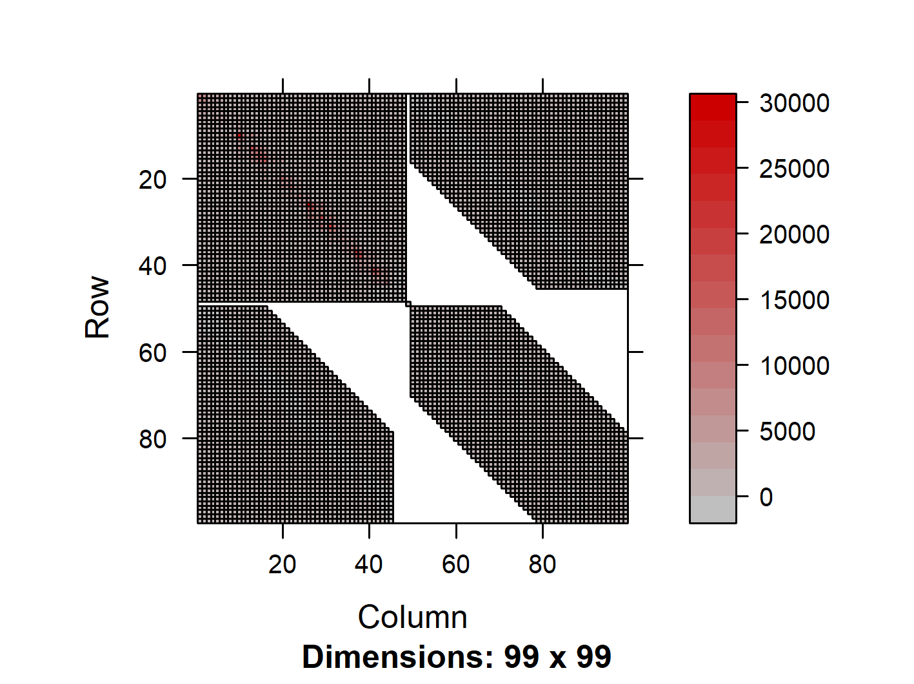